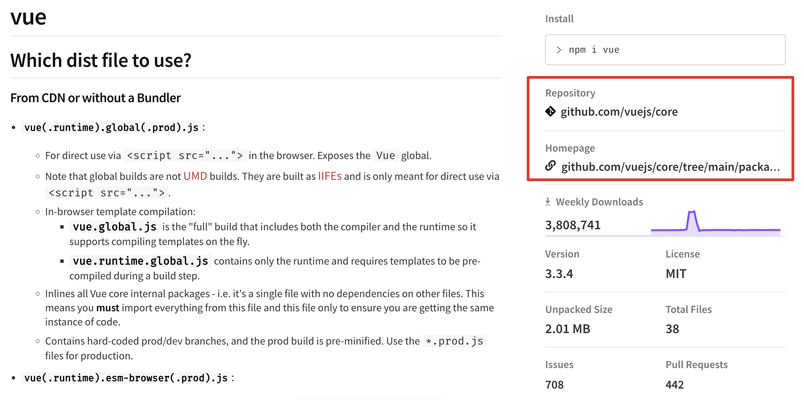
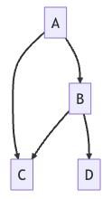

# 从零搭建Vue组件库——01.搭建 Monorepo 项目结构

> 本文参考了稀土掘金上蘑菇王的系列文章——[《从 0 到 1 搭建 Vue 组件库框架》](https://juejin.cn/post/7254341178258505788)，并通过 Github Copilot 的辅助编写功能进行了修改和补充。

## 导航

系列导航：[00.系列大纲](/articles/engineering-design/build-vue-component-library-from-scratch-00.md)

下一篇：[02.在 Monorepo 模式下集成 Vite 和 TypeScript - Part 1](/articles/engineering-design/build-vue-component-library-from-scratch-02-part-1.md)

## 为什么要采用 Monorepo 项目结构

对于组件库这种复杂的项目，将其拆分成多个子包是非常有必要的。我们先举一个普通的模块划分思路：

- `components` 包，作为组件库的主要代码，实现各个 UI 组件的核心逻辑。
- `shared` 包，主要存放各种杂七杂八的工具方法。
- `plugins` 包，可以实现组件库的周边插件(比如构建工具插件等)。
- `theme` 包，实现组件库的主题样式定制方案。
- `cli` 包，实现组件库模板脚手架的命令行工具。
- `docs` 包，组件库的示例 demo 与使用文档。
- `playground` 包，组件库的在线编辑、演示应用。

这是很自然的思路，就是将组件库的各个功能模块拆分成不同的包，这就是传统的 `MultiRepo` 项目结构。其中，每一个子包都有其独立的版本号、配置和发布流程，这样的好处是每个子包都可以独立开发、独立测试、独立发布，但是也存在一些问题，假设有这样一个场景：

docs@1.0.0 --> components@1.0.0 --> shared@1.0.0

假如我更新了 `shared` 包中的工具代码，当然希望 `components` 包中的代码也能够使用到最新的工具代码，并且反馈到 `docs` 包中的文档中，但是由于 `components` 包和 `docs` 包都是独立的，所以这种情况下就需要手动更新 `components` 包的依赖，然后再手动更新 `docs` 包的依赖，这样的操作是非常繁琐的，而且容易出错。更难受的是，假如发现我们在 `shared` 包中的更新有问题，再次修改仍要走一遍上述流程，这样的开发体验是非常糟糕的。

<style>
.text-green-400 {
  color: rgb(34 197 94);
}
</style>

docs@1.0.<span class="text-green-400">1</span> --> components@1.0.<span class="text-green-400">1</span> --> shared@1.0.<span class="text-green-400">1</span>

另一方面，虽然它们是不同的包，但它们的配置、构建、测试、发布等流程是相同的，所以它们的配置文件很多都是重复的，一旦有配置文件需要修改，就需要修改多个包中的配置文件，这样的操作也是非常繁琐的。

所以，我们需要一种更好的项目结构，这就是 `Monorepo` 项目结构，它的思路是将所有的子包都放在一个大的仓库中，这样的好处是：

- 各个模块之间可以快速的服用代码，省去了在不同项目中安装依赖的步骤。
- 任意一个模块发生修改，另一个模块能够立即反馈而不用走繁琐的发布和依赖更新流程。
- 各个模块之间也能够充分复用配置、CI 流程的脚本，比如 `.babelrc`、`vite.config.js` 等。
- 各个包的版本和互相之间的依赖关系得到集中管理。

详细的对比可以参考下面这几篇文章：

- [带你了解更全面的 Monorepo - 优劣、踩坑、选型](https://juejin.cn/post/7215886869199896637)
- [为什么越来越多的项目选择 Monorepo？](https://juejin.cn/post/7207743145999368229)

再举几个案例项目：

- [Vue 3](https://github.com/vuejs/core/tree/main/packages)
- [Element Plus](https://github.com/element-plus/element-plus/tree/dev/packages)
- [UnoCSS](https://github.com/unocss/unocss/tree/main/packages)

## 包管理基础

本章节只会简略地介绍 `package.json` 中的部分的字段，如果想要详细了解 `package.json` 的字段，可以参考下面这些文章：

[官方文档：package.json](https://link.juejin.cn/?target=https%3A%2F%2Fdocs.npmjs.com%2Fcli%2Fv9%2Fconfiguring-npm%2Fpackage-json%23homepage)

[你真的了解package.json吗？](https://juejin.cn/post/6987179395714646024)

[关于前端大管家 package.json，你知道多少？](https://juejin.cn/post/7023539063424548872)

接下来，我们就来一一介绍这些字段。

### 标识信息

- **`name`** 字段是包的唯一标识符，它的格式是`@scope/name`，其中 `scope` 是包的作用域，`name` 是包的名称，比如 `@vue/shared`。`name` 字段是必填字段，否则 `npm` 会报错。

  包的命名也是有一些规范的，也有相应的包来检查包的命名是否符合规范，比如 [validate-npm-package-name](https://www.npmjs.com/package/validate-npm-package-name)，关于这个包的源码解析看一参考文章：[验证 npm 包名是否合法](/articles/js/validate-npm-package-name.md)。

- **`version`** 字段是包的版本号，它的格式是`x.y.z`，其中 `x` 是主版本号，`y` 是次版本号，`z` 是修订版本号，比如 `1.0.0`。`version` 字段是必填字段，否则 `npm` 会报错。

  如果想要进一步了解 `semver` 的规范，可以参考下面这篇文章：

  - [语义化版本 2.0.0](https://semver.org/lang/zh-CN/)

  - [npm 的语义化版本规范](https://docs.npmjs.com/about-semantic-versioning)

### 基本信息

**基本信息主要由 `npm` 读取**，未正确设置不会影响包的使用，但会导致该包在 `npm.js` 上缺失一些基本信息，不能给用户提供正确的引导。



这里以 [Vue 的基本信息](https://github.com/vuejs/core/blob/main/packages/vue/package.json)举个例子：

```json
{
  "name": "vue",
  "version": "3.3.4",
  // 一句话简介
  "description": "The progressive JavaScript framework for building modern web UI.",
  // 源码仓库
  "repository": {
    "type": "git",
    "url": "git+https://github.com/vuejs/core.git"
  },
  // 关键字
  "keywords": ["vue"],
  // 作者
  "author": "Evan You",
  // 许可证
  "license": "MIT",
  // bug 反馈地址
  "bugs": {
    "url": "https://github.com/vuejs/core/issues"
  },
  // 项目主页
  "homepage": "https://github.com/vuejs/core/tree/main/packages/vue#readme"
}
```

### 入口信息

入口信息主要被 Node.js、各路打包构建工具读取，从而正确的引入包的代码。

入口文件的加载机制是比较复杂的，本文只讲到足够搭建组件库的程度，就不展开讲了，感兴趣的可以参考下面这篇文章：

- [package.json 导入模块入口文件优先级详解 main, browser, module, exports](https://juejin.cn/post/7225072417532739644)

除此之外，还需要具有一定的模块化规范知识。从目前的情况来看，至少要了解 cjs、esm 这两种现代化规范，这里同样给大家推荐一些文章：

- [阮一峰 —— Module 的加载实现](https://es6.ruanyifeng.com/#docs/module-loader)
- [ESM和CJS模块杂谈](https://juejin.cn/post/7048276970768957477)。

后续讲到打包和生成多场景产物时，在做详细的介绍。

这里列举几个需要被关注的字段：main、module、types、exports，这几个字段的作用分别是：

1. main 和 exports["."].require 字段用于设置以 require() 方式引入包的入口文件（cjs 规范）。

   ```json
   // 入口定义
   {
     "name": "my-module",
     "main": "index.js",
     "exports": {
       ".": {
         "require": "index.js"
       }
       // ...
     }
   }
   ```

   ```js
   // 在代码中引用
   const app = require('my-module') // 实际路径 node_modules/my-module/index.js
   ```

2. module 和 exports["."].import 字段用于设置以 import 方式引入包的入口文件（esm 规范）。

   ```json
   // 入口定义
   {
     "name": "my-module",
     "main": "index.js",
     "module": "index.js",
     "exports": {
       ".": {
         "require": "index.js",
         "import": "index.js"
       }
       // ...
     }
   }
   ```

   ```js
   // 在代码中引用
   import app from 'my-module' // 实际路径 node_modules/my-module/index.js
   ```

3. types 和 exports["."].types 字段用于设置 d.ts 类型声明的加载入口(TypeScript 专属)。

   ```json
   // 入口定义
   {
     "name": "my-module",
     "main": "index.js",
     "module": "index.js",
     "types": "index.d.ts",
     "exports": {
       ".": {
         "require": "index.js",
         "import": "index.js",
         "types": "index.d.ts"
       }
       // ...
     }
   }
   ```

4. exports 可以暴露更多的子路径，而 main、module、types 只能定义主出口。

   ```json
   // 入口定义
   {
     "name": "my-module",
     "main": "index.js",
     "exports": {
       ".": {
         "require": "index.js"
       },
       "./submodule.js": {
         "require": "./submodule.js"
       },
       "./locale/*.js": {
         "require": "./locale/*.js"
       },
       "./plugins/*.js": {
         "require": "./dist/plugins/*.js"
       }
       // ...
     }
   }
   ```

   最后，当 exports 和另外三个入口字段出现重复定义时，会有更高的优先级。

### 依赖信息

依赖信息的读取方只有包管理器，用于安装包时的依赖解析。

#### 版本约束

依赖信息的接口是一个对象，对象的键(key)是包的名称，值(value)是包的版本约束，例如：

```json
{
  "dependencies": {
    "lodash": "^4.17.21"
  },
  "devDependencies": {
    "vite": "~4.2.0"
  },
  "peerDependencies": {
    "vue": "^3.2.0"
  }
}
```

版本约束限制了包管理器为项目安装依赖时可选的版本范围：

- ^ 的含义是安装最新的 minor 版本，也就是安装最新的次版本，主版本号保持不变。例如 ^1.2.0 的约束下，会为项目安装最新的 minor 版本 1.X.Y，但不会安装下一个 major 版本 2.0.0。
- ~ 的含义是安装最新的 patch 版本，也就是安装最新的补丁版本，次版本号保持不变。例如 ~1.2.0 的约束下，会为项目安装最新的 patch 版本 1.2.X，但不会安装下一个 minor 版本 1.3.0。
- 如果版本号前面没有任何标识符，表示固定版本号，无论如何都只安装这个固定版本。

关于版本约束的进阶阅读：

- [工程的 package.json 中的 ^~ 该保留吗？](https://juejin.cn/post/7244818841502826553)

#### 依赖分类

<!-- prettier-ignore-start -->
|依赖类型|项目中|依赖中|用途|
|---|---|---|---|
|dependencies|会被安装|会被安装|项目运行时依赖|
|devDependencies|会被安装|不会被安装|项目在开发过程中需要的依赖。一般构建工具、测试框架、代码规范工具都会被作为开发依赖|
|peerDependencies|不会被安装|不会被安装。但是若其中声明的依赖没有被项目本身安装，或者安装版本不匹配时，会生成警告信息提示用户|定义依赖运行时需要的其他依赖，常用于表示插件和主框架的关系。例如：@vitejs/plugin-vue 的 peerDependencies 中就声明了主框架 vite 和 vue|
<!-- prettier-ignore-end -->

- 表格中的 项目中 理解为依赖信息被定义在我们正在开发的模块，对应根目录下的 package.json 中；
- 依赖中 理解为项目已经发布，被其他项目用作依赖，依赖信息被定义在其他项目 node_modules 内的依赖包中(即依赖的依赖)，对应 node_modules/${packageName}/package.json。

如果想进一步了解依赖的区别以及“幽灵依赖”的问题，可以参考下面这些文章：

- [新一代包管理工具 pnpm 使用心得](https://juejin.cn/post/7124613898115743757)
- [乱花迷人眼 - 一文彻底看懂 package.json 中的各种 dependencies](https://juejin.cn/post/7137228673156907044)

### 发布信息

发布信息的读取方只有包管理器。

#### files

files 指定了发布为 npm 包时，哪些文件或目录需要被提交到 npm 服务器中。

```json
{
  "files": ["dist", "LICENSE", "README.md"]
}
```

#### private

private 用于指定项目是否为私有包。当我们的项目不想被意外发布到公共 npm 仓库时，就设置 private: true。

```json
{
  "private": true
}
```

#### publishConfig

publishConfig 用于指定发布时的配置，当我们的项目需要发布到私有的 npm 仓库时(比如公司内网的仓库)，需要设置 publishConfig 对象。

```json
{
  "publishConfig": {
    "registry": "https://mynpm.com"
  }
}
```

### 脚本信息

脚本信息的读取方只有包管理器，这是包管理器给我们提供的一项福利功能，允许我们给复杂的命令赋予一个简单的别名，用于执行项目中的脚本。

```json
{
  "scripts": {
    "show": "echo 'Hello World!'",
    "build": "vite build",
    "dev": "vite",
    "lint": "eslint --ext .js,.vue src",
    "test": "jest"
  }
}
```

在上面的例子中，我们运行 npm run show 就可以执行打印 Hello World 的命令。

运行 npm run dev 就可以调用 vite 的命令行程序，启动 vite 开发服务器。然而直接在命令行中执行 vite 命令是会报错的，这是因为包管理器会将项目中所有相关的可执行命令二进制文件放入 node_modules/.bin 中，这个目录会在运行时被加入到系统环境变量 PATH。存放可执行二进制文件的行为可以通过配置 bin 字段来自定义，在这里我们不做展开讲。

## pnpm 包管理

### 选型理由

> pnpm - 速度快、节省磁盘空间的软件包管理器

monorepo 的单仓分模块的要求，使得仓库内的模块不仅要处理与外部模块的关系，还要处理内部之间相互的依赖关系。因此我们需要选择一个强大的包管理工具帮助处理这些任务。

目前前端包管理的根基是 npm，在其基础上衍生出了 yarn、pnpm。在 2022 年以后，我们推荐使用 pnpm 来管理项目依赖。pnpm 覆盖了 npm、yarn 的大部分能力，且多个维度的体验都有大幅度提升。

它具有以下优势：

- 速度快：多数场景下，安装速度是 npm/yarn 的 2 - 3 倍。
- 基于内容寻址：硬链接节约磁盘空间，不会重复安装同一个包，对于同一个包的不同版本采取增量写入新文件的策略。
- 依赖访问安全性强：优化了 node_modules 的扁平结构，提供了限制依赖的非法访问(幽灵依赖)的手段。
- 支持 monorepo：自身能力就对 monorepo 工程模式提供了有力的支持。在轻量场景下，无需集成 lerna、Turborepo 等工具。

关于 pnpm 的进阶阅读：[关于现代包管理器的深度思考——为什么现在我更推荐 pnpm 而不是 npm/yarn?](https://juejin.cn/post/6932046455733485575)

### workspace 模式

pnpm 支持 monorepo 模式的工作机制叫做 [workspace(工作空间)](https://pnpm.io/zh/workspaces)。

它要求在代码仓的根目录下存有 pnpm-workspace.yaml 文件指定哪些目录作为独立的工作空间，这个工作空间可以理解为一个子模块或者 npm 包。

例如以下的 pnpm-workspace.yaml 文件定义：a 目录、b 目录、c 目录下的所有子目录，都会各自被视为独立的模块。

```yaml
packages:
  - a
  - b
  - c/*
```

```bash
📦my-project
 ┣ 📂a
 ┃ ┗ 📜package.json
 ┣ 📂b
 ┃ ┗ 📜package.json
 ┣ 📂c
 ┃ ┣ 📂c-1
 ┃ ┃ ┗ 📜package.json
 ┃ ┣ 📂c-2
 ┃ ┃ ┗ 📜package.json
 ┃ ┗ 📂c-3
 ┃   ┗ 📜package.json
 ┣ 📜package.json
 ┣ 📜pnpm-workspace.yaml
```

需要注意的是，pnpm 并不是通过目录名称，而是通过目录下 package.json 文件的 name 字段来识别仓库内的包与模块的。

### 中枢管理操作

在 workspace 模式下，代码仓根目录通常不会作为一个子模块或者 npm 包，而是**主要作为一个管理中枢，执行一些全局操作，安装一些共有的依赖。**

下面介绍一些常用的中枢管理操作。

- 创建一个 package.json 文件。

  ```bash
  pnpm init
  ```

- 设置用户的全局 .npmrc 配置

  ```bash
  pnpm config set <key> <value>
  ```

- 根据当前目录 package.json 中的依赖声明安装全部依赖，在 workspace 模式下会一并处理所有子模块的依赖安装。

  ```bash
  pnpm install
  ```

- 安装项目公共开发依赖，声明在根目录的 package.json - devDependencies 中。-w 选项代表在 monorepo 模式下的根目录进行操作。
- 每个子包都能访问根目录的依赖，适合把 TypeScript、Vite、eslint 等公共开发依赖装在这里。

  ```bash
  pnpm install -wD xxx
  ```

- 卸载公共依赖，在根目录的 package.json - devDependencies 中删去对应声明

  ```bash
  pnpm uninstall -w xxx
  ```

- 执行根目录的 package.json 中的脚本

  ```bash
  pnpm run xxx
  ```

### 子包管理操作

在 workspace 模式下，pnpm 主要通过 --filter 选项过滤子模块，实现对各个工作空间进行精细化操作的目的。

- 为指定模块安装外部依赖
  - 下面的例子指为 a 包安装 lodash 外部依赖。
  - 同样的道理，-S 和 -D 选项分别可以将依赖安装为正式依赖(dependencies)或者开发依赖(devDependencies)。
    ```bash
    # 为 a 包安装 lodash
    pnpm --filter a i -S lodash
    pnpm --filter a i -D lodash
    ```
- 指定内部模块之间的互相依赖
  - 指定模块之间的互相依赖。下面的例子演示了为 a 包安装内部依赖 b。
    ```bash
    # 指定 a 模块依赖于 b 模块
    pnpm --filter a i -S b
    ```
    pnpm workspace 对内部依赖关系的表示不同于外部，它自己约定了一套 Workspace 协议 (workspace:)。下面给出一个内部模块 a 依赖同是内部模块 b 的例子。
    ```bash
    {
      "name": "a",
      // ...
      "dependencies": {
        "b": "workspace:^"
      }
    }
    ```
    在实际发布 npm 包时，workspace:^ 会被替换成内部模块 b 的对应版本号(对应 package.json 中的 version 字段)。替换规律如下所示：
    ```bash
    {
      "dependencies": {
        "a": "workspace:*", // 固定版本依赖，被转换成 x.x.x
        "b": "workspace:~", // minor 版本依赖，将被转换成 ~x.x.x
        "c": "workspace:^"  // major 版本依赖，将被转换成 ^x.x.x
      }
    }
    ```
- 过滤的高级用法

  - 用 --filter 过滤出目标工作空间集合后，不仅支持 install 安装依赖，run(执行脚本)、publish(发布包) 等绝大多数包管理操作都能够执行。
    ```bash
    # 发布所有包名为 @a/ 开头的包
    pnpm --filter @a/* publish
    ```
  - 当 --filter 筛选出多个包时，默认情况下，它会首先分析多个包之间的内部依赖关系，按照依赖关系拓扑排序的顺序对这些包执行指令，即按依赖树从叶到根的顺序。例如下图所示的依赖关系中，执行顺序为 C -> D -> B -> A。

    

  - --filter 的还有更多超乎我们想象的能力，它支持依赖关系筛选，甚至支持根据 git 提交记录进行筛选。

    ```bash
    # 为 a 以及 a 的所有依赖项执行测试脚本
    pnpm --filter a... run test
    # 为 b 以及依赖 b 的所有包执行测试脚本
    pnpm --filter ...b run test

    # 找出自 origin/master 提交以来所有变更涉及的包
    # 为这些包以及依赖它们的所有包执行构建脚本
    # README.md 的变更不会触发此机制
    pnpm --filter="...{packages/**}[origin/master]"
      --changed-files-ignore-pattern="**/README.md" run build

    # 找出自上次 commit 以来所有变更涉及的包
    pnpm --filter "...[HEAD~1]" run build
    ```

更多 pnpm 使用方面的细节还需自行查阅官方文档：[pnpm 官方文档](https://pnpm.io/zh/motivation)。

## 子模块划分

分析了那么多选型理由，积累了那么多前置知识，接下来马上就要投入实战环节了。但是在此之前，还要先确定自己的组件库要按什么样的规则划分模块。

我们将按照 element-plus 的思路将组件库拆分为多个模块，但更近一步的是，我们要尝试对 UI 组件的 components 包进一步拆分到单个组件的粒度，将每一个 UI 组件都作为一个独立的模块发包。

为什么要这么做呢？这来源于一个实际的需求：很多项目不希望全量引入组件库。这个需求主要有以下两方面的考虑：

- 项目仅仅使用组件库的个别组件，不希望全量引入，增大产物体积(其实按需引入、摇树机制可以规避)。
- 组件库的维护者往往会做整体更新，但是项目维护者却只希望最小限度变更。例如项目方面需要 Button 组件修复一个问题，仅仅希望升级这个 Button 组件，而不要升级其他无关组件，以免带来更多的风险。

我们为这个示例组件库起名为 wonderful-element。在我们的组件库正式投入开发前，我们先确定以下模块划分思路。这个思路可能会随着后续需求的增加不断地调整。

```bash
wonderful-element
├── docs          # 组件库文档 demo 模块
├── packages      # 组件库的各个实现模块放在 packages 目录下
|   ├── button    # 按钮组件
|   ├── input     # 输入框组件
|   ├── form      # 表单组件
|   ├── theme     # 组件库的样式与主题
|   ├── ...       # 更多 UI 组件
|   ├── ui        # 归纳各个 UI 组件的入口，即组件库的主包
|   ├── shared    # 其他工具方法
├── package.json
```

## 实战环节

### 初始化项目

事不宜迟，我们开始进入实战环节吧！

我们默认各位已经装好了开发环境，Node.js 与 npm 都可以正常工作，首先通过 npm i -g pnpm 安装好 pnpm，后续包管理相关的命令一律使用 pnpm 执行。

接下来创建我们的工程吧！

```bash
mkdir wonderful-element
cd wonderful-element
pnpm init
```

在项目根目录中生成了 packages.json 文件，但是根目录并不是任何一个模块，它将作为整个组件库 monorepo 项目的管理中枢。我们把对这个 package.json 中 name 以外的字段都删去，后续我们要根据自己的需要自定义。

```diff
{
  "name": "wonderful-element",
- "version": "1.0.0",
- "description": "",
- "main": "index.js",
- "scripts": {
-   "test": "echo \"Error: no test specified\" && exit 1"
- },
- "keywords": [],
- "author": "",
- "license": "ISC"
}
```

之后，我们在根目录下创建 pnpm-workspace.yaml 文件，这个文件的存在本身会让 pnpm 使用 monorepo 的模式管理这个项目，他的内容告诉 pnpm 哪些目录将被划分为独立的模块，这些所谓的独立模块被包管理器叫做 workspace 工作空间。我们在这个文件中写下以下内容：

```yaml
packages:
  # 根目录下的 docs 是一个独立的文档应用，应该被划分为一个模块
  - docs
  # packages 目录下的每一个目录都作为一个独立的模块
  - packages/*
```

那么我们开始实际建立这些工作空间，并将根目录下的 package.json 文件复制到每个工作空间中。为了方便演示，暂时只建立 UI 组件 button(按钮)、input(输入框) 以及公共方法模块 shared。这里展示出完成操作后的目录树：

```bash
📦wonderful-element
 ┣ 📂docs
 ┃ ┗ 📜package.json
 ┣ 📂packages
 ┃ ┣ 📂button
 ┃ ┃ ┗ 📜package.json
 ┃ ┣ 📂input
 ┃ ┃ ┗ 📜package.json
 ┃ ┗ 📂shared
 ┃   ┗ 📜package.json
 ┣ 📜package.json
 ┣ 📜pnpm-workspace.yaml
 ┗ 📜README.md
```

### 配置 package.json

接下来，我们要明确每一个模块的属性，设置它们的 package.json 文件。

注意：下面例子中的注释只是为了方便讲解，实操请务必删除注释，带有注释的 package.json 会在执行命令时报错

#### 根目录的 package.json

```json
// wonderful-element/package.json
{
  "name": "wonderful-element",
  "private": true,
  "scripts": {
    // 定义脚本
    "hello": "echo 'hello world'"
  },
  "devDependencies": {
    // 定义各个模块的公共开发依赖
  }
}
```

- private: true 表示这个包是私有的，不会被发布到公共 npm 仓库。
- devDependencies: 所有模块都会有一些公共的开发依赖，例如构建工具、TypeScript、Vue、代码规范等，**将公共开发依赖安装在根目录可以大幅减少子模块的依赖声明**。

#### 组件包的 package.json

这里只举一个组件的例子，其他组件包的配置除了 name 以外大体相同。

```json
// wonderful-element/packages/button/package.json
{
  // 标识信息
  "name": "@wonderful-element/button",
  "version": "0.0.0",

  // 基本信息
  "description": "",
  "keywords": ["vue", "ui", "component library"],
  "author": "Lucas Liu",
  "license": "MIT",
  "homepage": "https://github.com/gkn1234/wonderful-element/blob/master/README.md",
  "repository": {
    "type": "git",
    "url": "git+https://github.com/gkn1234/wonderful-element.git"
  },
  "bugs": {
    "url": "https://github.com/gkn1234/wonderful-element/issues"
  },

  // 定义脚本，由于还没有集成实际的构建流程，这里先以打印命令代替
  "scripts": {
    "build": "echo build",
    "test": "echo test"
  },

  // 入口信息，由于没有实际产物，先设置为空字符串
  "main": "",
  "module": "",
  "types": "",
  "exports": {
    ".": {
      "require": "",
      "module": "",
      "types": ""
    }
  },

  // 发布信息
  "files": ["dist", "README.md"],
  // "publishConfig": {},

  // 依赖信息
  "peerDependencies": {
    "vue": ">=3.0.0"
  },
  "dependencies": {},
  "devDependencies": {}
}
```

- name：组件统一发布到 @wonderful-element 坐标下，有坐标限制了命名空间，组件的名称可以尽可能简单。
- files：我们规定每个包的产物目录为 dist，此外还要一并发布 README.md 文档。
- publishConfig：如果我们需要发布到私有 npm 仓，请取消 publishConfig 的注释并根据实际情况填写。
- peerDependencies: 既然是使用 vue3 的组件库，我们需要正确声明主框架的版本。这里不将 vue 放入 dependencies 是因为用户项目同样也直接依赖 vue 框架，这样可能造成依赖版本不同的风险。这就是为什么周边库、插件总是要把主框架声明为 peerDependencies 的原因，我们的组件库也不例外。
- dependencies：项目的运行依赖都安装在这里。一般不容易或是不介意出现版本冲突的依赖都放在这里。比如 lodash 这样的工具方法库，即使版本冲突出现多实例的现象，也不会出现问题。
- devDependencies：大部分开发依赖都会被定义在根目录下，这里只会声明特有的、本模块专属的开发依赖。比如某个特定的 Vite 插件。

#### 项目文档的 package.json

```json
// wonderful-element/docs/package.json
{
  "name": "@wonderful-element/docs",
  "private": true,
  "scripts": {
    // 定义脚本，由于还没有集成实际的构建流程，这里先以打印命令代替
    "dev": "echo dev",
    "build": "echo build"
  },
  "dependencies": {
    // 安装文档特有依赖
  },
  "devDependencies": {
    // 安装文档特有依赖
  }
}
```

- private: true：项目文档的 packages.json 与根目录类似，它同样不需要被发布到 npm 仓库。
- dependencies 和 devDependencies：由于不涉及发包，因此依赖声明无需仔细考量，安装到那个里面效果都是一样的。不过还是建议大家还是按照“实际的含义”来决定安装类型。

## 结尾与资料汇总

至此，我们的 monorepo 项目的雏形就已经建立完毕。最后我们为项目补上 .gitignore，规定 node_modules 依赖目录不入仓，准备提交代码吧。

```ini
# .gitignore
node_modules
```

本章的实践的内容不多，更多的篇幅还是在试图在给大家讲清楚 pnpm、monorepo 的技术选型理由与一些前置知识点。建议不熟悉 pnpm workspace 命令的同学可以在搭建好的示例项目中尝试一下文章中提到的相关命令，这些命令在后续的章节将会被频繁使用。下一章节，我们将更多地投入实战，为每一个包都接入 Vite 和 TypeScript，成功构建出产物。

本章涉及到的相关资料汇总如下：

官网与文档：

[npm 官方文档](https://link.juejin.cn/?target=https%3A%2F%2Fdocs.npmjs.com%2F)

[yarn 官方文档](https://link.juejin.cn/?target=https%3A%2F%2Fyarnpkg.com%2F)

[pnpm 官方文档](https://link.juejin.cn/?target=https%3A%2F%2Fpnpm.io%2Fzh%2Fmotivation)

[pnpm filter](https://link.juejin.cn/?target=https%3A%2F%2Fpnpm.io%2Fzh%2Ffiltering)

[pnpm workspace](https://link.juejin.cn/?target=https%3A%2F%2Fpnpm.io%2Fzh%2Fworkspaces)

[package.json 官方文档](https://link.juejin.cn/?target=https%3A%2F%2Fdocs.npmjs.com%2Fcli%2Fv9%2Fconfiguring-npm%2Fpackage-json%23homepage)

[语义化版本 2.0.0](https://link.juejin.cn/?target=https%3A%2F%2Fsemver.org%2Flang%2Fzh-CN%2F)

[Webpack Package exports 章节](https://link.juejin.cn/?target=https%3A%2F%2Fwebpack.js.org%2Fguides%2Fpackage-exports%2F%23root)

[lerna monorepo 管理工具](https://link.juejin.cn/?target=https%3A%2F%2Flerna.js.org%2F)

[Turborepo monorepo 管理工具](https://link.juejin.cn/?target=https%3A%2F%2Fturbo.build%2Frepo%2Fdocs)

分享博文：

[Monorepo - 优劣、踩坑、选型](https://juejin.cn/post/7215886869199896637)

[为什么越来越多的项目选择 Monorepo？](https://juejin.cn/post/7207743145999368229)

[你真的了解package.json吗？](https://juejin.cn/post/6987179395714646024)

[关于前端大管家 package.json，你知道多少？](https://juejin.cn/post/7023539063424548872)

[semver：语义版本号标准 + npm的版本控制器🧲](https://juejin.cn/post/7122240572491825160)

[package.json 导入模块入口文件优先级详解](https://juejin.cn/post/7225072417532739644)

[阮一峰 - ES6 Module 的加载实现](https://link.juejin.cn/?target=https%3A%2F%2Fes6.ruanyifeng.com%2F%23docs%2Fmodule-loader)

[ESM和CJS模块杂谈](https://juejin.cn/post/7048276970768957477)

[工程的 package.json 中的 ^~ 该保留吗？](https://juejin.cn/post/7244818841502826553)

[新一代包管理工具 pnpm 使用心得](https://juejin.cn/post/7124613898115743757)

[一文彻底看懂 package.json 中的各种 dependencies](https://juejin.cn/post/7137228673156907044)

[关于现代包管理器的深度思考——为什么现在我更推荐 pnpm 而不是 npm/yarn?](https://juejin.cn/post/6932046455733485575)
