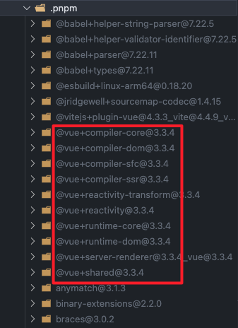
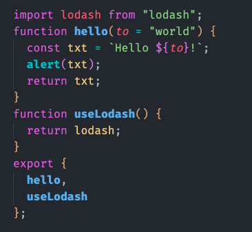
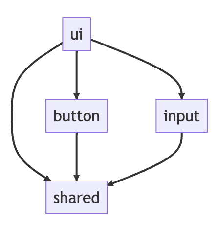
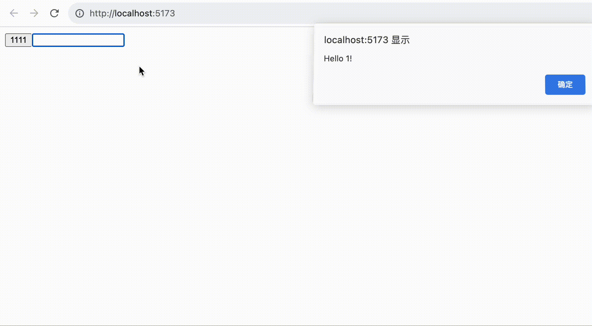

# 从零搭建Vue组件库——02.在 Monorepo 模式下集成 Vite 和 TypeScript - Part 1

> 本文参考了稀土掘金上蘑菇王的系列文章——[《从 0 到 1 搭建 Vue 组件库框架》](https://juejin.cn/post/7254341178258505788)，并通过 Github Copilot 的辅助编写功能进行了修改和补充。

## 导航

系列导航：[00.系列大纲](/articles/engineering-design/build-vue-component-library-from-scratch-00.md)

上一篇：[01.搭建 Monorepo 项目结构](/articles/engineering-design/build-vue-component-library-from-scratch-01.md)

下一篇：[02.在 Monorepo 模式下集成 Vite 和 TypeScript - Part 2](/articles/engineering-design/build-vue-component-library-from-scratch-02-part-2.md)

## 前言

在上一章节中，我们完成了“新建文件夹”的操作，使用 pnpm 为我们的组件库搭建了 monorepo 目录结构。在本章节，我们的组件库工程会开始初成体系——加入构建工具 Vite 和 TypeScript 类型支持，能够真正通过构建生成产物，并充分发挥出 monorepo 模式下开发的灵活性。

## Vite 介绍

> Vite 是一个由原生 ESM 驱动的 Web 开发构建工具，能够显著提升前端开发体验。

Vite 是一个新型的前端构建工具，它的特点是：

- 快速的冷启动：Vite 通过 ES Module 的方式，利用浏览器去解析 import，按需编译。
- 即时的热模块更新：Vite 通过 [HMR](https://v3.cn.vuejs.org/guide/migration/hmr.html#%E6%A6%82%E8%BF%B0) 实现了模块级别的热更新。
- 真正的按需编译：Vite 仅仅会编译那些被请求的模块，而不是像 Webpack 那样把所有的模块都编译一遍。

在我看来，Vite 的快更多地体现在了配置的快、上手的快。对于绝大多数复杂度有限的场景，Vite 都可谓实现了“构建的最佳实践”，大部分工程能力几乎都是开箱即用，极大地减少了构建配置的成本。即使你有深度使用的需求，Vite 也具有 自定义插件 的能力以及良好的 周边生态。

在当下，如果你想要接触一款前端构建工具，我强烈推荐从 Vite 入手。Vite 对于构建工具的初学者而言，能够大幅减少使用传统构建工具时繁琐的概念理解、插件选型、插件文档阅读的困难，快速建立起正反馈，这样才有不断深入学习下去的动力。

## 基本依赖安装

在更多操作开始前，我们先强调一下系列分享编写代码所使用的 IDE 为 VSCode。在操作过程中会涉及相当多的 IDE 使用技巧，如果使用 WebStorm 等其他 IDE 的话，这些知识可能是无法即刻应用的，需要读者自行变通。

### .npmrc 文件（可选）

在安装依赖前，先给大家介绍一下 .npmrc 文件，我们试着在项目的根目录下建立 .npmrc 文件。

```bash
mkdir .npmrc
```

这个 .npmrc 文件相当于项目级的 npm 配置：

```bash
registry=https://registry.npm.taobao.org
```

上面的配置相当于切换 npm 镜像源为 https://registry.npm.taobao.org，只不过配置只在当前项目目录下生效，优先级高于用户设置的本地配置。

这个效果是不是很像 npm set config registry https://registry.npm.taobao.org ？是的，npm set config 的本质是修改用户级的 .npmrc 文件，这个文件在 C:\Users\${用户名}\.npmrc(Windows 系统) 或者 ~/.npmrc(Linux 系统) 位置。

我推荐大家将一些必要的配置放在这个项目级的 .npmrc 文件中，并且将这个文件提交到代码仓，这样就可以使后续贡献的其他用户免去许多环境配置的麻烦，尤其是在公司的内网环境下，各式各样的 npm 私仓和代理配置让很多新人头疼。

当然，如果你是开源项目，就不是很推荐你在里面做网络环境相关的配置了，因为每个贡献者的网络环境是多样化的，这时项目级的 .npmrc 就只适合放一些与包管理相关的配置。

### 安装公共构建依赖

接下来，我们要在根目录下安装所需的构建工具：Vite 和 TypeScript。

```bash
pnpm i -wD vite typescript
```

因为每个包都需要用到 Vite 和 TypeScript 进行构建，我们在上一章 [从零搭建Vue组件库——01.搭建 Monorepo 项目结构](/articles/engineering-design/build-vue-component-library-from-scratch-01.md) 讲过，公共开发依赖统一安装在根目录下，是可以被各个子包正常使用的。

由于我们要构建的是 Vue 组件库，Vue 推荐的组件开发范式 单文件组件 SFC 并不是原生的 Web 开发语法，而是 Vue 方面定义的“方言”，需要经过一个编译为原生 js 的过程。因此我们需要引入相关的 Vite 插件 @vitejs/plugin-vue，这个插件集成了 vue 编译器的能力，使得构建工具能够理解 Vue SFC 模板。

```bash
pnpm i -wD @vitejs/plugin-vue
```

vue 应该被安装到根目录下的 dependencies，因为几乎所有子包的 peerDependencies 中都具有 vue(peerDependencies 相关可以复习[从零搭建Vue组件库——01.搭建 Monorepo 项目结构](/articles/engineering-design/build-vue-component-library-from-scratch-01.md))，我们结合 pnpm 的 resolve-peers-from-workspace-root 机制，可以统一所有子包中 vue 的版本

```bash
pnpm i -wS vue
```

关于 [resolve-peers-from-workspace-root](https://pnpm.io/zh/npmrc#resolve-peers-from-workspace-root) 的说明：

> 默认为 true。 启用后，将会使用根工作区项目的 dependencies 解析工作区中任何项目的 peer dependencies。这是一个有用的功能，因为你可以只在工作区的根目录中安装 peer dependencies，并且确保工作区中的所有项目都使用相同版本的 peer dependencies。

这一步操作正确的标志，是根目录 node_modules/.pnpm 路径下的 vue 系列包只有一个版本。如果同时出现 3.0.0 和 3.x.x 的 vue，说明操作未到位，3.0.0 版本的 vue 将导致构建过程中出现错误。



另外，如果喜欢使用 CSS 预处理器的话，也要在根目录下进行安装，这里我选择安装 Sass，大家也可以根据自己的喜好选择其他的预处理器，例如 Less、Stylus 等。

```bash
pnpm i -wD sass
```

## Vite 集成

为了成功集成 Vite，让我们的组件库能够构建出产物，这里我们需要完成三个步骤，分别是：

- 编写构建目标源码。因为本系列文章的重点是工程化而为组件库的开发，代码预备部分我们不会实现组件的实际功能，只给出能够提现构建要点的 demo 代码。
- 准备 vite.config 配置文件。
- 在 package.json 中设置构建脚本。

我们先回顾上一章节所规划的 monorepo 目录机构，在集成 Vite 的过程中，我们会对它做非常多的扩展：

1. 对于 packages 目录下的每一个组件包，我们制定了更细的源码组织规则：
   - 各种配置文件，如 package.json、vite.config.ts(js)，都放在模块根目录下。
   - src 目录下存放源码，其中 src/index.ts(js) 作为这个模块的总出口，所有需要暴露给外部供其他模块使用的方法、对象都要在这里声明导出。
   - dist 目录作为产物输出目录，当然如果没执行过构建命令，这个目录是不会生成的。
2. 在 packages 目录下新建统一出口包，命名为 wonderful-element。正如 element-plus 主包负责集合各个子包，并统一导出其中内容一般。
3. 我们还没走到搭建 demo 文档的阶段，但又迫不及待地想看到组件的实际效果，为了满足这个需求，我们要在根目录下建立 demo 模块，这个模块是一个 Web 应用，用来展示组件，同时验证我们的 monorepo 架构是否能立即响应子模块的更新修改。
4. 关于 tsconfig，我们会在集成 TypeScript 的阶段进行说明。

```bash
📦wonderful-element
 ┣ 📂docs
 ┃ ┗ 📜package.json
 ┣ 📂demo               # 展示组件效果的 Web 应用
 ┃ ┣ 📂node_modules
 ┃ ┣ 📂dist
 ┃ ┣ 📂public
 ┃ ┣ 📂src
 ┃ ┣ 📜index.html
 ┃ ┣ 📜vite.config.ts
 ┃ ┣ 📜tsconfig.json
 ┃ ┗ 📜package.json
 ┣ 📂packages
 ┃ ┣ 📂button
 ┃ ┃ ┣ 📂node_modules
 ┃ ┃ ┣ 📂dist           # 组件产物目录
 ┃ ┃ ┣ 📂src            # 组件源码目录
 ┃ ┃ ┃ ┣ 📜Button.vue
 ┃ ┃ ┃ ┗ 📜index.ts
 ┃ ┃ ┣ 📜package.json
 ┃ ┃ ┗ 📜vite.config.ts
 ┃ ┣ 📂input
 ┃ ┃ ┗ 📜...
 ┃ ┣ 📂shared
 ┃ ┃ ┗ 📜...
 ┃ ┗ 📂wonderful-element              # 组件库主包，各组件的统一出口
 ┃   ┗ 📜...
 ┣ 📜package.json
 ┣ 📜tsconfig.json
 ┣ 📜tsconfig.base.json
 ┣ 📜tsconfig.node.json
 ┣ 📜tsconfig.src.json
 ┣ 📜pnpm-workspace.yaml
 ┗ 📜README.md
```

因为我们规定了每个模块的 dist 都作为产物输出目录，而输出产物是不需要入仓的(clone 代码后执行构建命令就能生成)，所以要注意在根目录的 .gitignore 中添加产物目录 dist：

```diff
# .gitignore
node_modules
+dist
```

### 公共方法代码预备

在上一章的规划中([从零搭建Vue组件库——01.搭建 Monorepo 项目结构](/articles/engineering-design/build-vue-component-library-from-scratch-01.md))，我们安排 @wonderful-element/shared 作为公具方法包，将成为所有其他模块的依赖项。

我们假定工具方法中有一个打印 Hello World 的方法。另外，为了演示引入外部依赖的工程能力，我们还要导出一个方法 useLodash，这个方法原封不动地返回 lodash 实例对象。index.ts 会作为出口统一导出这些方法。下面展示操作步骤。

```bash
// 模块源码目录
📦shared
 ┣ ...
 ┣ 📂src
 ┃ ┣ 📜hello.ts
 ┃ ┣ 📜index.ts
 ┃ ┗ 📜useLodash.ts
 ┣ ...
```

```bash
# 为 shared 包安装 lodash 相关依赖
pnpm --filter @wonderful-element/shared i -S lodash @types/lodash
```

正在学习 TypeScript 的同学，如果对语法存在疑惑，可以及时前往 [TypeScript 官网](https://www.typescriptlang.org/zh/) 补充知识。

```ts
// packages/shared/src/hello.ts
export function hello(to: string = 'World') {
  const txt = `Hello ${to}!`
  alert(txt)
  return txt
}
```

```ts
// packages/shared/src/useLodash.ts
import lodash from 'lodash'

export function useLodash() {
  return lodash
}
```

```ts
// packages/shared/src/index.ts
export * from './hello'
export * from './useLodash'
```

### 组件代码预备

#### button 组件

我们先设置 button 组件的初始代码，为了演示 monorepo 工程中内部模块之间互相依赖的特性，我们假定按钮组件的用例为点击之后打印 Hello ${props.hello}，那么 button 将依赖于先前定义的 shared 模块中的 hello 方法。我们先通过 pnpm workspace 命令声明内部模块关联：

```bash
pnpm --filter wonderful-element/button i -S wonderful-element/shared
```

当然，我们也可以先在子模块下的 package.json 中按照 workspace 协议 手动声明内部依赖，然后通过 pnpm -w i 执行全局安装，也能达到和上面那条命令一样的效果，两种方式二选一即可。

```diff
// packages/button/package.json
{
  // ...
  "dependencies": {
+   "wonderful-element/shared": "workspace:^"
  }
}
```

接下来，实现 button 组件代码，并在 index.ts 中导出。

```bash
📦button
 ┣ ...
 ┣ 📂src
 ┃ ┣ 📜button.vue
 ┃ ┗ 📜index.ts
 ┣ ...
```

正在学习 Vue 框架的同学，如果对 demo 代码存在疑惑，可以及时前往 [Vue 官网](https://cn.vuejs.org/) 补充知识。

注意，这里 import from 'wonderful-element/shared' 语句在 IDE 中可能会出现 ts 报错，这个不影响构建，我们暂时忽略它，在后续 TypeScript 实操部分会解决。

```html
<script setup lang="ts">
  // packages/button/src/button.vue
  import { hello } from 'wonderful-element/shared'

  const props = withDefaults(
    defineProps<{
      text?: string
    }>(),
    {
      text: 'World',
    },
  )

  function clickHandler() {
    hello(props.text)
  }
</script>

<template>
  <button class="w-button" @click="clickHandler">
    <slot></slot>
  </button>
</template>
```

```ts
// packages/button/src/index.ts
import Button from './button.vue'

export { Button }
```

#### input 组件

按照类似的方式，也简单实现处理一下 input 模块。我们假定 input 输入框组件实现的用例是监听内容变化，调用 hello 方法打印当前输入的内容。

```bash
pnpm --filter wonderful-element/input i -S wonderful-element/shared
```

```html
<script setup lang="ts">
  // packages/input/src/input.vue
  import { hello } from 'wonderful-element/shared'

  withDefaults(
    defineProps<{
      modelValue?: string
    }>(),
    {
      modelValue: '',
    },
  )

  const emit = defineEmits<{
    (event: 'update:modelValue', val: string): void
  }>()

  function inputHandler(e: any) {
    const value: string = e.target.value
    emit('update:modelValue', value)
    hello(value)
  }
</script>

<template>
  <input class="w-input" type="text" :value="modelValue" @input="inputHandler" />
</template>
```

```ts
// packages/input/src/index.ts
import Input from './input.vue'

export { Input }
```

### 统一出口包

wonderful-element 模块作为各个组件的统一出口，需要在 package.json 中正确声明与所有组件的依赖关系，之后每增加一个新组件，都应该在 wonderful-element 模块中补充导出代码。

```json
// packages/wonderful-element/package.json
{
  // 其他字段完全参考 button 即可
  "dependencies": {
    "wonderful-element/button": "workspace:^",
    "wonderful-element/input": "workspace:^",
    "wonderful-element/shared": "workspace:^"
  }
}
```

完成声明后，执行 pnpm -w i 更新依赖。

之后在 src/index.ts 文件中将各个模块的内容导出即可。

```ts
// packages/wonderful-element/src/index.ts
export * from 'wonderful-element/button'
export * from 'wonderful-element/input'
export * from 'wonderful-element/shared'
```

### 构建公共方法模块(纯 JS/TS 代码)

按照 [Vite 官方介绍的配置方法](https://cn.vitejs.dev/config/#config-intellisense)，我们在公共方法模块 shared 包中添加 vite.config.ts，这个配置文件将告诉 vite 如何构建这个模块。

组件库项目的模块自然要以库模式构建，Vite 能够很好地支持这种构建方式，官方文档也对这种用法进行了 [说明](https://cn.vitejs.dev/guide/build.html#library-mode)。

我们编写一个库模式下最简单的 vite.config 文件，并将 package.json 中的 build 脚本修改成 Vite 构建指令。

```ts
// packages/shared/vite.config.ts
import { defineConfig } from 'vite'

export default defineConfig({
  build: {
    // 产物输出目录，默认值就是 dist。我们使用默认值，注释掉此字段。
    // outDir: 'dist',

    // 参考：https://cn.vitejs.dev/config/build-options.html#build-lib
    lib: {
      // 构建的入口文件
      entry: './src/index.ts',

      // 产物的生成格式，默认为 ['es', 'umd']。我们使用默认值，注释掉此字段。
      // formats: ['es', 'umd'],

      // 当产物为 umd、iife 格式时，该模块暴露的全局变量名称
      name: 'WonderfulElementShared',
      // 产物文件名称
      fileName: 'wonderful-element-shared',
    },
    // 为了方便学习，查看构建产物，将此置为 false，不要混淆产物代码
    minify: false,
  },
})
```

```diff
// packages/shared/package.json
{
  // ...
  "scripts": {
-   "build": "echo build",
+   "build": "vite build",
    "test": "echo test"
  },
}
```

之后，执行 shared 包的构建指令，Vite 会自动读取对应的 vite.config 文件，生成构建产物。

```bash
pnpm --filter @wonderful-element/shared run build

# 以下为指令输出
vite v4.4.4 building for production...
✓ 6 modules transformed.
dist/wonderful-element-shared.mjs  213.46 kB │ gzip: 41.73 kB
dist/wonderful-element-shared.umd.js  224.92 kB │ gzip: 42.24 kB
✓ built in 751ms
```

在默认情况下，Vite 会为我们生成 .mjs 和 .umd.js 后缀的产物，可以满足绝大多数情况下对于产物格式的要求。其中 .mjs 对应 esm 格式的可用产物，.umd.js 对应 cjs 格式的可用产物。我们按照产物的路径，在 package.json 中修改对应的入口字段(回顾：[从零搭建Vue组件库——01.搭建 Monorepo 项目结构](/articles/engineering-design/build-vue-component-library-from-scratch-01.md))：

```json
// packages/shared/package.json
{
  // 省略其他无关配置 ...
  "main": "./dist/wonderful-element-shared.umd.js",
  "module": "./dist/wonderful-element-shared.mjs",
  "exports": {
    ".": {
      "require": "./dist/wonderful-element-shared.umd.js",
      "module": "./dist/wonderful-element-shared.mjs"
      // ...
    }
  }
}
```

但是，我们仅仅导出了两个很短小的方法，生成的产物却有 200K 之大，这是为什么呢？这时因为我们安装的 npm 包 lodash 的代码也被打包进来了。

构建工具打包时默认行为，是将所有涉及模块的代码都一并集合到产物中。这在打包 Web 应用的时候是没问题的，因为浏览器并不能识别 npm 模块，所以产物就需要包含所有代码。可我们正在打包的东西将作为 npm 包给其他应用安装，在工程环境下，构建工具是可以识别模块引入语法的。

因此，我们在为 库 / npm 包 构建产物时，在实践中通常会将依赖项(package.json 中 dependencies、peerDependencies 字段下的依赖)声明为 external(外部依赖)，使这个依赖相关的源码不被整合进产物，而是保留着 import xxx from 'pkg' 的导入语句。

我们修改 vite.config 文件，增加 rollupOptions 选项，将依赖项 lodash 声明为外部模块：

```ts
// packages/shared/vite.config.ts
import { defineConfig } from 'vite'

export default defineConfig({
  build: {
    // 其他配置...

    // 参考：https://cn.vitejs.dev/config/build-options.html#build-rollupoptions
    rollupOptions: {
      // 确保外部化处理那些你不想打包进库的依赖
      external: [/lodash.*/],

      output: {
        // 在 UMD 构建模式下为这些外部化的依赖提供一个全局变量。即使不设置，构建工具也会为我们自动生成。个人倾向于不设置
        /*
        globals: {
          lodash: 'lodash'
        }
        */
      },
    },
  },
})
```

再次执行构建指令，我们可以看到产物体积大幅缩小。

```bash
pnpm --filter @wonderful-element/shared run build

# 以下为指令输出
vite v4.4.4 building for production...
✓ 3 modules transformed.
dist/wonderful-element-shared.mjs  0.20 kB │ gzip: 0.15 kB
No name was provided for external module "lodash" in "output.globals" – guessing "lodash".
dist/wonderful-element-shared.umd.js  0.69 kB │ gzip: 0.36 kB
✓ built in 93ms
```

检查 dist 目录下的产物可以发现，外部依赖 lodash 不再被打包进源码，而是保持原本的引入语句。外部化处理依赖对于库的开发者而言是一件非常严肃的事情，产物的大小会直接影响下游用户的使用体验。



### 构建组件模块(包含 Vue SFC 模板)

不同于公共方法模块的纯 ts/js 代码，Vue 组件通常要涉及到对开发范式 [单文件组件 SFC](https://cn.vuejs.org/guide/scaling-up/sfc.html) 的识别。幸运的是，Vite 提供了官方插件 [@vitejs/plugin-vue](https://github.com/vitejs/vite-plugin-vue/tree/main/packages/plugin-vue) 来处理这个复杂的编译任务。

我们以 button 模块为例子来演示 Vue 组件的构建配置：

- 在先前 shared 模块的基础上，我们需要进一步加入插件 @vitejs/plugin-vue 来处理 .vue 文件。
- 依赖外部化处理也要注意，button 模块依赖的 shared 模块因为在 dependencies 字段中已声明，因此将其排除。同时 peerDependencies vue 也应当被排除。
- 将 package.json 中的 build 命令更换为 vite build。

```ts
// packages/button/vite.config.ts
import { defineConfig } from 'vite'
import vue from '@vitejs/plugin-vue'

export default defineConfig({
  // 增加插件的使用
  plugins: [vue()],
  build: {
    lib: {
      entry: './src/index.ts',
      name: 'WonderfulElementButton',
      fileName: 'wonderful-element-button',
    },
    minify: false,
    rollupOptions: {
      external: [
        // 除了 @wonderful-element/shared，未来可能还会依赖其他内部模块，不如用正则表达式将 @wonderful-element 开头的依赖项一起处理掉
        /@wonderful-element.*/,
        'vue',
      ],
    },
  },
})
```

完成上述操作后，执行 button 包的构建命令，输出产物。

```bash
pnpm --filter @wonderful-element/button run build

# 以下为指令输出
vite v4.4.4 building for production...
✓ 5 modules transformed.
dist/style.css           0.06 kB │ gzip: 0.08 kB
dist/wonderful-element-button.mjs  0.94 kB │ gzip: 0.50 kB
No name was provided for external module "vue" in "output.globals" – guessing "vue".
No name was provided for external module "@wonderful-element/shared" in "output.globals" – guessing "shared".
dist/wonderful-element-button.umd.js  1.44 kB │ gzip: 0.71 kB
✓ built in 622ms
```

构建成功后，根据产物路径修改 package.json 的入口字段。

```json
// packages/button/package.json
{
  // 省略其他无关配置 ...
  "main": "./dist/wonderful-element-button.umd.js",
  "module": "./dist/wonderful-element-button.mjs",
  "exports": {
    ".": {
      "require": "./dist/wonderful-element-button.umd.js",
      "module": "./dist/wonderful-element-button.mjs"
      // ...
    }
  }
}
```

### 整体构建

最后还剩下统一出口 ui 模块，由于只有导出语句，暂不需要 @vitejs/plugin-vue 插件，它的处理方式与 shared 模块类似。

到此为止，所有组件的构建都完成了，我们可以通过 [路径过滤器](https://pnpm.io/zh/filtering#--filter-glob---filter-glob) 选中 packages 目录下所有包进行构建。

```bash
pnpm --filter "./packages/**" run build
```

由于 wonderful-element 是组件库的统一出口包，它的 package.json 的 dependencies 字段中声明了所有其他模块，我们也可以用依赖过滤器 ...，构建 ui 以及其所有的依赖项，达到整体构建的效果。不过如果不能确保所有包都在 ui 中再进行一次导出，还是采用前者更佳。

```bash
pnpm --filter wonderful-element... run build
```

执行结果如下：

```bash
Scope: 4 of 6 workspace projects
packages/shared build$ vite build
│ vite v4.4.9 building for production...
│ transforming...
│ ✓ 3 modules transformed.
│ rendering chunks...
│ computing gzip size...
│ dist/wonderful-element-shared.mjs  0.20 kB │ gzip: 0.15 kB
│ No name was provided for external module "lodash" in "output.globals" – guessing "lodash".
│ dist/wonderful-element-shared.umd.js  0.70 kB │ gzip: 0.37 kB
│ ✓ built in 84ms
└─ Done in 547ms
packages/button build$ vite build
│ vite v4.4.9 building for production...
│ transforming...
│ ✓ 3 modules transformed.
│ rendering chunks...
│ computing gzip size...
│ dist/wonderful-element-button.mjs  0.62 kB │ gzip: 0.35 kB
│ No name was provided for external module "vue" in "output.globals" – guessing "vue".
│ No name was provided for external module "@wonderful-element/shared" in "output.globals" – guessing "shared".
│ dist/wonderful-element-button.umd.js  1.11 kB │ gzip: 0.56 kB
│ ✓ built in 626ms
└─ Running...
packages/input build$ vite build
│ vite v4.4.9 building for production...
│ transforming...
└─ Done in 1s transformed.
│ rendering chunks...
│ computing gzip size...
│ dist/wonderful-element-input.mjs  0.74 kB │ gzip: 0.40 kB
│ No name was provided for external module "vue" in "output.globals" – guessing "vue".
│ No name was provided for external module "@wonderful-element/shared" in "output.globals" – guessing "shared".
│ dist/wonderful-element-input.umd.js  1.25 kB │ gzip: 0.61 kB
│ ✓ built in 653ms
└─ Done in 1s
packages/wonderful-element build$ vite build
│ vite v4.4.9 building for production...
│ transforming...
[1 lines collapsed]
│ rendering chunks...
│ computing gzip size...
│ dist/wonderful-element.mjs  0.13 kB │ gzip: 0.08 kB
│ No name was provided for external module "@wonderful-element/button" in "output.globals" – guessing "button".
│ No name was provided for external module "@wonderful-element/input" in "output.globals" – guessing "input".
│ No name was provided for external module "@wonderful-element/shared" in "output.globals" – guessing "shared".
│ dist/wonderful-element.umd.js  1.39 kB │ gzip: 0.45 kB
└─ Running...
│ ✓ built in 55ms
└─ Done in 401ms
```

观察命令行输出，可以发现整个打包执行顺序(shared -> button & input(并行) -> ui) 是符合依赖树的拓扑排序的(回顾：[从零搭建Vue组件库——01.搭建 Monorepo 项目结构](/articles/engineering-design/build-vue-component-library-from-scratch-01.md))。由于我们用 rollupOptions.external 外部化了依赖，这个特性现在对我们而言无关紧要，但在未来定制完善的打包体系，需要研究全量构建时，拓扑排序的特性就会变得非常关键。



我们将组件库的整体构建命令写入根目录下的 package.json，后续我们将通过 pnpm run build:ui 更快捷地执行构建。

```diff
// package.json
{
  // ...
  "scripts": {
-   "hello": "echo 'hello world'"
+   "build:ui": "pnpm --filter ./packages/** run build"
  },
}
```

## 搭建 demo 应用演示组件效果

我们正好借助创建 demo 演示模块来给大家分享如何在 monorepo 项目里建立一个网站应用模块。我们先设置好 demo 模块的目录结构：

```bash
📦wonderful-element
 ┣ 📂...
 ┣ 📂demo
 ┃ ┣ 📂node_modules
 ┃ ┣ 📂dist
 ┃ ┣ 📂public
 ┃ ┣ 📂src
 ┃ ┃ ┣ 📂main.ts
 ┃ ┃ ┗ 📜App.vue
 ┃ ┣ 📜index.html
 ┃ ┣ 📜vite.config.ts
 ┃ ┣ 📜tsconfig.json
 ┃ ┗ 📜package.json
```

由于 demo 是新添加的模块，需要在 pnpm-workspace.yaml 中补充声明这个工作空间：

```diff
// pnpm-workspace.yaml
packages:
  - docs
  - packages/*
+ - demo
```

编辑 demo 模块的 package.json：

- 将 wonderful-element 声明为依赖项，导入所有组件；
- script 脚本中添加 vite dev 命令用于运行应用；
- private 设置为 true 避免被当做 npm 包发布。
- 完成编辑后，不要忘记执行 pnpm i -w 更新整个项目的依赖。

```json
// demo/package.json
// 注意实操时删除注释，package.json 不支持注释
{
  "name": "@wonderful-element/demo",
  "private": true,
  "scripts": {
    // 启动 vite 开发服务器运行应用
    "dev": "vite dev"
  },
  "dependencies": {
    "wonderful-element": "workspace:^"
  },
  "devDependencies": {}
}
```

Web 应用是以 index.html 作为入口的。

```html
<!-- demo/index.html -->
<!doctype html>
<html lang="en">
  <head>
    <meta charset="UTF-8" />
    <meta name="viewport" content="width=device-width, initial-scale=1.0" />
    <title>DEMO</title>
  </head>
  <body>
    <div id="app"></div>
    <script type="module" src="/src/main.ts"></script>
  </body>
</html>
```

vite.config 采取默认配置即可，只需加入 vue 插件。

```ts
// demo/vite.config.ts
import { defineConfig } from 'vite'
import vue from '@vitejs/plugin-vue'

export default defineConfig({
  plugins: [vue()],
})
```

之后编辑源码。对于 ts 的报错我们暂不理会，在集成完 TypeScript 后会报错都会消失。

```ts
// demo/src/main.ts
import { createApp } from 'vue'
import App from './App.vue'

createApp(App).mount('#app')
```

```html
<!-- demo/src/App.vue -->
<script setup lang="ts">
  import { Button, Input } from 'wonderful-element'
</script>

<template>
  <div>
    <button>1111</button>
    <input />
  </div>
</template>
```

最后，执行 demo 模块的 dev 命令，启动应用。

```bash
pnpm --filter @wonderful-element/demo run dev

# 输出内容
  VITE v4.4.4  ready in 534 ms

  ➜  Local:   http://localhost:5173/
  ➜  Network: use --host to expose
  ➜  press h to show help
```



## 结尾与资料汇总

由于篇幅原因，上半篇只完成了 Vite 的集成，TypeScript 的实践部分放在下半篇完成。

本章涉及到的相关资料汇总如下：

官网与文档：

[VSCode](https://code.visualstudio.com/)

[WebStorm](https://www.jetbrains.com/webstorm/)

[pnpm](https://pnpm.io/zh/)

[Vite](https://cn.vitejs.dev/)

[Vue](https://cn.vuejs.org/)

[Rollup](https://rollupjs.org/guide/zh/)

[TypeScript](https://www.typescriptlang.org/zh/)

[CSS 预处理器](https://developer.mozilla.org/zh-CN/docs/Glossary/CSS_preprocessor)

[Sass](https://sass-lang.com/)

[Less](https://less.bootcss.com/)

[Stylus](https://stylus.bootcss.com/)

[@vitejs/plugin-vue](https://github.com/vitejs/vite-plugin-vue/tree/main/packages/plugin-vue)
