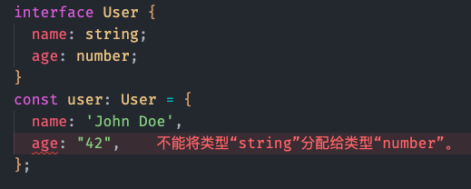
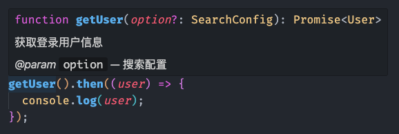
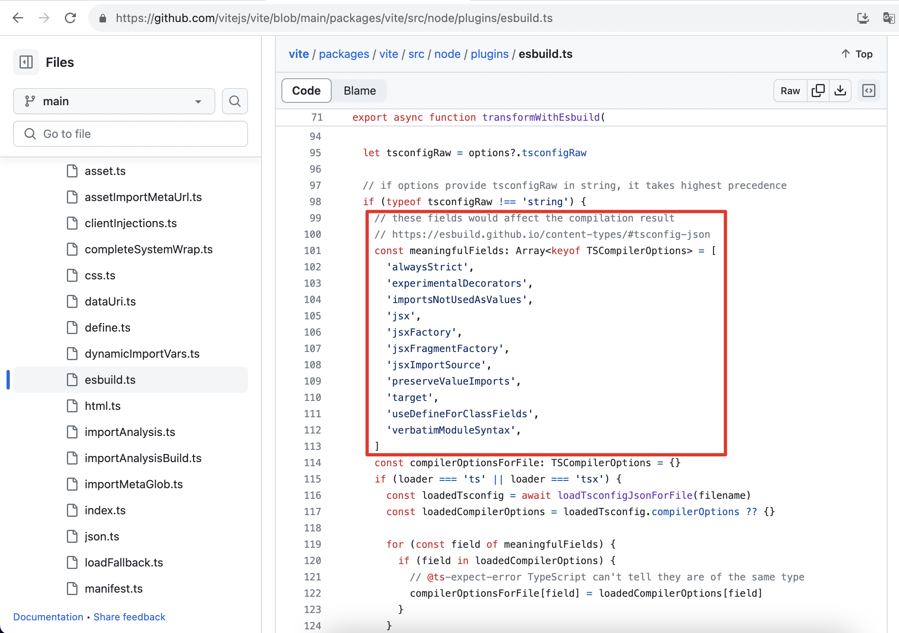
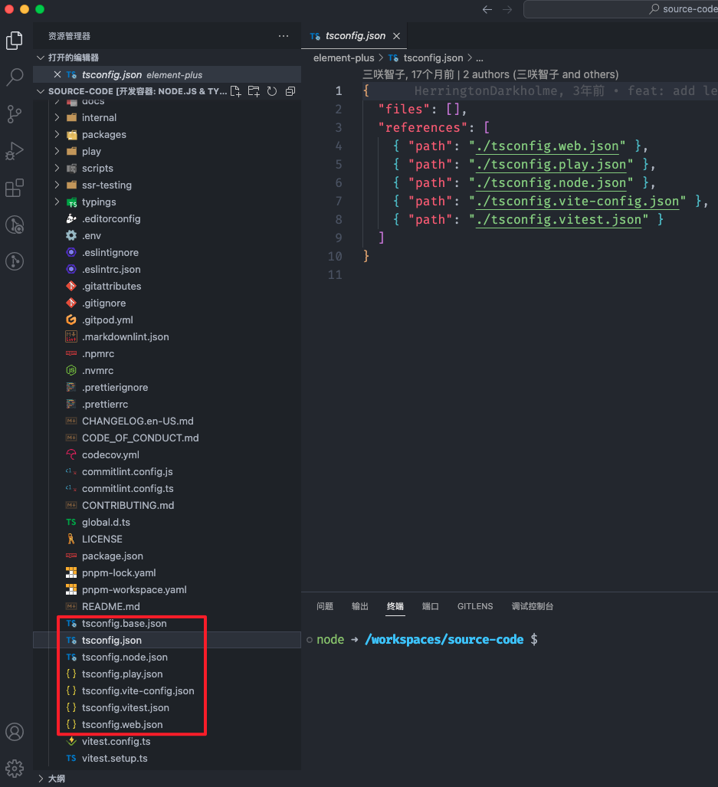
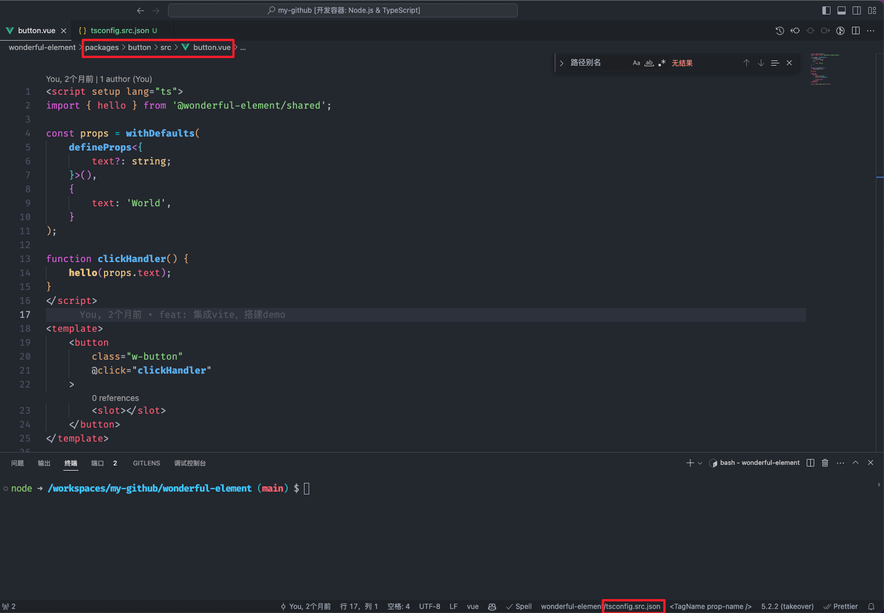
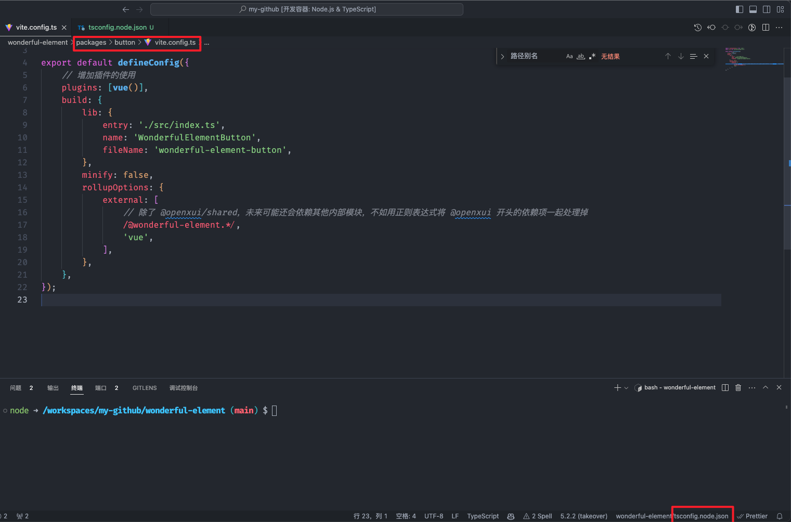
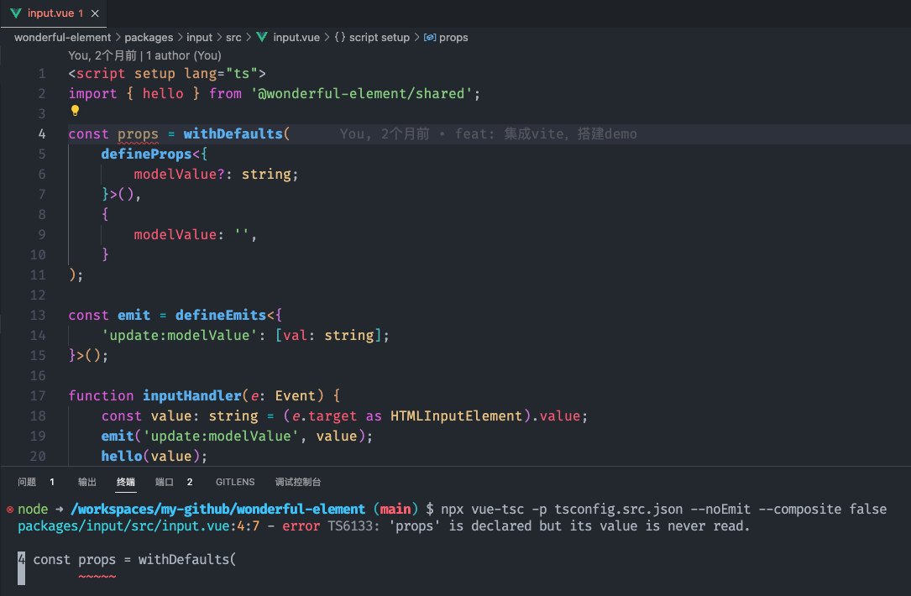
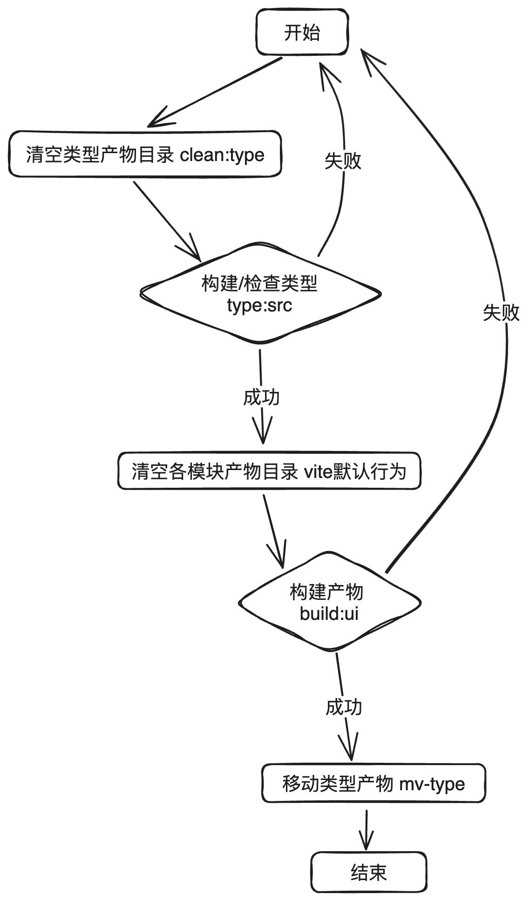
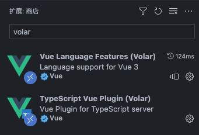

# 从零搭建Vue组件库——02.在 Monorepo 模式下集成 Vite 和 TypeScript - Part 2

> 本文参考了稀土掘金上蘑菇王的系列文章——[《从 0 到 1 搭建 Vue 组件库框架》](https://juejin.cn/post/7254341178258505788)，并通过 Github Copilot 的辅助编写功能进行了修改和补充。

## 导航

系列导航：[00.系列大纲](/articles/engineering-design/build-vue-component-library-from-scratch-00.md)

上一篇：[02.在 Monorepo 模式下集成 Vite 和 TypeScript - Part 1](/articles/engineering-design/build-vue-component-library-from-scratch-02-part-1.md)

上半部分，我们通过集成构建工具 Vite 使组件库能构建出产物。下半部分，我们将要集成 TypeScript，为组件库的开发注入类型系统的支持。

## TypeScript 选型与简介

> TypeScript 是基于 JavaScript 之上构建的强类型编程语言。

选择 TypeScript 的理由已经老生常谈了，总结概述如下：

1. 为 js 添加静态类型检查，提前发现运行时出现的类型错误，将大量错误扼杀在编译阶段，提高代码健壮性。
   
2. 与编辑器结合，获得更好的代码提示，甚至实现“代码即文档”的效果(配合注释)，代码可读性的提高可以大幅减少后人上手成本。
   

我们发现，TypeScript 开始发力、获得收益的场景，都是在项目开发的中后期，而前期往往需要我们更多的努力与投入，这就决定了适合使用 TypeScript 的项目往往要有频繁迭代，长期维护的特点。组件库往往期望得到长期维护，若使用率很高的话，也避免不了频繁迭代。

另外，我个人比起静态类型检查，更加青睐 TypeScript 类型对理解代码提供的帮助。很多第三方库缺少文档，但是如果它有相对可靠的类型声明文件，其中的类型注解和接口声明就足以帮助我理解使用方法。从我个体的感受出发，推及到用户的角度，不难想到如果我们的组件库有完善的类型定义，就能隐性地给使用者带来很多帮助。

## 集成 TypeScript

完成了 Vite 的集成，我们可以开始集成 TypeScript 了。在已经安装好 typescript 公共依赖的情况下，所谓集成其实就是填写 tsconfig.json 文件。大部分项目都用着相似的 tsconfig 预设，且稳定之后在迭代过程中很少修改，因此我们不会对配置项做太多介绍。关于 tsconfig.json 的各个配置项，建议直接查阅[官方说明](https://www.typescriptlang.org/tsconfig)。

### tsconfig 到底为了谁？

在先前集成 Vite 过程中，我们没有做任何一点 TypeScript 配置，甚至无视了 IDE 的相关报错，但是丝毫没有影响 Vite 成功解析了我们的 ts 文件，并且构建出了产物。如果你平时习惯使用 Vite 脚手架生成 ts 项目，可能会感到有点反直觉，以为没有配好 ts 应该会导致构建过程出错。

其实，在 Vite 官方文档中，是这样 [介绍](https://cn.vitejs.dev/guide/features.html#typescript) 与 TypeScript 的关系的：

> Vite 天然支持引入 .ts 文件。请注意，Vite 仅执行 .ts 文件的转译工作，并不执行任何类型检查。并假定类型检查已经被你的 IDE 或构建过程处理了。

Vite 本质上是双引擎架构——内部除了 Rollup 之外，还集成了另一个构建工具 Esbuild。Esbuild 有着超快的编译速度，它在其中负责第三方库构建和 TS/JSX 语法编译。

无论是构建模式还是开发服务器模式，Vite 都通过 Esbuild 来将 ts 文件转译为 js，对这个过程的细节感兴趣的同学，可以前往 [Vite 源码 - Esbuild](https://github.com/vitejs/vite/blob/main/packages/vite/src/node/plugins/esbuild.ts) 插件 分析。

我们可以理解为，Vite 为了保证构建效率，内部并没有执行完整的 tsc 编译过程，而是每当遇到一个 ts 文件，就组装出一个最小化的、剔除了所有与类型检查相关配置的 tsconfig，交由 Esbuild 做转译工作——这个转译只确保生成对应的 js 产物，不做任何多余的事情。因此，仅仅做单文件的转译几乎不需要多少 tsconfig 配置，以至于在没有 tsconfig.json 的情况下，Vite 的转译工作都能在绝大多数情况下获得正确预期结果。

在源码中可以看到，tsconfig.json 只有极其有限的几个字段可能对构建结果产生影响。



既然 tsconfig 对于 Vite 构建的影响如此之小，那么我们配置它更多地是为了什么？其实 Vite 文档中的那句 **“假定类型检查已经被你的 IDE 或构建过程处理了”** 就很好地揭示了答案：

- tsconfig 主要写给 IDE 看的，为了让 IDE 能够实现类型检查，提示我们代码中的类型错误。
- Vite 不负责类型检查，并且推荐我们在构建过程中于另一个进程单独执行类型检查，那么 tsconfig 就应该提供给执行检查任务的编译器 tsc。

### 规划 TypeScript 分治策略

下面我们开始规划整个项目的 tsconfig 配置。对于每个 tsconfig.json 文件，我们主要从以下两个角度理解：

- 每个 tsconfig.json 将一个文件集合声明为一个 ts project(如果称为项目则容易产生概念混淆，故叫做 ts project)，通过 include 描述集合中包含的文件、exclude 字段声明了集合中需要排除的文件。注意，除了 node_modules 中的三方依赖，每个被引用的源码文件都要被包含进来。
- compilerOptions 是编译选项，决定了 TypeScript 编译器在处理该 ts project 包含的文件时所采取的策略与行为。

```json
{
  "compilerOptions": {
    // 项目的编译选项
  },
  "include": [
    // 项目包含哪些文件
  ],
  "exclude": [
    // 在 include 包含的文件夹中需要排除哪些文件
  ]
}
```

include 与 exclude 字段通过 [glob](https://docs.python.org/zh-cn/3/library/glob.html) 语法进行文件匹配，不熟悉的同学可以通过以下文章简单了解：

[前端工程化之强大的glob语法](https://juejin.cn/post/6876363718578405384)

[glob 模式匹配简明教程](https://juejin.cn/post/6844904077801816077)

我们会将整个工程划分为多个 ts project，应该采用什么样的划分依据呢？我们可以参考 element-plus 的划分策略，不是将每个子模块划分为一个 ts project，分散在各个包中管理。而是将功能相似的代码划分到一个 ts project 中，集中在根目录下管理。



对于每个 TypeScript 项目而言，编译选项 compilerOptions 大部分都是重复的，因此我们需要建立一个基础配置文件 tsconfig.base.json，供其他配置文件继承。

```json
// tsconfig.base.json
{
  "compilerOptions": {
    // tsc 编译产物输出目录
    "outDir": "dist",
    // 编译目标 js 的版本
    "target": "es2018",
    // 设置程序的模块系统
    "module": "esnext",
    // 项目基础目录
    "baseUrl": ".",
    // 是否生成辅助 debug 的 .map.js 文件
    "sourceMap": false,
    // 模块解析策略
    "moduleResolution": "node",
    "allowJs": false,
    // 严格模式类型检查，建议开启
    "strict": true,
    // 不允许有未使用的变量
    "noUnusedLocals": true,
    // 允许引入 .json 模块
    "resolveJsonModule": true,
    // 与 esModuleInterop 配合允许从 commonjs 的依赖中直接按 import XX from 'xxx' 的方式引入 default 模块
    "allowSyntheticDefaultImports": true,
    "esModuleInterop": true,
    // 产物不消除注释
    "removeComments": false,
    // 项目的根目录
    "rootDir": ".",
    // 默认引入的模块类型声明
    "types": [],
    // 路径别名设置
    "paths": {
      "@wonderful-element/*": ["packages/*"]
    }
  }
}
```

我们将所有 node 环境下执行的脚本、配置文件划分为一个 ts project，准备其配置文件 tsconfig.node.json。

```json
// tsconfig.node.json
{
  // 继承基础配置
  "extends": "./tsconfig.base.json",
  "compilerOptions": {
    // 该 ts project 将被视作一个部分，通过项目引用(Project References)功能集成到一个 tsconfig.json 中
    "composite": true,
    // node 脚本没有 dom 环境，因此只集成 esnext 库即可
    "lib": ["ESNext"],
    // 继承 Node.js 库函数的类型声明
    "types": ["node"],
    // 跳过库声明文件的类型检查
    "skipLibCheck": true
  },
  "include": [
    // 目前项目中暂时只有配置文件，如 vite.config.ts
    "**/*.config.*"
  ],
  "exclude": [
    // 暂时先排除产物目录，packages/xxx/dist/x.config.js 或者 node_modules/pkg/x.config.js 不会被包含进来
    "**/dist",
    "**/node_modules"
  ]
}
```

对于所有模块中 src 目录下的源码文件，它们几乎都是组件库的实现代码，大多要求浏览器环境下特有的 API(例如 DOM API)，且相互之间存在依赖关系。我们创建 tsconfig.src.json 将它们划入同一个 ts project 中。

```json
// tsconfig.src.json
{
  // 继承基础配置
  "extends": "./tsconfig.base.json",
  "compilerOptions": {
    "composite": true,
    // 组件库依赖浏览器的 DOM API
    "lib": ["ESNext", "DOM", "DOM.Iterable"],
    "types": ["node"]
  },
  "include": ["typings/env.d.ts", "packages/**/src"]
}
```

到此，IDE 还是无法正常提供类型服务，我们最终还是要在根目录建立一个总的 tsconfig.json，通过 [项目引用(Project References)功能](https://www.typescriptlang.org/docs/handbook/project-references.html) 将多个 compilerOptions.composite = true 的 ts project 聚合在一起，这样 IDE 才能够识别。

```json
// tsconfig.json
{
  "compilerOptions": {
    "target": "es2022",
    "moduleResolution": "node",

    // vite 会读取到这个 tsconfig 文件(位于工作空间根目录)，按照其推荐配置这两个选项
    // https://cn.vitejs.dev/guide/features.html#typescript-compiler-options
    "isolatedModules": true,
    "useDefineForClassFields": true
  },
  "files": [],
  "references": [
    // 聚合 ts project
    { "path": "./tsconfig.src.json" },
    { "path": "./tsconfig.node.json" }
  ]
}
```

[项目引用(Project References)](https://www.typescriptlang.org/docs/handbook/project-references.html) 特性，简单理解就是为项目的不同部分应用不同 tsconfig 的能力，如果希望更详细地了解，除了官方文档外，推荐阅读以下文章：

[探究 tsconfig.node.json 文件和 references 字段的作用](https://juejin.cn/post/7126043888573218823)

[Nest.js 这么大的项目是怎么优化 ts 编译性能的？](https://juejin.cn/post/7181462211964076093)

完成配置后，若出现下图中的效果，且源代码中没有任何 ts 报错，则代表我们的配置是完全正确的——对于组件源码文件，IDE 准确地识别了它的归属 tsconfig.src.json。Vite 配置文件作为 Node.js 脚本，也被 IDE 划拨到 tsconfig.node.json。




注意：VSCode 的 TypeScript 状态有时会有更新延迟。遇到这种情况，可以尝试通过 Ctrl + P 调出命令框，搜索 reload 关键字，执行 Developer: Reload Window 指令重载 IDE。

如果对 tsconfig 实际应用的编译选项或者包含的文件产生疑惑，可以通过以下命令去验证：

```bash
npx tsc -p tsconfig.src.json --showConfig

# 输出结果
{
    "compilerOptions": {
        # ...
        # 最终编译选项
    },
    "files": [
        # 实际包含的文件
        "./typings/env.d.ts",
        "./packages/button/src/index.ts",
        "./packages/input/src/index.ts",
        "./packages/shared/src/hello.ts",
        "./packages/shared/src/index.ts",
        "./packages/shared/src/useLodash.ts",
        "./packages/ui/src/index.ts"
    ],
    "include": [
        "typings/env.d.ts",
        "packages/**/src"
    ]
}
```

未来随着项目的增长，我们会根据实际情况不断更新这些 tsconfig，例如让已有的 ts project 包含更多的源码；或者划分出新的 ts project(比如测试专用的 tsconfig.test.json)。

最后，我们还要补充一些缺失的类型声明：

- 我们在 tsconfig 文件中设置了 "types": ["node"]，代表注入 Node.js 各种库函数的类型声明，这需要我们在根目录下补充安装 @types/node。

  ```bash
  pnpm i -wD @types/node
  ```

- 我们在 tsconfig.src.json 的 include 字段中包含了 typings/env.d.ts，这是为了让 TypeScript 对于 Vite 的一些特定功能提供类型定义(参考：TypeScript 的智能提示)，我们应该实际创建这个文件。这个文件除了服务于 Vite，在后续可能将其他一些环境相关的类型定义放在这里。

  ```ts
  // typings/env.d.ts
  /// <reference types="vite/client" />
  ```

### demo 应用的 TypeScript 配置

demo 应用(回顾：[从零搭建Vue组件库——02.在 Monorepo 模式下集成 Vite 和 TypeScript - Part 1](./build-vue-component-library-from-scratch-02-part-1.md))由于相对独立，不涉及组件库的核心构建，因此我们在其目录下单独创建 tsconfig.json，并且不通过项目引用关联到根目录的 tsconfig 中：

```json
// demo/tsconfig.json
{
  // 集成基础配置
  "extends": "../tsconfig.base.json",
  "compilerOptions": {
    "baseUrl": ".",
    // Web 应用需要 DOM 环境
    "lib": ["ESNext", "DOM", "DOM.Iterable"],
    // Web 应用不需要 node 相关方法
    "types": [],
    // baseUrl 改变了，基础配置中的 paths 也需要一并重写
    "paths": {
      "@/*": ["src/*"],
      "@wonderful-element/*": ["../packages/*/src"]
    }
  },
  "include": [
    // demo 应用会引用其他子模块的源码，因此都要包含到 include 中
    "../packages/*/src",
    "src"
  ]
}
```

完成配置后，demo 应用源码中的 IDE 报错信息应该全部解决了(重载 IDE 后)。

## monorepo 即刻响应

先前我们提到 monorepo 的一个巨大优势就是模块的修改能够得到即刻反馈，为迭代提供了巨大便利性。在我们这个项目中，这个特点体现为：修改每个组件的源码能立即触发 demo 应用的热更新，每个改动都能立即呈现在展示网页上。

这个效果需要 TypeScript 和 Vite 共同配合实现。这一节我们就来研究我们的方案是如何实现这一效果的。

### tsconfig.json 中的 paths

在上一节我们配置的 tsconfig 中，paths 这项配置是非常值得关注的，它提供了别名转换的功能。例如：

```json
// tsconfig.base.json
{
  "compilerOptions": {
    // ...
    "paths": {
      "@wonderful-element/*": ["packages/*"]
    }
  }
}
```

上面的 paths 配置，会将我们代码中的 import 导入语句按照这样的规则转换：

```ts
// 示例为 @wonderful-element/button 中引入 @wonderful-element/shared

// 原语句
import { hello } from '@wonderful-element/shared'

// ts 编译时转换为
import { hello } from '<rootPath>/<baseUrl>/packages/shared'
```

现在，我们来回顾之前集成 Vite 时([从零搭建Vue组件库——02.在 Monorepo 模式下集成 Vite 和 TypeScript - Part 1](./build-vue-component-library-from-scratch-02-part-1.md))的 packages/button/src/button.vue 文件。

当时 `import { hello } from '@wonderful-element/shared';` 这个语句是报了类型错误的，正确声明 paths 后，这个路径被 TypeScript 正确解析。

<!-- 缺少插图，这里解析的效果和文章不一致 -->

如果你仔细思考过之前所有的操作，特别是联系起前面的一个结论：tsconfig 是写给 IDE 和 tsc 编译器看的，那么很自然会有下面的问题：

- 为什么我们在 tsconfig 的 paths 中设置的路径别名，与我们的包名相同？
- 对于同样的 @wonderful-element/shared，tsc / IDE 理解的和构建工具 Vite 理解的是不是同一个东西？

### 分辨源码与产物

其实，tsc / IDE 和 Vite 对于同样的 @wonderful-element/shared 的理解确实是不一样的：

- tsc 根据 path 中设置的别名，将这个 id 解析成 <rootPath>/<baseUrl>/packages/shared/src，这个对应的是我们的源码文件。
- 但是 Vite 在没有设置别名的情况下，将 @wonderful-element/shared 看做一个 npm 模块，结合其 package.json 的入口字段，最终这个 id 实际被解析为 node_modules/@wonderful-element/shared/dist/wonderful-element-shared.mjs。

简单来说，tsc 定位到了源码文件，因此没有报错。而 Vite 定位到了构建产物，也没有出错。不过 tsc 只负责类型检查，而实打实的执行者是 Vite，Vite 目前读取的是产物而不是源码，这样的机制会导致我们对子模块源码的修改无法立即同步，必须先执行子模块的打包命令，假若子模块的产物目录 dist 被删除，demo 应用甚至会报错崩溃。

<!-- 缺少录屏 -->

有什么办法能让 Vite 的理解与 tsc 一致吗？我们需要设置 Vite 配置中的 [别名 alias](https://cn.vitejs.dev/config/shared-options.html#resolve-alias)，路径别名解析的优先级要高于 npm 模块解析。下面 demo 应用的 Vite 配置中，我们设置的 resolve.alias 可以将所有 import 语句中的 @wonderful-element/xxx 替换为 ../packages/xxx/src，从而命中源码而非产物，这样源码的更新就会及时通过 HMR 机制反馈到页面上了。

```ts
// demo/vite.config.ts
import { defineConfig } from 'vite'
import vue from '@vitejs/plugin-vue'
import { join } from 'node:path'

export default defineConfig({
  plugins: [vue()],
  resolve: {
    alias: [
      {
        find: /^@wonderful-element\/(.+)$/,
        replacement: join(__dirname, '..', 'packages', '$1', 'src'),
      },
    ],
  },
})
```

<!-- 缺少录屏 -->

需要如此设置 alias 别名的，只有需要及时热更新的模块，例如 demo 以及未来的文档 docs。对于子模块之间的互相依赖，就没有必要在对应的 vite.config 中设置 alias 了，因为：

1. 子模块的 dependencies 在打包时都外部化处理了，依赖项实际上并不会被 Vite 读取到。
2. 即使 Vite 可能读取到依赖项，但我们批量打包组件时，pnpm 会为我们做好拓扑排序处理(回顾：[从零搭建Vue组件库——01.搭建 Monorepo 项目结构](./build-vue-component-library-from-scratch-01.md))，永远确保被依赖者先完成打包，依赖者后完成打包。

## TypeScript 类型检查

通过 tsc 命令指定对应的 tsconfig 文件，我们就能对该 ts project 所包含的所有文件进行类型检查。例如我们想对所有源码文件进行类型检查，通过以下命令即可实现。

```bash
# 根目录执行
npx tsc -p tsconfig.src.json --noEmit --composite false
```

在上面的命令中，-p 指定对应的 tsconfig 文件，--noEmit 使构建产物不被输出，--composite false 使得 buildInfo 文件不被输出。

但是，由于源码是 Vue 组件，所以 tsc 命令会报错，我们需要借助 vue-tsc 来支持：

```bash
pnpm i -wD vue-tsc

npx vue-tsc -p tsconfig.src.json --noEmit --composite false
```



接下来，我们把类型检查相关的命令在根目录 package.json 中声明。因为 Node.js 脚本不涉及 Vue 框架，对 tsconfig.node.json 的类型检查就无需 vue-tsc 了。另外，我们也给组件的统一构建指令加上了限制，要求类型检查必须通过才能执行构建。

```diff
// package.json
{
  // ...
  "scripts": {
+   "type:node": "tsc -p tsconfig.node.json --noEmit --composite false",
+   "type:src": "vue-tsc -p tsconfig.src.json --noEmit --composite false",
-   "build:ui": "pnpm --filter ./packages/** run build"
+   "build:ui": "pnpm run type:src && pnpm --filter ./packages/** run build"
  },
}
```

## 生成 d.ts 类型声明产物

到目前为止，我们的组件产物还是有一个比较大的遗憾——缺少 d.ts 类型声明文件。这会导致用户在引用我们的包时，无法获得类型提示信息。

在 Vite 的体系下，生成 d.ts 文件可以借助于插件 [vite-plugin-dts](https://github.com/qmhc/vite-plugin-dts)，然而这次我们并不打算使用这个插件，这个插件在迭代的过程中做了太多兼容以及细节处理，已经过于复杂，特别是在 monorepo 模式下，它内部的路径解析总是出现各种各样的问题。在 3.0.0 主版本更新后，其内部生成 d.ts 的机制已经改为 vue-tsc 实现，我们不如直接使用 [vue-tsc](https://github.com/vuejs/language-tools/tree/master/packages/vue-tsc)。

在先前的类型检查命令的基础上，补充 --declaration 和 --emitDeclarationOnly 选项就可以为所有的包生成 d.ts 文件。

```bash
npx vue-tsc -p tsconfig.src.json --composite false --declaration --emitDeclarationOnly
```

所有的产物都会被生成到 outDir 字段指定的根目录下的 dist。这和我们的需求有所不合，我们希望对应产物能在每个子模块自己的 dist 目录下。

```bash
📦dist
 ┗ 📂packages
 ┃ ┣ 📂button
 ┃ ┃ ┗ 📂src
 ┃ ┃ ┃ ┣ 📜button.vue.d.ts
 ┃ ┃ ┃ ┗ 📜index.d.ts
 ┃ ┣ 📂input
 ┃ ┃ ┗ 📂src
 ┃ ┃ ┃ ┣ 📜index.d.ts
 ┃ ┃ ┃ ┗ 📜input.vue.d.ts
 ┃ ┣ 📂shared
 ┃ ┃ ┗ 📂src
 ┃ ┃ ┃ ┣ 📜hello.d.ts
 ┃ ┃ ┃ ┣ 📜index.d.ts
 ┃ ┃ ┃ ┗ 📜useLodash.d.ts
 ┃ ┗ 📂ui
 ┃ ┃ ┗ 📂src
 ┃ ┃ ┃ ┗ 📜index.d.ts
```

幸运的是，d.ts 产物目录的内部结构与 packages 的结构是一致的，我们可以很容易实现移动产物的脚本。在根目录下建立 scripts 目录，专门用于存放构建相关的脚本，记得在 tsconfig.node.json 里面补充这个新的脚本目录。

```diff
// tsconfig.node.json
{
  // ...
  "include": [
    "**/*.config.*",
+   "scripts"
  ],
}
```

之后在 scripts 目录下创建 dts-mv.ts 脚本实现这个功能。

```ts
// scripts/dts-mv.ts
import { join } from 'node:path'
import { readdir, cp } from 'node:fs/promises'

/** 以根目录为基础解析路径 */
const fromRoot = (...paths: string[]) => join(__dirname, '..', ...paths)

/** 包的 d.ts 产物目录 */
const PKGS_DTS_DIR = fromRoot('dist/packages')

/** 包的目录 */
const PKGS_DIR = fromRoot('packages')

/** 单个包的 d.ts 产物相对目录 */
const PKG_DTS_RELATIVE_DIR = 'dist'

/** 包的代码入口相对目录 */
const PKG_ENTRY_RELATIVE_DIR = 'src'

async function main() {
  const pkgs = await match()
  const tasks = pkgs.map(resolve)
  await Promise.all(tasks)
}

/** 寻找所有需要移动 dts 的包 */
async function match() {
  const res = await readdir(PKGS_DTS_DIR, { withFileTypes: true })
  return res.filter((item) => item.isDirectory()).map((item) => item.name)
}

/**
 * 处理单个包的 dts 移动
 * @param pkgName 包名
 */
async function resolve(pkgName: string) {
  try {
    const sourceDir = join(PKGS_DTS_DIR, pkgName, PKG_ENTRY_RELATIVE_DIR)
    const targetDir = join(PKGS_DIR, pkgName, PKG_DTS_RELATIVE_DIR)
    const sourceFiles = await readdir(sourceDir)
    const cpTasks = sourceFiles.map((file) => {
      const source = join(sourceDir, file)
      const target = join(targetDir, file)
      console.log(`[${pkgName}]: moving: ${source} => ${target}`)
      return cp(source, target, {
        force: true,
        recursive: true,
      })
    })
    await Promise.all(cpTasks)
    console.log(`[${pkgName}]: moved successfully!`)
  } catch (e) {
    console.log(`[${pkgName}]: failed to move!`)
  }
}

main().catch((e) => {
  console.error(e)
  process.exit(1)
})
```

ts 脚本不能直接执行，要借助额外的工具，例如：[tsx](https://github.com/esbuild-kit/tsx)、[ts-node](https://github.com/TypeStrong/ts-node)。个人比较倾向于用 tsx，相较而言免配置，问题少。此外，由于 tsc 不具备清空输出目录的功能，为了避免混淆输出产物，我们可以选择安装工具 [rimraf](https://github.com/isaacs/rimraf) 来负责清空产物目录。

```bash
pnpm i -wD tsx

pnpm i -wD rimraf
```

具备了一切基础条件后，我们修改 package.json 里的相关脚本操作，将清空产物目录、构建类型、构建产物三个主要步骤按照合理的流程组合起来。只需执行一条 pnpm run build:ui 就可以完成整套构建流程。



```diff
// package.json
{
  // ...
  "scripts": {
    // ...
+   "clean:type": "rimraf ./dist",
    "type:node": "tsc -p tsconfig.node.json --noEmit --composite false",
-   "type:src": "vue-tsc -p tsconfig.src.json --noEmit --composite false",
+   "type:src": "pnpm run clean:type && vue-tsc -p tsconfig.src.json --composite false --declaration --emitDeclarationOnly",
+   "mv-type": "tsx ./scripts/dts-mv.ts",
-   "build:ui": "pnpm run type:src && pnpm --filter ./packages/** run build",
+   "build:ui": "pnpm run type:src && pnpm --filter ./packages/** run build && pnpm run mv-type"
  },
}
```

当然，不要忘记给所有子包补充类型声明文件入口字段，这里以 button 组件为例：

```diff
// packages/button/package.json
{
  // ...
  "main": "./dist/openxui-button.umd.js",
  "module": "./dist/openxui-button.mjs",
- "types": "",
+ "types": "./dist/index.d.ts",
  "exports": {
    ".": {
      "require": "./dist/openxui-button.umd.js",
      "module": "./dist/openxui-button.mjs",
-     "types": ""
+     "types": "./dist/index.d.ts"
    }
  },
}
```

<!-- 缺少 类型错误导致构建失败 演示录屏 -->

<!-- 缺少 侯建流程成功 演示录屏 -->

## 集成相关 IDE 插件

最后，推荐大家安装 Vue 官方推荐的 IDE 插件：[TypeScript Vue Plugin](https://marketplace.visualstudio.com/items?itemName=Vue.vscode-typescript-vue-plugin) 和 [Volar](https://marketplace.visualstudio.com/items?itemName=Vue.volar)，分别对 Vue 开发提供了类型支持和语言特性支持，在插件市场中能够直接搜索到。



安装完成后，为了让 Vue 与 TypeScript 配合地更好，支持导出组件的实例类型，建议按照官方推荐开启 [Takeover 模式](https://cn.vuejs.org/guide/typescript/overview.html#volar-takeover-mode)，相关阅读内容：

[为组件模板引用标注类型](https://cn.vuejs.org/guide/typescript/composition-api.html#typing-component-template-refs)

[Volar Takeover 模式](https://cn.vuejs.org/guide/typescript/overview.html#volar-takeover-mode)

既然结合了 IDE 插件，我们也要设身处地地为我们潜在的贡献者着想，将我们正在享受的优质体验也分享给他们。这就又需要先前提到的 .vscode 目录了，这次我们在其中建立两个新文件：

- 建立 settings.json 文件，用与指定 IDE 配置，这些配置只会在本项目中生效。我们让 Volar 使用项目中安装的新版本 ts 而非全局安装或者 IDE 中内置的老版本。
  ```json
  // .vscode/settings.json
  {
    "typescript.tsdk": "node_modules/typescript/lib"
  }
  ```

* 建立 extensions.json 文件，将两款新插件的 id 加入到推荐列表，IDE 会主动询问打开项目的新用户是否安装这些插件。

  ```json
  // .vscode/extensions.json
  {
    "recommendations": ["vue.volar", "vue.vscode-typescript-vue-plugin"]
  }
  ```

* 后续涉及到其他 IDE 插件的使用时，我们还会回来频繁配置这两个文件。

## 结尾与资料汇总

本以为集成两个构建工具是非常简单的事情，但是实际上却发散出了如此多的细节。在本文的最后，我们再梳理一下思路：

1. 首先我们要在项目的根目录安装公共依赖，公司内网的项目可以使用 .npmrc 文件指定特殊网络环境下的 npm 配置，并提交到仓库中方便他人安装依赖。
2. 接着我们为每一个子包预设了源码，填写了 vite.config 文件，在 package.json 中配置 build 构建脚本。添加 @vitejs/plugin-vue 插件可以使 Vite 识别 Vue SFC 语法；用 pnpm 过滤器选中所有子包执行 build 命令，可以达到整体构建的目的。
3. 之后，我们在 monorepo 项目下搭建了一个 web 应用作为临时样例，展示我们的组件。
4. 我们发现即使没有配置 TypeScript，仅仅 Vite 也能够成功构建 ts 代码。经过研究后，我们明确了 Vite 只负责转译，tsconfig 的配置大部分对于 Vite 是不生效的，这些配置主要影响 IDE 语言服务以及 tsc 的类型检查。
5. 我们没有采用每个子项目一个 tsconfig 的组织方式，而是按照代码用途的区别(node脚本和源码)划分不同的 tsconfig 配置，在根目录下集中管理。但对于 demo 样例应用，由于其不参与集中构建，我们独立为其设置了 tsconfig.json。
6. 我们通过将 tsconfig 的 paths 路径别名设置得与 monorepo 下的包名一致，使得 IDE 将内部依赖解析到对应的源码而非产物，又对 Vite 的 resolve.alias 别名做了同样的设置，最终我们的 demo 样例项目实现了热更新——修改其依赖的组件源码，能够立即反馈在页面上。
7. vue-tsc 是 vue 语言服务的核心模块之一，我们用它实现了类型检查和声明文件 d.ts 导出。为了适应 monorepo 项目的目录结构，我们实现了一个脚本将集中的声明文件移动到对应模块的产物目录下。
8. 完成 TypeScript 的集成后，我们进一步优化了先前的整体构建流程，通过 npm script 加入了清理产物、类型检查、导出类型声明的步骤，至此一个比较完善的组件库构建模式成型了。
9. 最后，我们集成了 IDE 插件 Volar、TypeScript Vue Plugin，开启了 takeover 模式，获得了编写 vue - ts 代码的最佳体验。还通过在 .vscode 目录下加入项目级 IDE 配置文件 settings.json 和 extensions.json，引导其他贡献者安装插件，获取推荐的预设。

最后给大家留一个问题：我们导出的类型是否足够靠谱？能不能支持复杂的类型，例如作用域插槽的类型？甚至更进一步，能不能支持泛型组件：`<script setup lang="ts" generic="T">`？希望有好奇的同学能够在已有样例的基础上进一步尝试一下。

本章涉及到的相关资料汇总如下：

官网与文档：

[Vue](https://cn.vuejs.org/)

[Vite](https://cn.vitejs.dev/)

[Esbuild](https://esbuild.github.io/)

[TypeScript](https://www.typescriptlang.org/zh/)

[tsconfig.json 选项说明](https://www.typescriptlang.org/tsconfig)

[glob](https://docs.python.org/zh-cn/3/library/glob.html)

[vite-plugin-dts](https://github.com/qmhc/vite-plugin-dts)

[vue-tsc](https://github.com/vuejs/language-tools/tree/master/packages/vue-tsc)

[tsx](https://github.com/esbuild-kit/tsx)

[ts-node](https://github.com/TypeStrong/ts-node)

[rimraf](https://github.com/isaacs/rimraf)

[TypeScript Vue Plugin](https://marketplace.visualstudio.com/items?itemName=Vue.vscode-typescript-vue-plugin)

[Volar](https://marketplace.visualstudio.com/items?itemName=Vue.volar)

分享博文：

[前端工程化之强大的glob语法](https://juejin.cn/post/6876363718578405384)

[glob 模式匹配简明教程](https://juejin.cn/post/6844904077801816077)

[探究 tsconfig.node.json 文件和 references 字段的作用](https://juejin.cn/post/7126043888573218823)

[Nest.js 这么大的项目是怎么优化 ts 编译性能的？](https://juejin.cn/post/7181462211964076093)
