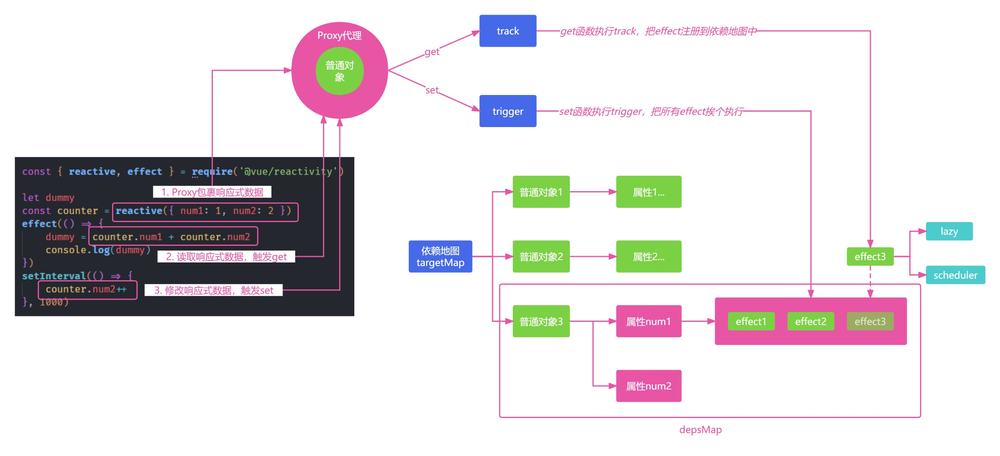

# 怎样手写一个响应式系统

Vue 最标志性的功能就是其低侵入性的响应式系统。组件状态都是由响应式的 JavaScript 对象组成的。当更改它们时，视图会随即自动更新。这让状态管理更加简单直观，但理解它是如何工作的也是很重要的，这可以帮助我们避免一些常见的陷阱。

理解的最快方法就是自己动手实现一边，今天我们就来手写一个迷你的响应式系统。

## 响应式

根据响应式组件通知效果可以知道，**响应式机制的主要功能就是，可以把普通的 JavaScript 对象封装成为响应式对象，拦截数据的获取和修改操作，实现依赖数据的自动化更新**。

所以，一个最简单的响应式模型，我们可以通过 reactive 或者 ref 函数，把数据包裹成响应式对象，并且通过 effect 函数注册回调函数，然后在数据修改之后，响应式地通知 effect 去执行回调函数即可。

光这么说可能还不太好理解，我们可以通过一个简单的小例子来直观的感受下响应式的效果。

Vue 的响应式是可以独立在其他平台使用的。比如你可以新建 test.js，使用下面的代码在 node 环境中使用 Vue 响应。以 reactive 为例，我们使用 reactive 包裹 JavaScript 对象之后，每一次对响应式对象 counter 的修改，都会执行 effect 内部注册的函数：

```js
// test.js
const { reactive, effect } = require('@vue/reactivity')

let dummy
const counter = reactive({ num1: 1, num2: 2 })
effect(() => {
    dummy = counter.num1 + counter.num2
    console.log(dummy)
})
setInterval(() => {
    counter.num2++
}, 1000)
```

执行 node test.js 之后，你就可以看到 effect 内部的函数会一直调用，每次 count.value 修改之后都会执行。

看到这个 API 估计你有点疑惑，effect 内部的函数式如何知道 count 已经变化了呢？

我们先来看一下响应式整体的流程图，上面的代码中我们使用 reactive 把普通的 JavaScript 对象包裹成响应式数据了。

所以，在 effect 中获取 counter.num1 和 counter.num2 的时候，就会触发 counter 的 get 拦截函数；get 函数，会把当前的 effect 函数注册到一个全局的依赖地图中去。这样 counter.num1 在修改的时候，就会触发 set 拦截函数，去依赖地图中找到注册的 effect 函数，然后执行。



具体是怎么实现的呢？我们从第一步把数据包裹成响应式对象开始。先看 reactive 的实现。