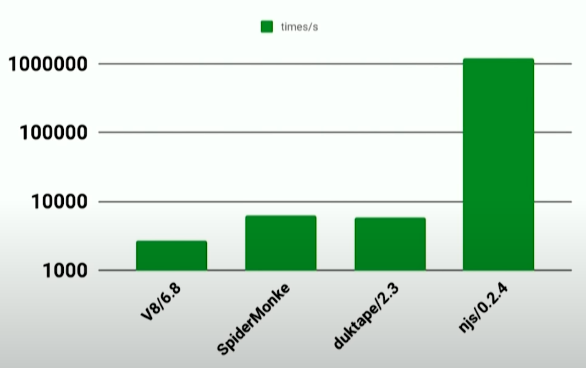
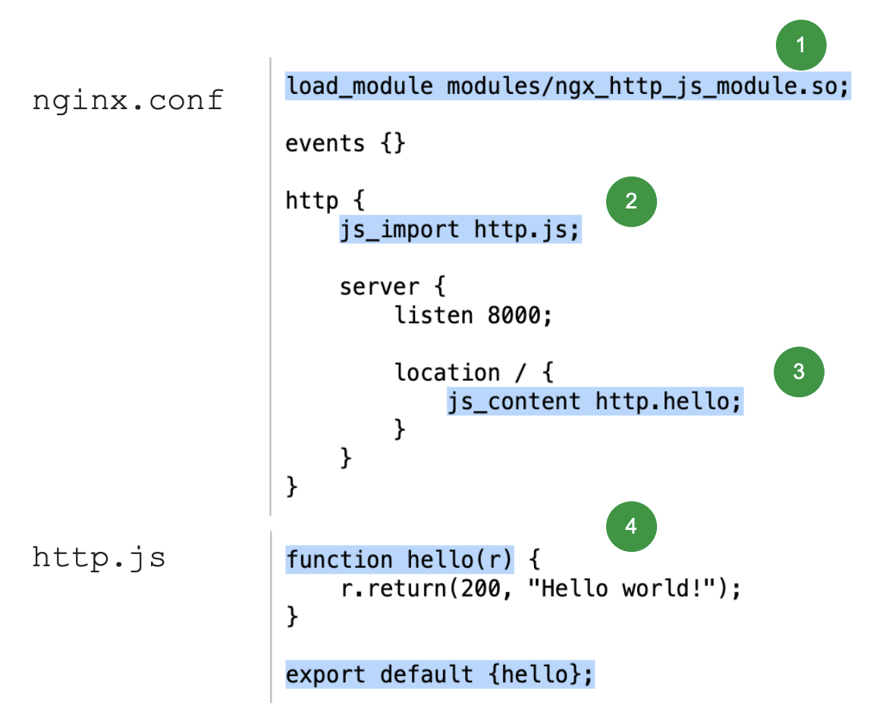

# Web 服务器配置中的 NGINX JavaScript

NJS 的目标是成为一个通用的 nginx 脚本框架，正如它的名字是 nginx 和 JavaScript 的混合词，NJS 结合了两者， 成为了一个从头编写了 JavaScript 解释器的 nginx 模块。

- nginx 脚本化配置的历史
- NJS 的设计目标
- NJS 解释器实现方式
- NJS 可用的功能
- 在 nginx 中使用 NJS

介绍下本文大纲，第一部分将谈论 nginx 脚本化配置的历史；第二章将是关于 NJS 的目标是什么，它要解决什么以及它不想解决什么；下一张将要谈论 NJS 解决这些问题的方式以及它的实现方式；下一章将展示 NJS 目前可用的功能；最后再来展示一下如何在 nginx 中使用 NJS 的示例。

好了，大纲已经介绍完了，那么我们从 nginx 脚本化配置的历史开始。

## NGINX 脚本化配置的历史

想要了解 nginx 脚本化配置的历史，从 nginx 团队对理想中的原生脚本的想法入手显然很有用，所以让我们来看看这些设想中的特性。

### 理想中的脚本特性

- 够快够轻量
  - 否则可以使用更高级的替代方案，例如 Node.js
- 与nginx的异步特性很好地集成
- 模块化
  - 不需要它的人可以禁用它来压榨更多的性能
- 流行的脚本语言
  - 帮助人们更快的编写他们的脚本

第一点也是重要的一点就是要够轻量够快，人类乐于使用 nginx 就是因为它速度快并且十分轻量，如果新脚本做不到这一点那还有什么意义，完全可以使用其他更高级的代替方案，例如 Node.js

第二点，理想的脚本语法应该能与nginx的异步特性很好地集成，由 nginx 负责进程的主要事件循环而不是其他。

下一点是关于模块化，它必须能够被禁用，以便不需要它的人可以禁用它来压榨更多的性能

最后，它应该是一种流行的脚本语言，可以帮助人们更快地编写他们的脚本，而不用去学习一门新语言，毕竟平时人们都有其他事情要做

### 关于 Perl

优势
- 可以使用现有的 Perl 库
- Perl代码可以嵌入到nginx 配置文件中

劣势
- 不支持非阻塞 IO
- Perl 解释器会退出工作进程

第一次尝试在 nginx 中实现原生脚本是在 2005 年，nginx 支持了 perl 语言模块，那么来了解一下 perl 与刚才提到的理想中的脚本语言有多少一致性

perl 模块第一大优势是可以使用现有的 Perl 库，这对于脚本来说是一个很大的优势。

第二点是 Perl 代码可以直接嵌入到nginx 的配置文件中，这种便利性是显而易见的

现在再来谈谈关于 perl 的负面评价

首先是它不支持非阻塞 IO，这是因为 perl 的解释器不知道它是在 nginx 中工作的，所以它会阻塞操作，显然这点对 nginx 来说是不可接受的，这是 perl 模块的很大的一个问题。

下一点是关于 perl 脚本本身，当他发生错误时会退出整个工作进程，这显然也是不可接受的。

## 设计目标

**现代化，快速的，针对 NGINX 运行时量身定制的高级脚本**

好，我们完成了 nginx 脚本化配置历史的部分，现在来继续第二部分。NJS 的目标是什么，nginx 团队试图用 NJS 模块解决什么问题。

NJS 的最终目的主要是减少 nginx 用户使用 C 语言编写新模块的必要性，毕竟开发 C 语言模块对新手甚至是有经验的开发人员来说也是一件困难的事情，尤其在时间紧张的时期更不值得这样去做。同时，如果离开 nginx 创建一个单独的应用程序来满足你的需求，速度可能很慢且占用大量 CPU。

所以再让我们更详细的看一下这些设计目标。

- 快速和轻量
  - njs 不应该过度降低nginx的性能
  - 内存/CPU 开销不应很大

- 安全性/健壮性
  - 每个请求都应与其他请求隔离

- 流行的脚本语言

首先第一点，它应该是快速和轻量的，使用njs不能拖慢nginx本身的速度，所以它也不应该有很大的CPU和内存开销，只为了能够在单个工作进程中处理大量的请求，就像nginx本身一样。

第二点是关于安全性和健壮性，这个想法意味着每个请求都应该在它自己的与其他请求隔离的上下文中执行，至少有两个原因来做这件事，第一个原因是关于安全性，为了让你的代码与其他人编写的代码相隔离，将来你只需插入代码即可或为了其他事情而开发它。第二点关于健壮性，如果你有一个独立的上下文，那么你可以毫无问题地处理给定连接的特殊情况而不会影响其他连接。

最后再次提到的一点是要用流行的脚本语言，因为当你想要解决一些特定问题的时候，人们不想把时间花在学习新语言上。

### 为什么是 JavaScript？

现在给你一些决定选择 JavaScript 的原因

- 现代通用语言
  - 因此，人们可以快速地理解它
- 类 C 语法
  - 与 nginx 配置文件良好匹配
- 事件驱动对于 JavaScript 来说是很自然的
  - 与 nginx 运行时完美匹配

JavaScript 的第一个大优点是 JavaScript 是一种现代化的通用语言，如果不是这一点，很可能就不会用 JavaScript 来扩展 nginx 了。

第二个优点是，JavaScript 有类似 C 的语法，这对于许多开发人员和 DevOps 来说是非常熟悉的。另外，对于 JavaScript 来说额外的一大优点是 JavaScript 有花括号来标记块，所以它与 nginx 配置的编写方式是很匹配的，所以在未来 JavaScript 也许可以直接注入到 nginx 配置文件中，这可能会成为一个很有用的特性。

最后一点要提到的是 JavaScript 是为浏览器编写的，所以事件驱动对于 JavaScript 来说是很自然的，它内置于 JavaScript 中，因此该特性与 nginx 运行时完美匹配，因为 nginx 本身也是与事件循环、回调以及类似的东西相关的。

### 为什么要自己实现解释器

下面是为什么 nginx 团队要自己实现解释器的原因。

- V8/SpiderMonkey 在 nginx 中使用的话太重了
  - 复杂的引擎，对 nginx 来说有太多不必要的开销
- Duktape 对于 nginx 内部的任务来说不够快
  - 具有不同的优先级。更重视内存占用和 ECMAScript 规范一致性，而不是性能
- 自定义解释器可以针对 nginx 运行时进行定制

第一个原因是是，因为现有的 JavaScript 引擎，像 V8 和 SpiderMokey 一样先进的 JavaScript 引擎都太重了，而不能在 nginx 中使用它们。很明显他们是为不同的任务而设计的，他们被设计为在浏览器中执行，他们有各种各样的渲染引擎、垃圾收集器等等现代浏览器需要的所有东西，这是相当多的，但在 nginx 上的服务器端配置中，情况相当不同，你不需要很多额外的东西。

第二个代替方案是 Duktape，Duktape 是一个可以嵌入的 JavaScript 的引擎，可以嵌入到 C 和 C++ 语言中，他非常成熟，具有很多功能。但 Duktape 的问题在于它具有不同的优先级，更重视内存占用和 ECMAScript 规范一致性以及所有在它的优先级中比性能更重要的东西。这个对 nginx 来说不是一件好事，因为对于 nginx 我们更想要的是速度。

最后，当自己实现解释器时，你可以根据你的执行环境对其进行定制，这样就是一件非常有用的事情，因为当你拥有自己的解释器时，你可以对其进行自定义。至于自定义可以做什么，以下面这张图为例子。

**每秒创建上下文次数**



这是每秒创建上下文的数量对比，截图来自2018年 nginx 团队的分享，你可以看到 NJS 创建上下文的速度至少比其他引擎快了两个个数量级。

原因很简单，只是 NJS 被设计为针对上下文创建时间进行了优化。对于 V8 和 SpiderMonkey 这样的浏览器引擎来说，引入一些延迟来处理 JavaScript 代码例如运行JIT编译器是完全可以接受的，但对于运行在服务器端的 NJS 来说情况完全不同，对于一个给定的请求路径，他所要运行的代码是相同的，因此可以预编译代码，可以剥离任何不需要的功能，可以优化上下文创建时间，这就是为什么我们看到这样的数字。

## NJS interpreter

那么接下来就将展示 NJS 如何实现前面描述的目标。

### 为什么 NJS 这么快

**NGINX modules**

- 在启动时进行字节码编译
- 为每个请求克隆一份已编译的虚拟机
  - 快速创建和销毁虚拟机
- 没有 JIT 编译

<!-- 第一点是在 nginx 开始运行时，NJS 代码就会被编译成字节码，而不是像浏览器引擎一样一边解释一边执行，因此速度上有很大提升。

我想提一下复制和写入的含义是正确的。他以为这曾经是一个孩子和最近的实例，更改了全局对象。该更改仅对特定请求可见，因此这意味着我们共享大量不可变代码的很大一部分。减少CPU和内存开销。 

最后我想提的一点是我们jit两个原因，第1个原因是关于可以置信。飘逸变异。如果你可以编译代码，那么你可以运行它，而对于GT变异情况并非如此。那个原因是 Git引擎在NG x环境中并没有给你带来很多性能优势。因为大多数你是在 n这个词本身内部没有大量计算而不是受到x本身的限制，而是引擎和NG是本身受到通常你的限制。我调用几个本身的外部IP，你会受到他的限制。 -->

**解释器**

- 基于寄存器的虚拟机
  - 内存占用小
- 使用 UTF-8 编码的字符串
  - ECMAScript 规范要求 UTF-16 
- 不进行垃圾回收
  - 而是立即销毁克隆的虚拟机

<!-- 是关于NG x解释器的实现方式。这是基于寄存器的虚拟机机器，并根据基于堆栈的虚拟机的比较，我们在那里注册基于虚拟机的内存占用量较小。典型的。那是小势力，你在那里大约有几千自己的内存。第2点是根据以下买一条本规范。应该使用tf16编码处理字符串，但显然这不是。你想挤出性能，这不是一个好主意，因为您必须为任何过失数据块分配至少两倍以上的资金。因此按键是使用由tf8字符串。能够显著减少CPU中的内存。提到的一点是关于垃圾收集的操作开销，因为你们中大多数人都知道现代语言，高级语言，例如Java JavaScript，他们采用某种形式的垃圾收集算法。必须处理的特殊过程，手机不再使用的数据，但该进程本身引用技术的进程和垃圾收集器的进程停止，它们引入可测量的开销和测量的延迟而不是NG4岁适合本身的不同策略。

大多数NG模块都是编写的。 NDS从内存池中分配内存，该内存此时链接到当前请求。数据请求完成，NG.克隆的虚拟机会被整体销毁。为该NG实例的操作非常便宜。显然他对于短期请求非常有效。会为长期存在的请求引入过多的内存消耗。而我们计划引入可选的垃圾手机引擎。来应对此类任务。 -->

### NJS 不会做的事

- nginx + NJS 不是应用程序服务器
  - 不是“Node.js”的替代品
- 严格的 ECMAScript 规范一致性（进行中）
  - 大量的工作要做，优先级不高

<!-- 那最后我想再次重申，我们是尝试做什么和我们不想做的事情。所以第1点是NG s和n级s不是。用程序服务器。所以我们不会替换note gs。例如note gs就很好，这绝对是我们想要的。要做的事。在NG x本身内部添加额外的脚本功能。我要扩展，这个是引擎配置，将它们设置为两个以使用使它们更灵活而不是。替换note gs。

只关于以三维脚本规范的一致性。它是关于现代和高级代理的编写方式，因此他们确认我们是。定的。我脚本规范。对我们来说优先级比较低，因为这是一项巨大的工作要做而且该规范的一些怪癖，不允许我们进行一些额外的优化。这就是为什么最终我们准备好看的。 -->

## NJS 可用的功能

### 目前可用的功能

- Boolean, Number, String, Object, Array, Function, Regexp, JOSN, Math, Promise
- exceptions 异常
- 闭包和箭头函数
- let (0.6.0), const (0.6.0), async (0.7.0), await (0.7.0)
- 加密、文件操作等等

https://nginx.org/en/docs/njs/compatibility.html

最后一章要讨论的是 NJS 目前可用的东西。

要提到的第1件事是 JavaScript 中所有的原生对象都符合 ECMAScript 5.1规范，例如 Boolean, Number, String, Object, Array 等等

第二点是关于异常的，你可以以通常的方式抛出它们，catch 捕获他们。

你可以使用闭包和箭头函数，这些当然都是支持的，还有刚支持不久的一些 ES6 语法，例如 let/const、async/await

另外，你还可能会用到加密模块和fs文件系统模块，例如计算哈希值或者想要读取和写入文件

当然，还有一下是目前 NJS 中不支持的

下面是关于什么在 NJS 中不可用

- eval()
- 将 NJS 直接嵌入到 nginx 配置文件中
- 兼容性文档中未提到的 API

例如 eval() 操作不可用，因为性能和安全性的原因，nginx 团队并不打算实现它。

而将 NJS 直接嵌入到 nginx 配置文件中这个功能仍在计划中还未实现。

另外，在官方兼容性文档中没有提到的 API 均还未受到支持。其实如果时间再往前推两年，刚才提到的 let/const、async/await 也在不支持待实现的队伍中，而现在大部分你熟悉的 API 都已经实现了，所以这点不用太担心。

## 在 NGINX 中使用 NJS

### 安装

以安装njs预编译模块为例，需要nginx版本是 1.9.11 或更高版本

1. 安装预构建包。
    - Ubuntu 和 Debian 系统：
        ```bash
        sudo apt-get install nginx-module-njs
        ```
    - RedHat、CentOS 和 Oracle Linux 系统：
        ```bash
        sudo yum install nginx-module-njs
        ```
2. 在 nginx.conf 配置文件的顶层（“main”）上下文（而非 http 或 stream 上下文）中添加一个 load_module 指令，以启用该模块。本例启用了 NJS 的 http 模块，另外还有 stream 模块用来控制 TCP/UDP 协议的流量。
    ```nginx
    load_module modules/ngx_http_js_module.so;
    ```
3. 重新加载 NGINX，以便将 NGINX JavaScript 模块加载到运行实例中。
    ```bash
    sudo nginx -s reload
    ```

终于我们要开始看 NJS 如何使用了，首先我们必须安装它，以安装njs预编译模块为例，需要nginx版本是 1.9.11 或更高版本，你要做的事很简单，就是使用apt-get安装 njs 模块，然后在 nginx.conf 配置文件的顶层（“main”）上下文（而非 http 或 stream 上下文）中使用 load_module 指令引入 njs 模块并允许我们在其余配置中使用 njs 指令。本例启用了 NJS 的 http 模块，另外还有 stream 模块用来控制 TCP/UDP 协议的流量。最后重新加载 NGINX，以便将 NGINX JavaScript 模块加载到运行实例中。

如果您不想在开发机或本地进行安装，只是想简单查看 NJS 的运行情况。那么也可以使用docker容器配合下面链接中的例子来查看，这些链接中包含我们接下来会讲到的所有示例。

https://github.com/nginx/njs-examples

https://github.com/f5devcentral/nginx-njs-usecases

这些示例中包含工作中可能需要的各个方面的功能，例如：

- 授权
  - 生成 JWT 令牌
  - 根据请求正文内容授权请求
- 代理
  - 将多个子请求的结果异步合并到单个回复中
  - 链式访问多个子请求
- 修改响应
  - 修改或删除上游服务器发送的 Cookie
  - 将响应正文字符转换为小写
- 记录
  - 使用json格式记录日志
  - 记录每个客户端的请求数

等等。

### Hello World



1. 启用 njs 模块

2. 使用 js_import 引用 http.js 文件
   
3. 使用 js_content 引用 http.js 文件中导出的 hello 方法
   
4. 定义并导出 hello 方法

https://nginx.org/en/docs/njs/reference.html

那么在看更像上一页那些复杂的例子之前，按照编程界的惯例，我们先来实现一个最简单的示例 hello world。

你要做的第1件事就是加载 njs 模块，然后我们使用第一个 NJS 指令 js_import，它的作用很简单，就是引入你编写的 js 文件，在这里就是引入了 http.js 文件；再使用第二个NJS 指令 js_content，它的作用也很简单，就是将这个特定位置的内容处理程序更改为 NJS 脚本，在这里就是指从 http.js 文件中导出的 hello 方法。

最后再来看一看 http.js 文件，我们在这里编写名为 hello 的标准JavaScript函数，其参数通常被命名为r，代表 nginx 当前正在服务的请求。从官方文档中可以查看 r 有许多成员变量和方法可以用来操作请求。这里我们使用 return 方法，它和 nginx 本身的 return 非常相似，向用户返回200的状态码和文本 hello world。

现在示例已经完成了，只剩下最后一步，启动 nginx 并 curl http://localhost，这样就可以看到刚刚 hello 方法所返回的 Hello World 了。

### 子请求功能

```nginx
# nginx.conf

js_import main from http/join_subrequests.js;

location /join {
    js_content main.join;
}

location /foo {
    proxy_pass http://backend1;
}

location /bar {
    proxy_pass http://backend2;
}
```

```js
// example.js

async function join(r) {
    join_subrequests(r, ['/foo', '/bar']);
}

async function join_subrequests(r, subs) {
    let results = await Promise.all(subs.map(uri => r.subrequest(uri)));

    let response = results.map(reply => ({
        uri:  reply.uri,
        code: reply.status,
        body: reply.responseBody,
    }));

    r.return(200, JSON.stringify(response));
}

export default {join};
```

第二个示例将向您展示 NJS HTTP 模块的子请求方法的功能。在此示例中，我们将向该示例后端中的至少两个接口发出多个同步子请求。并且我们将收集他们的返回，将联合结果同步返回给客户端。

从配置文件中我们可以看到，我们使用了 js_import 指令将js文件导入，并使用了别名的功能将导入的模块命名为 main，我们可以在其余配置用别名来引用它。然后使用 js_content 指令将 main 对象中的 join 方法作为 join 接口的处理函数，这样看起来和 ES6 的模块导入方式是不是更像了。

然后来看看 js 文件中的内容，我们在 join 方法中使用了一个发起子请求的辅助函数，该辅助函数需要一个请求对象和子请求列表。其内部通过 Promise.all 和 r 对象上的 subrequest 子请求方法并行执行多个子请求调用，在所有子请求完成后拼装所有返回内容，并将其序列化后返回给 join 请求。

在这个示例中我们看到了两个熟悉的朋友，Promise 和 JSON 对象，他们都是 njs 解释器实现的全局对象，所以你可以在任意 njs 文件中使用他们。
