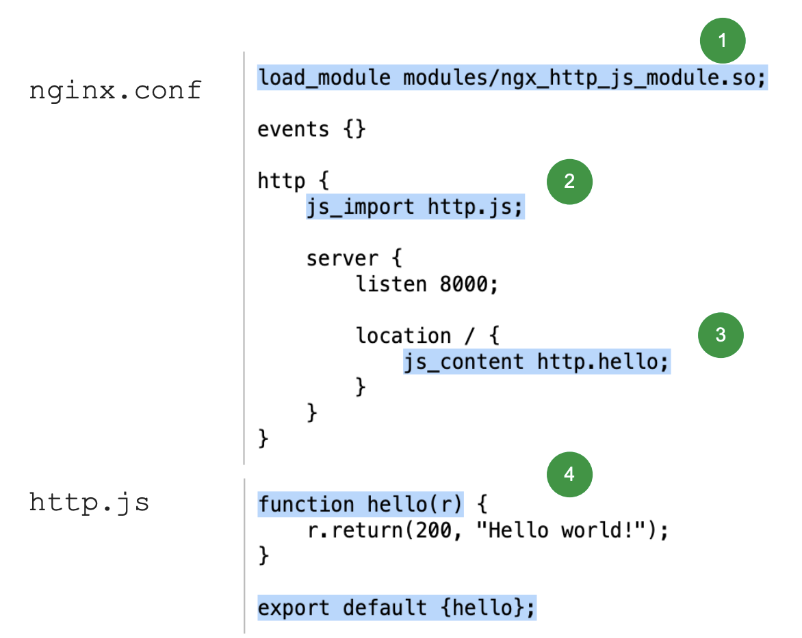

# 在 Nginx 中运行 JavaScript

## 目录

- 技术背景
- 初识
- 真实案例

## 技术背景

### 扩展 NGINX 功能的四种方式

C-Modules、Perl、Lua、JavaScript


### NJS 核心价值

使用脚本的方式扩展应用服务能力

- 减少开发投入：减少用户独立使用C语言开发特定场景的nginx模块的可能性。
- 降低使用难度：将JavaScript代码集成到nginx HTTP和流（TCP/UDP）模块的事件处理模型中。
- 提高产出效率：使用JavaScript代码扩展nginx配置语法，以实现复杂的配置解决方案。

### NJS 与 Node.js、JavaScript 的区别

一、运行时不同

Node.js 使用 Google V8 JavaScript 引擎，而 NGINX JavaScript 则是基于 ECMAScript 标准的定制化实现，专为 NGINX 设计。Node.js 在内存中有一个持久化的 JavaScript 虚拟机 (VM)，执行日常垃圾回收以管理内存；而 NGINX JavaScript 针对每个请求都会初始化一个新的 JavaScript VM 以及其所需的内存，并在请求完成时释放内存空间。

二、语言规范差异

JavaScript 的规范由 ECMAScript 标准定义。NGINX JavaScript 遵循 ECMAScript 5.1 和一些 ECMAScript 6 标准（面向数学函数）。通过实现自己的 JavaScript 运行时，njs 能够优先确保对服务器端用例的语言支持，忽略不需要的项目。

## 初识

### 安装 NJS 模块

以安装njs预编译模块为例，需要nginx版本是 1.9.11 或更高版本

1. 安装预构建包。
    - Ubuntu 和 Debian 系统：
        ```bash
        sudo apt-get install nginx-module-njs
        ```
    - RedHat、CentOS 和 Oracle Linux 系统：
        ```bash
        sudo yum install nginx-module-njs
        ```
2. 在 nginx.conf 配置文件的顶层（“main”）上下文（而非 http 或 stream 上下文）中添加一个 load_module 指令，以启用该模块。本例面向 HTTP 和 TCP/UDP 流量加载 JavaScript 模块。
    ```nginx
    load_module modules/ngx_http_js_module.so;
    load_module modules/ngx_stream_js_module.so;
    ```
3. 重新加载 NGINX，以便将 NGINX JavaScript 模块加载到运行实例中。
    ```bash
    sudo nginx -s reload
    ```

### NJS 基本使用入门



1. 启用 njs 模块
2. 使用 js_import 引用 http.js 文件
3. 使用 js_content 引用 http 文件中的 hello 方法
4. 定义并导出 hello 方法

### NJS 异步方法

```js
// 初始化连接
ngx.fetch('http://nginx.org/en/docs/njs')

// 当url返回时
.then(reply => reply.text())

// 当正文读取完成时
.then(body => r.return(200, body.toString()))

// 如果出现了问题，就执行这里
.catch(e => r.return(501, e.message))
```

### NJS 模块的用例

- 授权
  - 生成 JWT 令牌
  - 根据请求正文内容授权请求
- 代理
  - 将多个子请求的结果异步合并到单个回复中
  - 链式访问多个子请求
- 修改响应
  - 修改或删除上游服务器发送的 Cookie
  - 将响应正文字符转换为小写

## 真实案例 - 自定义日志输出格式

在下面的示例中，我们使用 NGINX 作为一个简单的 web 服务器，并采用 NGINX JavaScript 构建特定格式的访问日志，日志中包括：

- 请求时间
- 客户端地址
- 请求方法
- 请求路径
- 请求状态
- 客户端发送的请求头
- 后端返回的响应头

此示例的 NGINX 配置非常简单。

```nginx
http {
    js_import   conf.d/logging.js;              # 从这里加载 js 代码
    js_set      $access_log logging.kvAccess;   # 用 js 方法为变量赋值
    log_format  kvPairs $access_log;            # 定义特殊的日志格式

    server {
        listen 80;
        root /usr/share/nginx/html;
        access_log /var/log/nginx/access.log kvPairs;
    }
}
```

可以见到，NGINX JavaScript 代码并不内嵌在配置语法内。相反，我们使用 [js_import](https://nginx.org/en/docs/http/ngx_http_js_module.html#js_import) 指令来导入包含了所有 JavaScript 代码的文件。[js_set](https://nginx.org/en/docs/http/ngx_http_js_module.html#js_set) 指令定义了一个新的 NGINX 变量 `$access_log`，后面是为变量赋值的 JavaScript 函数。[log_format](https://nginx.org/en/docs/http/ngx_http_log_module.html#log_format) 指令定义了一种名为 kvPairs 的新格式，它能够将 `$access_log` 的值写入每个日志行。

[server](https://nginx.org/en/docs/http/ngx_http_core_module.html#server) 块定义了一个简单的 HTTP 服务器，监听 80 端口，指定根目录。
[access_log](https://nginx.org/en/docs/http/ngx_http_log_module.html#access_log) 指令指定了所有请求均采用 kvPairs 格式进行记录。

现在，来看看日志处理的 JavaScript 代码。

```js
function kvAccess(r) {
    var log = `${r.variables.time_iso8601} client=${r.remoteAddress} method=${r.method} uri=${r.uri} status=${r.status}`;
    r.rawHeadersIn.forEach(h => log += ` in.${h[0]}=${h[1]}`);
    r.rawHeadersOut.forEach(h => log += ` out.${h[0]}=${h[1]}`);
    return log
}

export default { kvAccess }
```

NGINX 变量只有在被需要的时候才会进行求值计算，这意味着 js_set 定义的 JavaScript 函数只在需要该变量的值时才执行。在此示例中，由于 $access_log_headers 被用于 [log_format](https://nginx.org/en/docs/http/ngx_http_log_module.html#log_format) 指令，因此 kvAccess() 在日志记录时执行。

以下是本示例的真实日志，其中包括请求的基本信息、带有 **in.** 前缀的请求头以及带有 **out.** 前缀的响应头。

```bash
curl http://127.0.0.1/
2022-10-19T12:25:32+00:00 client=172.17.0.1 method=GET uri=/index.html status=200 in.Host=127.0.0.1 in.User-Agent=curl/7.79.1 in.Accept=*/* out.ETag=\x22634fec1f-117\x22 out.Accept-Ranges=bytes
```

## 总结

## 相关链接

NJS文档：

http://nginx.org/en/docs/njs/

应用示例：

https://github.com/nginx/njs-examples

https://github.com/f5devcentral/nginx-njs-usecases

博客：

https://nginx.com/blog/tag/javascript

源代码：

https://github.com/nginx/njs
