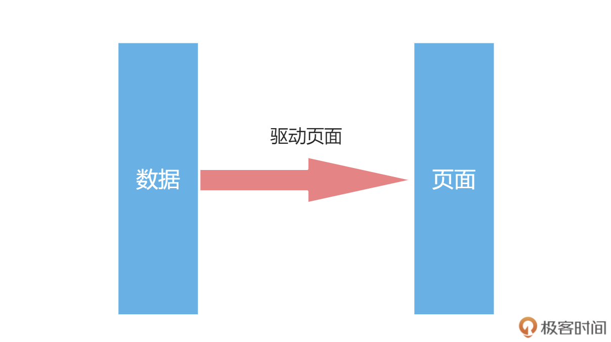
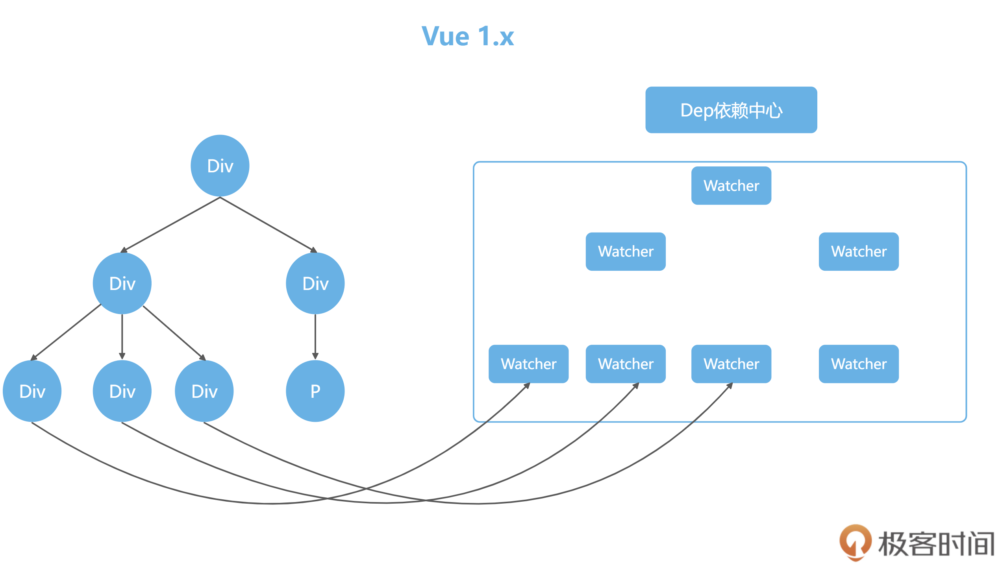
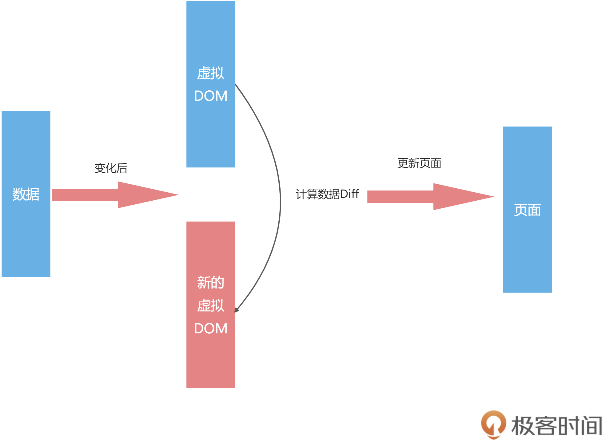
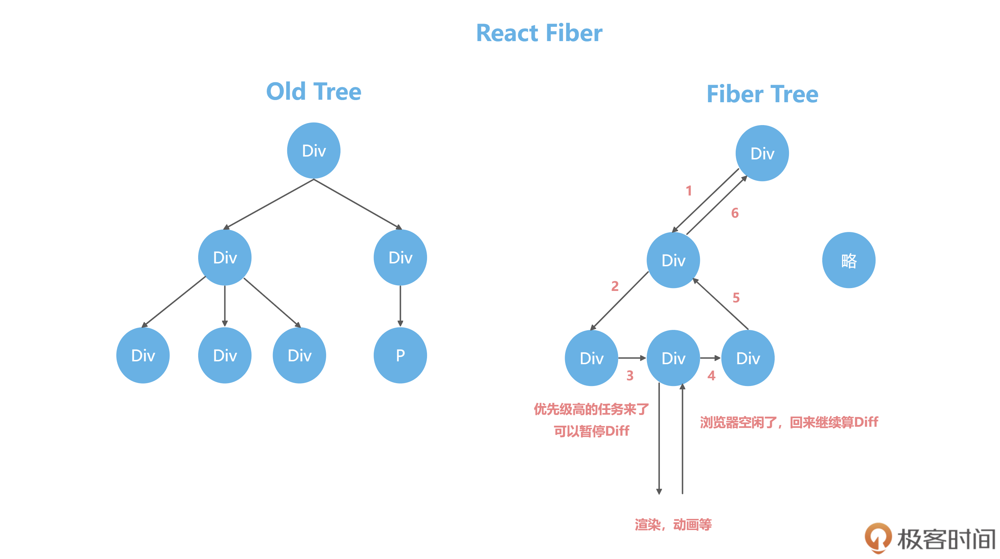
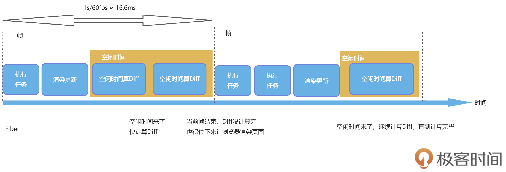
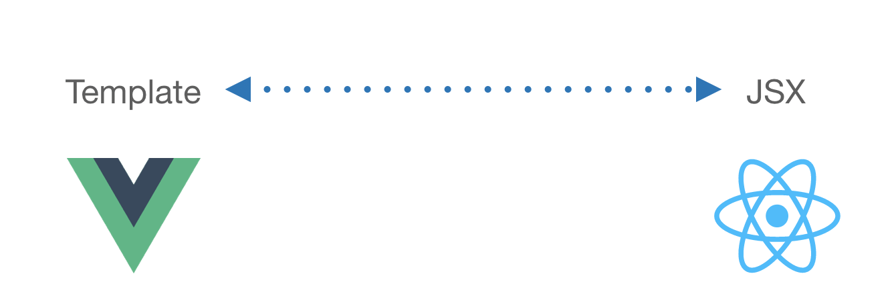
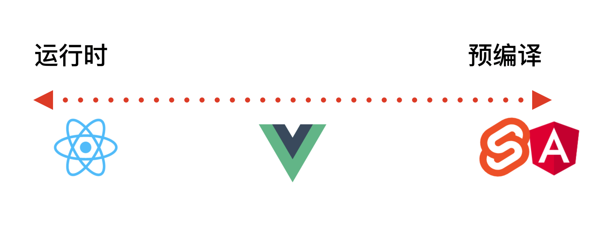

# 01 | 宏观视角：从前端框架发展史聊聊为什么要学Vue 3？

你好，我是大圣。

今天，我们来聊一聊前端框架的发展历史。在熟悉这段历史之后，相信你能把握到 Vue 在前端框架中的地位。这样，你就会对 Vue 有一个更精准的定位，从而能够知道我们为什么要选择 Vue 框架，以及 Vue 的优势和它的真正价值在哪里。

同时，前端框架的发展历史可能也会让你感触很多。因为每一个上网的人，或多或少都会感觉到前端网页在这些年发生了很多的变化，这是一种切身的、直观的体会。我们都能感觉到网页在设计模式、渲染等等地方的变化，而这种种变化的背后，其实都可以放到前端框架的演变历史中来解释。

## 石器时代

谈前端框架发展史之前，我们先来简单回顾一下前端的发展历史吧。

- 1990 年，第一个 Web 浏览器诞生了。这是前端这个技术的起点，代表这一年它出生了。后面的时间里，前端圈有很多里程碑事件。
- 1994 年，网景公司发布第一个商业浏览器 Navigator。
- 1995 年，网景工程师 Brendan Eich 用 10 天时间设计了 JavaScript，同年微软发布了 IE 浏览器，进而掀起了浏览器大战。
- 2002 年，IE 在浏览器大战中赢得胜利，IE6 占有率超过 96% 。

而前端的发展历史，又非常直观地显示在你看到的前端网页的演变历史中。整个 90 年代，受限于网速，网页都是静态页，显示非常单一，前端的工作大部分都只是让美工来切切图和写写 HTML+CSS。也因此，在 90 年代，前端还处在一种萌发期的状态，前端工程师这一工种也没有明确出现。

**再后来，后端越来越复杂，开始分层。就像在小公司里，大家啥都干，但公司规模大了之后，就要分部门，职责明确，代码也从揉在一起发展到 Model，View 和 Controller，分别负责不同的功能。**

这就是后端 MVC 模式的盛行，让我们可以在模板里写上要展现的数据。以前的代码都是所有内容写在一起，现在就会用 Model 负责数据。后端渲染页面之前，会把数据库的数据显示在前端。这个时候，除了写前端代码必备的 HTML、CSS 和简单的 JavaScript 动效，我们也开始用到了 JSP 和 Smarty，我们会写出如下这种代码：

```html
<!DOCTYPE html>
  <html>
  <head>
  <meta charset="utf-8">
  <title>smarty test1</title>
  </head>
  <body>
  它的名字叫{$name}
  </body>
  </html>
```

上述代码写出来的页面，就可以直接显示后端数据库里的数据了，这也就是所谓的动态网页。动态页面使得前端本身的丰富程度大大提升。这一下子迎来了整个互联网开发的繁荣时期，但这种模式下的任何数据更新，都需要刷新整个页面，并且在带宽不足的年代，这样做会耗费不少加载网页的时间。

所以这个时代的网页主要还是以显示数据和简单的特效为主，比如当时众多的门户网站，也都没有太多的用户交互，主要就是显示后端存储的新闻。

直到 2004 年，Google 发布了 Gmail，用户可以在不刷新页面的情况下进行复杂的交互，之后，Ajax 逐渐成为网页开发的技术标准，也不断地被应用于各种网站。**Ajax 这个技术让我们可以异步的获取数据并且刷新页面，从此前端不再受限于后端的模板，这也宣告了 Web2.0 时代正式到来。**至此，前端工程师也正式作为一个独立工种出现。

## 铁器时代

在 Gmail 诞生后，虽然依然有浏览器的混战和兼容性问题，比如绑定事件不同的浏览器就要写不同的代码，但大家意识到前端也可以做出复杂应用。而 jQuery 的出现迅速风靡全球，一个 $ 走天下，学会 jQuery 就等同于学会了前端，算是前端车同轴的时代。在这之后，前端的具体开发不再被 JavaScript 的兼容性问题所困扰。

那个时候 jQuery+Bootstrap 一把梭，成为了前端开发领域的主流技术，前端代码内嵌在后端的项目中，写完直接发布，通篇都是如下的代码：

```js
$('#alert-btn').on('click',function(){
  $('#app .input').val('hi')
})
```

那个时候写代码，就是找到某个元素，进行 DOM 操作，特别像铁器时代的拼刺刀，随着前端项目规模的逐渐提升，前端也需要规模化的时候，在 2009 年 AngularJS 和 Node.js 的诞生，也宣告前端工业革命的到来。

## 工业时代

AngularJS 的诞生，引领了前端 MVVM 模式的潮流；Node.js 的诞生，让前端有了入侵后端的能力，也加速了前端工程化的诞生。现在前端三大框架 Angular、React、Vue 的发展主线，也就是从这里开始的。

所谓 MVVM，就是在前端的场景下，把 Controller 变成了 View-Model 层，作为 Model 和 View 的桥梁，Model 数据层和 View 视图层交给 View-Model 来同步，第二讲我们会通过一个清单应用让你熟悉 MVVM 开发模式和传统 jQuery 的开发模式的区别，这里你先留个印象就好。

## 前端三大框架

在前端 MVVM 模式下，不同框架的目标都是一致的，就是利用数据驱动页面，但是怎么处理数据的变化，各个框架走出了不同的路线。



这些框架要回答的核心问题就是，数据发生变化后，我们怎么去通知页面更新。各大框架在这个步骤上，各显神通：

Angular 1 就是最老套的脏检查。所谓的脏检查，指的是 Angular 1 在对数据变化的检查上，遵循每次用户交互时都检查一次数据是否变化，有变化就去更新 DOM 这一方法。这个方法看似简单粗暴，但算是数据驱动页面早期的实现，所以一经推出，就迅速占领了 MVVM 市场。

后面 Angular 团队自断双臂，完全抛弃 Angular 1，搞了一个全新的框架还叫 Angular，引入了 TypeScript、RxJS 等新内容，虽然这些设计很优秀，但是不支持向前兼容，抛弃了老用户。这样做也伤了一大批 Angular 1 用户的心，包括我。这也是 Angular 这个优秀的框架现在在国内没有大面积推广的原因。

而 Vue 1 的解决方案，就是使用响应式，初始化的时候，Watcher 监听了数据的每个属性，这样数据发生变化的时候，我们就能精确地知道数据的哪个 key 变了，去针对性修改对应的 DOM 即可，这一过程可以按如下方式解构：



在上图中，左边是实际的网页内容，我们在网页中使用{{}}渲染一个变量，Vue 1 就会在内容里保存一个监听器监控这个变量，我们称之为 Watcher，数据有变化，watcher 会收到通知去更新网页。

通俗来说，如果把网页数据看成你管理的员工，普通数据就是那种每次你都需要找到他，告诉他要怎么做的人，响应式数据就是他本身有任何变化，都会主动给你发日报告诉你的积极员工。

此外，Facebook 的 React 团队提出了不同于上面的 Angular、Vue 的的解决方案，他们设计了 React 框架，在页面初始化的时候，在浏览器 DOM 之上，搞了一个叫虚拟 DOM 的东西，也就是用一个 JavaScript 对象来描述整个 DOM 树。我们可以很方便的通过虚拟 DOM 计算出变化的数据，去进行精确的修改。

我们先看 React 中的一段代码：

```html
<div id = "app">
    <p class = "item">Item1</p>
    <div class = "item">Item2</div>
</div>
```

在 React 中，这样一段 HTML 会被映射成一个 JavaScript 的对象进行描述。这个对象就像数据和实际 DOM 的一个缓存层，通过管理这个对象的变化，来减少对实际 DOM 的操作。

这种形式不仅让性能有个很好的保障，我们还多了一个用 JSON 来描述网页的工具，并且让虚拟 DOM 这个技术脱离了 Web 的限制。因为积累了这么多优势，虚拟 DOM 在小程序，客户端等跨端领域大放异彩。

虚拟 DOM 在运行的时候就是这么一个对象：

```js
{
  tag: "div",
  attrs: {
    id: "app"
  },
  children: [
    {
      tag: "p",
      attrs: { className: "item" },
      children: ["Item1"]
    },
    {
      tag: "div",
      attrs: { className: "item" },
      children: ["Item2"]
    }
  ]
}
```

这个对象完整地描述了 DOM 的树形结构，这样数据有变化的时候，我们生成一份新的虚拟 DOM 数据，然后再对之前的虚拟 DOM 进行计算，算出需要修改的 DOM，再去页面进行操作。

浏览器操作 DOM 一直都是性能杀手，而虚拟 DOM 的 Diff 的逻辑，又能够确保尽可能少的操作 DOM，这也是虚拟 DOM 驱动的框架性能一直比较优秀的原因之一。



## Vue 与 React 框架的对比

通过上面对前端三大框架的介绍，我们不难发现 Vue 和 React 在数据发生变化后，在通知页面更新的方式上有明显的不同，通俗的来说，就是：**在 Vue 框架下，如果数据变了，那框架会主动告诉你修改了哪些数据；而 React 的数据变化后，我们只能通过新老数据的计算 Diff 来得知数据的变化**。

这两个解决方案都解决了数据变化后，如何通知页面更新的问题，并且迅速地获得了很高的占有率，但是他们都碰到了性能的瓶颈：

- 对于 Vue 来说，它的一个核心就是“响应式”，也就是数据变化后，会主动通知我们。响应式数据新建 Watcher 监听，本身就比较损耗性能，项目大了之后每个数据都有一个 watcher 会影响性能。
- 对于 React 的虚拟 DOM 的 Diff 计算逻辑来说，如果虚拟 DOM 树过于庞大，使得计算时间大于 16.6ms，那么就可能会造成性能的卡顿。

为了解决这种性能瓶颈， Vue 和 React 走了不同的道路。

React 为了突破性能瓶颈，借鉴了操作系统时间分片的概念，引入了 Fiber 架构。通俗来说，就是把整个虚拟 DOM 树微观化，变成链表，然后我们利用浏览器的空闲时间计算 Diff。一旦浏览器有需求，我们可以把没计算完的任务放在一旁，把主进程控制权还给浏览器，等待浏览器下次空闲。

这种架构虽然没有减少运算量，但是巧妙地利用空闲实现计算，解决了卡顿的问题。你可以看一下我画的图解：



在上图中，左侧是一个树形结构，树形结构的 Diff 很难中断；右侧是把树形结构改造成了链表，遍历严格地按照子元素 -> 兄弟元素 -> 父元素的逻辑，随时可以中断和恢复 Diff 的计算过程。

为了方便你对计算 Diff 的理解，我们来看下面这张图：



这个图里两个虚线之间是浏览器的一帧，高性能的动画要求是 60fps，也就是 1 秒要渲染 60 次，每一帧的时间就是 16.6 毫秒，在这 16.6 毫秒里，浏览器自己的渲染更新任务执行后，会有一部分的空闲时间，这段时间我们就用来计算 Diff。

等到下一帧任务来了，我们就把控制权还给浏览器，让它继续去更新和渲染，等待空闲时间再继续计算，这样就不会导致卡顿。

Vue 1 的问题在于响应式数据过多，这样会带来内存占用过多的问题。所以 Vue 2 大胆引入虚拟 DOM 来解决响应式数据过多的问题。

这个解决方案使用虚拟 DOM 解决了响应式数据过多的内存占用问题，又良好地规避了 React 中虚拟 DOM 的问题， 还通过虚拟 DOM 给 Vue 带来了跨端的能力。看到这个解决方案的时候，我真是一拍大腿，直呼“真牛！”。

**响应式数据是主动推送变化，虚拟 DOM 是被动计算数据的 Diff，一个推一个拉，它们看起来是两个方向的技术，但被 Vue 2 很好地融合在一起，采用的方式就是组件级别的划分。**

对于 Vue 2 来说，组件之间的变化，可以通过响应式来通知更新。组件内部的数据变化，则通过虚拟 DOM 去更新页面。这样就把响应式的监听器，控制在了组件级别，而虚拟 DOM 的量级，也控制在了组件的大小。

这个方案也体现了 Vue 一直以来坚持的中庸的设计思想。

下图左边就是一个个的组件，组件内部是没有 Watcher 监听器的，而是通过虚拟 DOM 来更新，每个组件对应一个监听器，大大减小了监听器的数量。


除了响应式和虚拟 DOM 这个维度，Vue 和 React 还有一些理念和路线的不同，在模板的书写上，也走出了 template 和 JSX 两个路线。


React 的世界里只有 JSX，最终 JSX 都会在 Compiler 那一层，也就是工程化那里编译成 JS 来执行，所以 React 最终拥有了全部 JS 的动态性，这也导致了 React 的 API 一直很少，只有 state、hooks、Component 几个概念，主要都是 JavaScript 本身的语法和特性。

而 Vue 的世界默认是 template，也就是语法是限定死的，比如 v-if 和 v-for 等语法。有了这些写法的规矩后，我们可以在上线前做很多优化。Vue 3 很优秀的一个点，就是在虚拟 DOM 的静态标记上做到了极致，让静态的部分越过虚拟 DOM 的计算，真正做到了按需更新，很好的提高了性能。



在模板的书写上，除了 Vue 和 React 走出的 template 和 JSX 两个路线，还出现了 Svelte 这种框架，没有虚拟 DOM 的库，直接把模板编译成原生 DOM，几乎没有 Runtime，所有的逻辑都在 Compiler 层优化，算是另外一个极致。



## 总结

了解了前端 MVVM 框架发展的历史和方向后，相信你脑海里已经建立起了一个前端框架发展的地图，每个框架都在探索自己的路线。后面还会涌现出更多优秀的框架，我们到时候只需要把那个框架纳入到这个地图中去理解，这样你很快就明白这个框架做了什么，而这也是很多前端大神能够快速学习一个新框架的主要原因。

浏览器的诞生让我们可以方便地显示文本和图片的内容和样式；JavaScript 的出现让网页动了起来；Gmail 的发布，宣告前端也可以使用 Ajax 异步加载技术，来进行复杂网页的开发，前端工程师这个工种也正式出现了。

随着浏览器厂商的混战，各个浏览器都有自己的特色，jQuery 框架的出现统一了写法，解决了那个时代最棘手的前端问题：兼容性，极大提高了开发者的效率。

随着 Angular 1 的诞生，我们多了一套开发模式，就是数据驱动页面。我们甚至不再需要使用 jQuery 去寻找 DOM，而是只关注数据的来源和修改，这也就是现在我们所处的前端时代。我们所熟悉的 Vue、React、Angular 和 Svelte 等框架，都是在数据驱动页面这个场景下涌现的框架。

相信到这里，你已经大概明白前端的这些框架的风格和特点，以及 Vue 在这些框架中的地位，Vue 3 在 Vue 2 的基础之上做了全面的升级，在性能、扩展性和包的大小上，Vue3 都有质的飞跃。

我已经迫不及待地想聊聊 Vue 3 到底有哪些新特性，并且强烈推荐你来学习。

## 思考题

在你看来，Vue 需不需要 React 的 Fiber 呢？

欢迎在留言区分享你的思考，畅所欲言。如果你觉得今天的内容有所帮助，也欢迎你分享给你身边的朋友，邀请他一起学习。