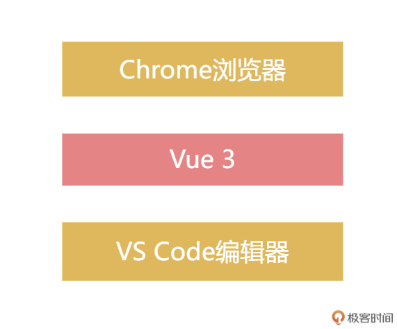
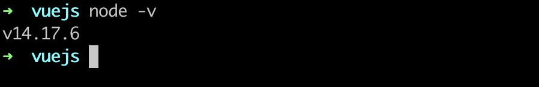
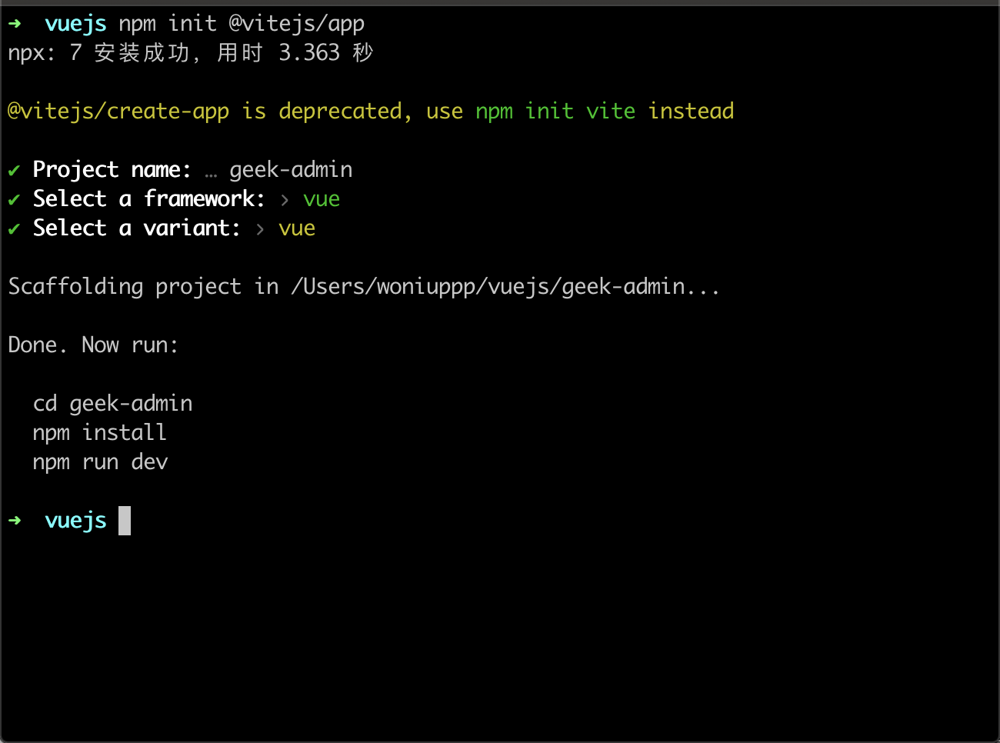
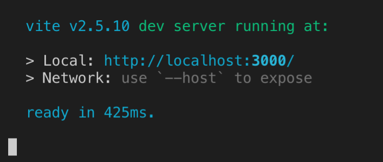
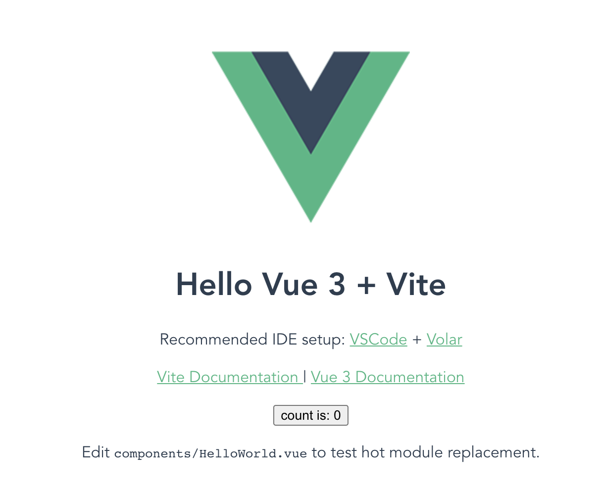
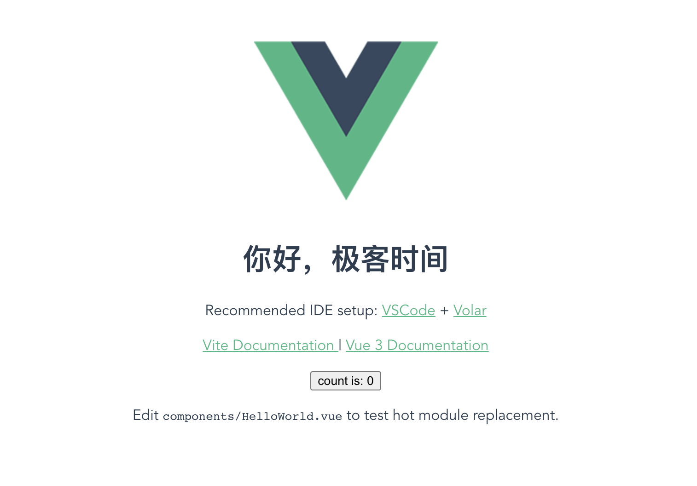
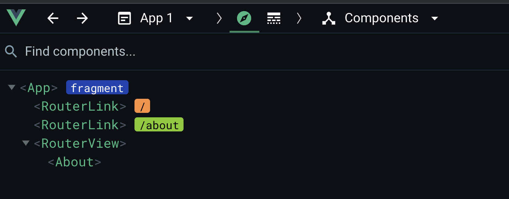
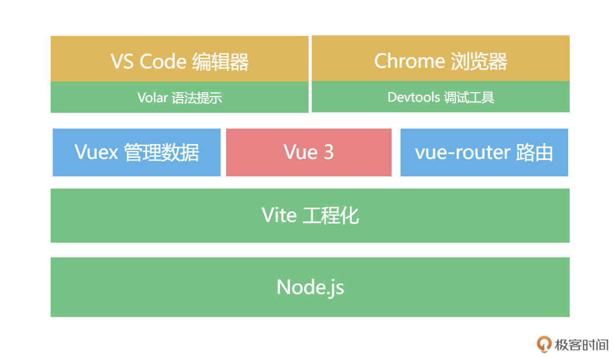

# 05 | 项目启动：搭建Vue 3工程化项目第一步

你好，我是大圣，欢迎进入课程的第二部分——基础入门篇。在课程导读篇，我们了解了 Vue 3 的新特性以及从 Vue 2 升级到 Vue 3 的方法。相信你现在已经和小圣同学一样，迫不及待地想做一个实际的项目。当然了，在实战中学习 Vue 3 也是最好并且最快的学习方式。不过，你先别着急。在基础入门篇，我会用 5 讲的篇幅，带你学习 Vue 3 的核心功能，包括项目搭建、Composition API、响应式、组件化和动画。这 5 讲结束后，你就会对 Vue 3 的核心功能有一个整体的了解，为我们全家桶实战篇的学习打下坚实的基础。实际开发中，除了 Vue 3 这个库，我们还需要 Vue 3 的最新全家桶，也就是 Vue 3 的周边生态，这其实就和士兵需要武器装备是一样的。今天这次，我会手把手带你安装和构建 Vue 3 开发环境。环境准备在之前的语法演示中，我们直接使用 script 引入 Vue 3，从而在浏览器里实现了所有调试功能。但是在实际的项目中，我们会使用专门的调试工具。在项目上线之前，代码也需要打包压缩，并且考虑到研发效率和代码可维护性，所以在下面，我们需要建立一个工程化的项目来实现这些功能。你能在下图中看到我们现在要用到的工具，VS Code 写 Vue 3 的代码，直接在 Chrome 浏览器里展示，我们会在这个基础之上逐步添加新的工具。



对于 Vue 2，官方推荐用 Vue-cli 创建项目；而对于 Vue 3，我建议你使用 Vite 创建项目，因为 vite 能够提供更好更快的调试体验。在使用 Vite 之前，我们要先安装 Node.js 。下载安装 Node.js 的过程是傻瓜式的，直接去Node.js 官网下载安装即可。下载的时候，我们可以选择 LTS 版本，也就是稳定版，进行下载和安装即可。安装完毕后，我们创建 vuejs 工作目录，然后在命令行窗口执行 node -v 指令，如果看到如下界面就算安装成功啦。



之后，我们就可以在 VS Code 里进行 Vue 项目的开发。不过，在正式开发之前，我推荐使用 VS Code 的官方扩展插件 Volar，这个插件给 Vue 3 提供了全面的开发支持。我们访问 Volar 的地址，直接点击 Install，就会启动 VS Code 并且安装。然后使用 Chrome 访问 Vue 3 调试插件的地址 ，可以帮助我们在浏览器里高效的调试页面。接下来，在命令行窗口里，我们对 vuejs 目录执行下面的命令，这样就可以创建一个 Vite 的初始化项目。

```sh
npm init @vitejs/app
```

之后，在 Project name 这一行，我们输入项目的名字，例如 geek-admin；接着，在 Select a framework 这一行输入框架的名字，这里我们选择 vue；再之后，在 select a variant 这一行，因为在项目里，我们没有选择 TS，所以这里我们依然选择 vue 即可。



我们看一下 geek-admin 下面的文件目录，这个目录就是我们项目启动的骨架了。目录中的 index.html 是项目的入口；package.json 是管理项目依赖和配置的文件；public 目录放置静态资源，比如 logo 等图片；vite.config.js 就是和 Vite 相关所有工程化的配置；src 就是工作的重点，我们大部分的代码都会在 src 目录下管理和书写，后面我们也会在 src 目录下细化项目规范。

```
.
├── README.md
├── index.html           入口文件
├── package.json
├── public               资源文件
│   └── favicon.ico
├── src                  源码
│   ├── App.vue          单文件组件
│   ├── assets
│   │   └── logo.png
│   ├── components   
│   │   └── HelloWorld.vue
│   └── main.js          入口
└── vite.config.js vite工程化配置文件
```

在这之后，我们在 geek-admin 文件夹内执行 npm install 命令，来进行依赖的安装，然后执行 npm run dev 命令来启动项目，看到如下信息就算是启动成功了。



我们根据命令行中的提示，在 Chrome 里打开http://localhost:3000/，看到如下图所示的页面时，我们第一步就完成了。



完成了项目的初始化之后，下一步我们会细化 src 目录，搭建源码的骨架架构。我们去 VS Code 里打开项目，修改一下 src 目录下的 App.vue 文件。例如，我们改动一下文件中的 HelloWorld 组件，把 msg 改成“你好，极客时间”，之后你会发现浏览器不需要我们去刷新，首页大标题就自动更新了，这种热更新的开发体验会伴随我们整个项目开发，极大提高我们的开发效率。



现在，项目的架构是下图所示的这个样子，这样我们的项目就拥有了工程化的雏形。我们来从下往上看这个架构：我们所有工程化体系都是基于 Node.js 生态；我们使用 VS Code+Volar 编辑器 + 语法提示工具作为上层开发工具；使用 Vite 作为工程化工具；使用 Chrome 进行调试，这些都是 Vue 3 工程化体系的必备工具。


由于小圣还不熟悉 TypeScript，这里我们就依然使用 JavaScript 来开发，方便学习。关于如何使用 TypeScript 开发 Vue 3，我们会在课程的第十四讲中详细地讲到。我们开发的项目是多页面的，所以 vue-router 和 Vuex 也成为了必选项，就像一个团队需要人员配比，Vue 负责核心，Vuex 负责管理数据，vue-router 负责管理路由。我们在 geek-admin 目录中使用下面这段代码安装 Vuex 和 vue-router。

```sh
npm install vue-router@next vuex@next
```

框架搭建完毕后，我们如何在项目的 src 目录下面组织我们的路由和其他代码呢？我们需要制定一些基本的规范，最常见的规范就是使用文件夹来做区分。对于如何做分区，下面的规范这一部分就会介绍到。

规范无规矩不成方圆，团队项目中的规范尤其重要。我们先对几个文件夹的分层进行规定，便于管理，下面是 src 目录的组织结构。

```
├── src
│   ├── api            数据请求
│   ├── assets         静态资源
│   ├── components     组件
│   ├── pages          页面
│   ├── router         路由配置
│   ├── store          vuex数据
│   └── utils          工具函数
```

我们的页面需要引入路由系统，我们进入到 router 文件夹中，新建 index.js，写入下面的代码：

```js
import {
    createRouter,
    createWebHashHistory,
  } from 'vue-router'
  import Home from '../pages/home.vue'
  import About from '../pages/about.vue'
  
  const routes = [
    {
      path: '/',
      name: 'Home',
      component: Home
    },
    {
      path: '/about',
      name: 'About',
      component: About
    }
  ]
  
  const router = createRouter({
    history: createWebHashHistory(),
    routes
  })
  
  export default router
```

上面的代码中，我们首先引入了 createRouter 和 createWebHashHistory 两个函数。createRouter 用来新建路由实例，createWebHashHistory 用来配置我们内部使用 hash 模式的路由，也就是 url 上会通过 # 来区分。之后在上面的代码里，我们引入两个组件 about 和 home，根据不同的访问地址/ 和/home  去渲染不同的组件，最后返回 router 即可。现在页面就会报错，提示我们找不到 about 和 home 这两个组件，然后我们去 pages 下面新建两个文件，分别输入如下内容：

```html
<template>
    <h1>这是关于页面</h1>
</template>
```

```html
<template>
    <h1>这是首页</h1>
</template>
```

注意，这两个文件是以 .vue 作为后缀的，这是 Vue 中单文件组件的写法，我们可以在一个文件中通过 template、script 和 style 来维护 Vue 组件的 HTML、JavaScript 和 CSS。然后我们在 main.js 中，加载 router 的配置：

```js
import { createApp } from 'vue'
import App from './App.vue'

import router from './router/index'
createApp(App)
    .use(router)
    .mount('#app')
```

然后去 App.vue 中，我们删掉 template 之前的代码，加入如下内容：

```html
<template>
  <div>
    <router-link to="/">首页</router-link> | 
    <router-link to="/about">关于</router-link>
  </div>
  <router-view></router-view>
</template>
```

代码中的 router-link 和 router-view 就是由 vue-router 注册的全局组件，router-link 负责跳转不同的页面，相当于 Vue 世界中的超链接 a 标签； router-view 负责渲染路由匹配的组件，我们可以通过把 router-view 放在不同的地方，实现复杂项目的页面布局。我们在浏览器中打开http://localhost:3000/，就会看到下图的页面，点击“关于”和“首页”都会有页面切换的效果。]


我们打开 Chrome 的调试窗，这也是我们以后常用的调试页面，在 Vue 这个标签页中，能很清晰地看到组件的层级关系。



至此，一个多页面的 Vue 开发项目雏形就完成了，现在的页面架构变成了下面图示的这样：



当然这样还不够，我们在实际项目开发中还会有各种工具的集成，比如写 CSS 代码时，我们需要预处理工具 stylus 或者 sass；组件库开发中，我们需要 Element3 作为组件库；网络请求后端数据的时候，我们需要 Axios。对于团队维护的项目，工具集成完毕后，还要有严格的代码规范。我们需要 Eslint 和 Prettier 来规范代码的格式，Eslint 和 Prettier 可以规范项目中 JavaScript 代码的可读性和一致性。代码的管理还需要使用 Git，我们默认使用 GitHub 来托管我们的代码。此外，我们还会使用 commitizen 来规范 Git 的日志信息。对于我们项目的基础组件，我们还会提供单元测试来确保代码质量和可维护性，最后我们还会配置 GitHub Action 来实现自动化的部署。最后这个项目的架构大概是下面这样，这就是一个足以应对复杂项目开发的架构了：


项目雏形搭建完毕后，后面用到哪一块就会把哪一块加上，也就是用一个循序渐进的方式学习。比如我们下一讲完成一个独立功能的时候，才会把 Git 规范加上。至此，项目搭建完毕，在下一讲中，我们开启下一步，也就是页面的主体代码编写。总结我们来总结一下今天学的知识点。首先在环境准备阶段，我们基于 Vite 2 和 Vue 3 搭建了我们项目的初始化框架，包含文件规范、工程化、路由和开发的基础配置，后面我们所有的代码都会在这个架构基础之上进行添加。你可以理解环境准备阶段是给 Vue 3 提供装备的过程，vue-router 提供路由的管理、Vuex 管理数据流、VS Code+Chrome+Vite 则提供了极致的开发调试体验。之后，在本讲内容的第二部分，我们制定了代码和文件夹规范。后续新增组件就要去 src/components 目录，新增数据请求就去 src/api 目录。并且 main.js 在项目入口对路由数据进行了注册，这样我们就能够通过执行 npm run dev启动这个项目。之后，我们就能看到首页和关于页面，这样项目的雏形我们就搭建完毕。最后，在第二部分结尾，我还展示了一下整个项目架构的全景图，你能看到，从环境的准备到项目的初始化，再到搭建完成项目雏形，整个项目架构的全景图也在项目开发过程中逐渐完善。思考题当然，没有完美的项目结构，那么对于我们目前的项目来说，你觉得还需要新增什么插件和工具吗？欢迎你在留言区分享你的想法，如果你对这个项目结构还有什么疑问和建议，我们也可以一起讨论。也推荐你把这一讲推荐给你自己的朋友和同事，我们下一讲见！