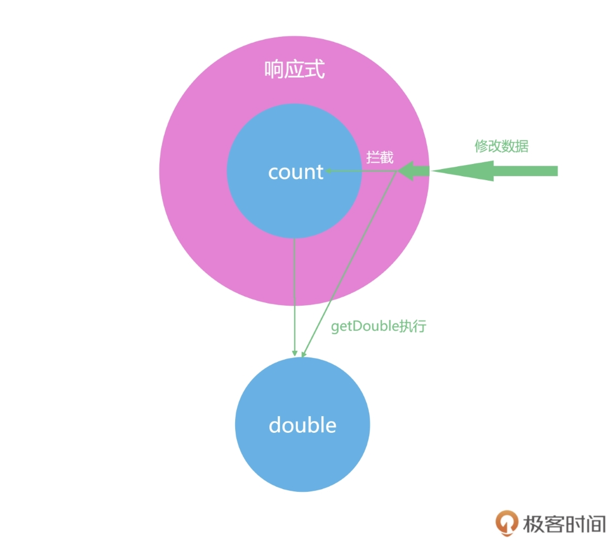
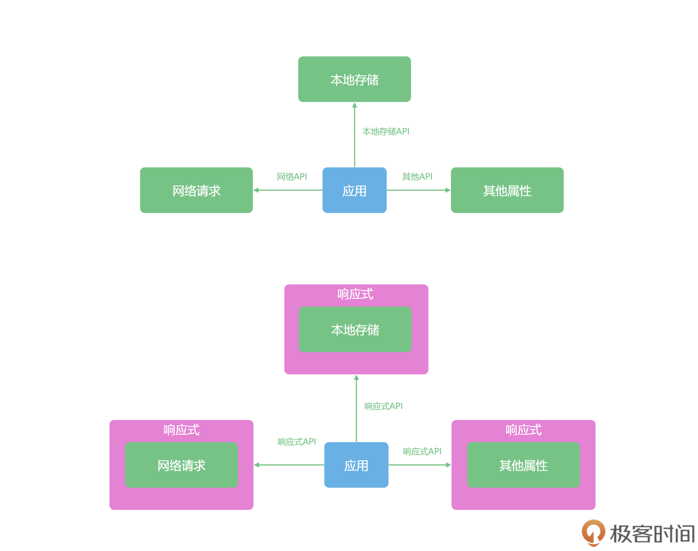

# 07 | 巧妙的响应式：深入理解Vue 3的响应式机制

你好，我是大圣。在上一讲中，我给你介绍了 Composition API 相比于 Option API 的优点，以及 `<script setup>` 的语法，这些内容能够给我们后面的开发打下了坚实的基础。

今天我带你深入了解一下 Vue 3 的响应式机制，相信学完今天的内容，你会对响应式机制有更深地体会。我还会结合代码示例，帮你掌握响应式机制的进阶用法，让我们正式开始学习吧！

## 什么是响应式

响应式一直都是 Vue 的特色功能之一。与之相比，JavaScript 里面的变量，是没有响应式这个概念的。你在学习 JavaScript 的时候首先被灌输的概念，就是代码是自上而下执行的。我们看下面的代码，代码在执行后，打印输出的两次 double 的结果也都是 2。即使我们修改了代码中的 count 的值后，double 的值也不会有任何改变。

```js
let count = 1
let double = count * 2
console.log(double)
count = 2
console.log(double)
```

double 的值是根据 count 的值乘以二计算而得到的，如果现在我们想让 doube 能够跟着 count 的变化而变化，那么我们就需要在每次 count 的值修改后，重新计算 double。

比如，在下面的代码，我们先把计算 doube 的逻辑封装成函数，然后在修改完 count 之后，再执行一遍，你就会得到最新的 double 值。

```js
let count = 1
// 计算过程封装成函数
let getDouble = n=>n*2 //箭头函数
let double = getDouble(count)
console.log(double)

count = 2
// 重新计算double，这里我们不能自动执行对double的计算
double = getDouble(count)
console.log(double)
```

实际开发中的计算逻辑会比计算 doube 复杂的多，但是都可以封装成一个函数去执行。下一步，我们要考虑的是，如何让 double 的值得到自动计算。

如果我们能让 getDouble 函数自动执行，也就是如下图所示，我们使用 JavaScript 的某种机制，把 count 包裹一层，每当对 count 进行修改时，就去同步更新 double 的值，那么就有一种 double 自动跟着 count 的变化而变化的感觉，这就算是响应式的雏形了。



## 响应式原理

响应式原理是什么呢？Vue 中用过三种响应式解决方案，分别是 defineProperty、Proxy 和 value setter。我们首先来看 Vue 2 的 defineProperty API，这个函数详细的 API 介绍你可以直接访问[MDN 介绍文档](https://developer.mozilla.org/zh-CN/docs/Web/JavaScript/Reference/Global_Objects/Object/defineProperty)来了解。

这里我结合一个例子来说明，在下面的代码中，我们定义个一个对象 obj，使用 defineProperty 代理了 count 属性。这样我们就对 obj 对象的 value 属性实现了拦截，读取 count 属性的时候执行 get 函数，修改 count 属性的时候执行 set 函数，并在 set 函数内部重新计算了 double。

```js
let getDouble = n=>n*2
let obj = {}
let count = 1
let double = getDouble(count)

Object.defineProperty(obj,'count',{
    get(){
        return count
    },
    set(val){
        count = val
        double = getDouble(val)
    }
})
console.log(double)  // 打印2
obj.count = 2
console.log(double) // 打印4  有种自动变化的感觉
```

这样我们就实现了简易的响应式功能，在课程的第四部分，我还会带着你写一个更完善的响应式系统。

但 defineProperty API 作为 Vue 2 实现响应式的原理，它的语法中也有一些缺陷。比如在下面代码中，我们删除 obj.count 属性，set 函数就不会执行，double 还是之前的数值。这也是为什么在 Vue 2 中，我们需要 $delete 一个专门的函数去删除数据。

```js
delete obj.count
console.log(double) // doube还是4
```

Vue 3 的响应式机制是基于 Proxy 实现的。就 Proxy 这个名字来说，你也能看出来这是代理的意思，Proxy 的重要意义在于它解决了 Vue 2 响应式的缺陷。我们看下面的代码，在其中我们通过 new Proxy 代理了 obj 这个对象，然后通过 get、set 和 deleteProperty 函数代理了对象的读取、修改和删除操作，从而实现了响应式的功能。

```js
let proxy = new Proxy(obj,{
    get : function (target,prop) {
        return target[prop]
    },
    set : function (target,prop,value) {
        target[prop] = value;
        if(prop==='count'){
            double = getDouble(value)
        }
    },
    deleteProperty(target,prop){
        delete target[prop]
        if(prop==='count'){
            double = NaN
        }
    }
})
console.log(obj.count,double)
proxy.count = 2
console.log(obj.count,double) 
delete proxy.count
// 删除属性后，我们打印log时，输出的结果就会是 undefined NaN
console.log(obj.count,double) 
```

我们从这里可以看出 Proxy 实现的功能和 Vue 2 的 definePropery 类似，它们都能够在用户修改数据的时候触发 set 函数，从而实现自动更新 double 的功能。而且 Proxy 还完善了几个 definePropery 的缺陷，比如说可以监听到属性的删除。

Proxy 是针对对象来监听，而不是针对某个具体属性，所以不仅可以代理那些定义时不存在的属性，还可以代理更丰富的数据结构，比如 Map、Set 等，并且我们也能通过 deleteProperty 实现对删除操作的代理。

当然，为了帮助你理解 Proxy，我们还可以把 double 相关的代码都写在 set 和 deleteProperty 函数里进行实现，在课程的后半程我会带你做好更完善的封装。比如下面代码中，Vue 3 的 reactive 函数可以把一个对象变成响应式数据，而 reactive 就是基于 Proxy 实现的。我们还可以通过 watchEffect，在 obj.count 修改之后，执行数据的打印。

```js
import {reactive,computed,watchEffect} from 'vue'

let obj = reactive({
    count:1
})
let double = computed(()=>obj.count*2)
obj.count = 2

watchEffect(()=>{
    console.log('数据被修改了',obj.count,double.value)
})
```

有了 Proxy 后，响应式机制就比较完备了。但是在 Vue 3 中还有另一个响应式实现的逻辑，就是利用对象的 get 和 set 函数来进行监听，这种响应式的实现方式，只能拦截某一个属性的修改，这也是 Vue 3 中 ref 这个 API 的实现。在下面的代码中，我们拦截了 count 的 value 属性，并且拦截了 set 操作，也能实现类似的功能。

```js

let getDouble = n => n * 2
let _value = 1
double = getDouble(_value)

let count = {
  get value() {
    return _value
  },
  set value(val) {
    _value = val
    double = getDouble(_value)

  }
}
console.log(count.value,double)
count.value = 2
console.log(count.value,double)
```

三种实现原理的对比表格如下，帮助你理解三种响应式的区别。


## 定制响应式数据

简单入门响应式的原理后，接下来我们学习一下响应式数据在使用的时候的进阶方式。在前面第二讲做清单应用的时候，我给你留过一个思考题，就是让你想办法解决所有的操作状态在刷新后就都没了这个问题。

解决这个问题所需要的，就是让 todolist 和本地存储能够同步。我们首先可以选择的就是在代码中，显式地声明同步的逻辑，而 watchEffect 这个函数让我们在数据变化之后可以执行指定的函数。

我们看下使用 `<script setup>` 重构之后的 todolist 的代码。这段代码使用 watchEffect，数据变化之后会把数据同步到 localStorage 之上，这样我们就实现了 todolist 和本地存储的同步。

```js
import { ref, watchEffect, computed } from "vue";

let title = ref("");
let todos = ref(JSON.parse(localStorage.getItem('todos')||'[]'));
watchEffect(()=>{
    localStorage.setItem('todos',JSON.stringify(todos.value))
})
function addTodo() {
  todos.value.push({
    title: title.value,
    done: false,
  });
  title.value = "";
}
```

更进一步，我们可以直接抽离一个 useStorage 函数，在响应式的基础之上，把任意数据响应式的变化同步到本地存储。我们先看下面的这段代码，ref 从本地存储中获取数据，封装成响应式并且返回，watchEffect 中做本地存储的同步，useStorage 这个函数可以抽离成一个文件，放在工具函数文件夹中。

```js
function useStorage(name, value=[]){
    let data = ref(JSON.parse(localStorage.getItem(name)|| value))
    watchEffect(()=>{
        localStorage.setItem(name,JSON.stringify(data.value))
    })
    return data
}
```

在项目中我们使用下面代码的写法，把 ref 变成 useStorage，这也是 Composition API 最大的优点，也就是可以任意拆分出独立的功能。

```js
let todos = useStorage('todos',[])

function addTodo() {
  ...code
}
```

现在，你应该已经学会了在 Vue 内部进阶地使用响应式机制，去封装独立的函数。社区也有非常优秀的 Vueuse 工具库，包含了大量类似 useStorage 的工具函数库。在后续的实战应用中，我们也会经常对通用功能进行封装。

如下图所示，我们可以把日常开发中用到的数据，无论是浏览器的本地存储，还是网络数据，都封装成响应式数据，统一使用响应式数据开发的模式。这样，我们开发项目的时候，只需要修改对应的数据就可以了。



基于响应式的开发模式，我们还可以按照类似的原理，把我们需要修改的数据，都变成响应式。比如，我们可以在 loading 状态下，去修改浏览器的小图标 favicon。和本地存储类似，修改 favicon 时，我们需要找到 head 中有 icon 属性的标签。

在下面的代码中，我们把对图标的对应修改的操作封装成了 useFavicon 函数，并且通过 ref 和 watch 的包裹，我们还把小图标变成了响应式数据。

```js
import {ref,watch} from 'vue'
export default function useFavicon( newIcon ) {
    const favicon = ref(newIcon)

    const updateIcon = (icon) => {
      document.head
        .querySelectorAll(`link[rel*="icon"]`)
        .forEach(el => el.href = `${icon}`)
    }
    const reset = ()=>favicon.value = '/favicon.ico'

    watch( favicon,
      (i) => {
        updateIcon(i)
      }
    )
    return {favicon,reset}
  } 
```

这样在组件中，我们就可以通过响应式的方式去修改和使用小图标，通过对 faivcon.value 的修改就可以随时更换网站小图标。下面的代码，就实现了在点击按钮之后，修改了网页的图标为 geek.png 的操作。

```html
 <script setup>
 import useFavicon from './utils/favicon'
 let {favicon}  = useFavicon()
 function loading(){
   favicon.value = '/geek.png'
 }
</script>

<template>
  <button @click="loading">123</button>
</template>
```

## Vueuse 工具包

我们自己封装的 useStorage，算是把 localStorage 简单地变成了响应式对象，实现数据的更新和 localStorage 的同步。同理，我们还可以封装更多的类似 useStorage 函数的其他 use 类型的函数，把实际开发中你用到的任何数据或者浏览器属性，都封装成响应式数据，这样就可以极大地提高我们的开发效率。

Vue 社区中其实已经有一个类似的工具集合，也就是 VueUse，它把开发中常见的属性都封装成为响应式函数。

VueUse  趁着这一波 Vue 3  的更新，跟上了响应式 API 的潮流。VueUse 的官方的介绍说这是一个 Composition API  的工具集合，适用于 Vue 2.x 或者 Vue 3.x，用起来和 React Hooks  还挺像的。

在项目目录下打开命令行里，我们输入如下命令，来进行 VueUse 插件的安装：

```
npm install @vueuse/core
```

然后，我们就先来使用一下 VueUse。在下面这段代码中，我们使用 useFullscreen 来返回全屏的状态和切换全屏的函数。这样，我们就不需要考虑浏览器全屏的 API，而是直接使用 VueUse 响应式数据和函数就可以很轻松地在项目中实现全屏功能。

```html
<template>
  <h1 @click="toggle">click</h1>
</template>
<script setup>
import { useFullscreen } from '@vueuse/core'
const { isFullscreen, enter, exit, toggle } = useFullscreen()
</script>
```

useFullscreen 的封装逻辑和 useStorage 类似，都是屏蔽了浏览器的操作，把所有我们需要用到的状态和数据都用响应式的方式统一管理，VueUse 中包含了很多我们常用的工具函数，我们可以把网络状态、异步请求的数据、动画和事件等功能，都看成是响应式的数据去管理。

## 总结

我们来总结一下今天学到的内容，首先我给你介绍了响应式的概念以及我们为什么需要响应式，具体 Vue 3 的响应式源码，我会在课程第四部分带你手写一个。

然后，通过对 useStorage 的封装，我为你讲解了响应式机制的进阶用法，那就是可以把一切项目中的状态和数据都封装成响应式的接口，屏蔽了浏览器的 API，对外暴露的就是普通的数据，可以极大地提高我们的开发效率。

接着，我带你了解了 VueUse 这个工具包，这也是 Vue 官方团队成员的作品。VueUse 提供了一大批工具函数，包括全屏、网络请求、动画等，都可以使用响应式风格的接口去使用，并且同时兼容 Vue 2 和 Vue 3，开箱即用。这门课程剩下的项目中会用到很多 VueUse 的函数，也推荐你去 GitHub 关注 VueUse 的动态和功能。

## 思考题

最后，留给你一道思考题：你的项目中有哪些数据可以封装成响应式数据呢？

欢迎在评论区留言，我会跟你一起探究 Vue 3 响应式的其他用法，也欢迎你把这篇文章分享给其他人，我们下一讲见！