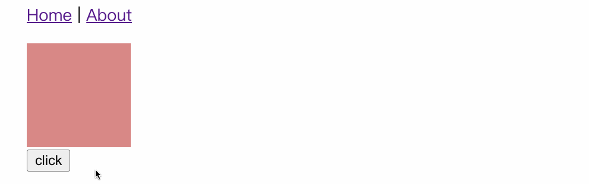
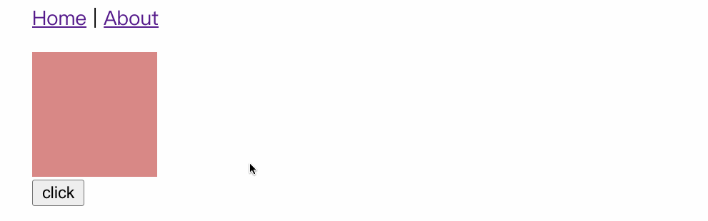
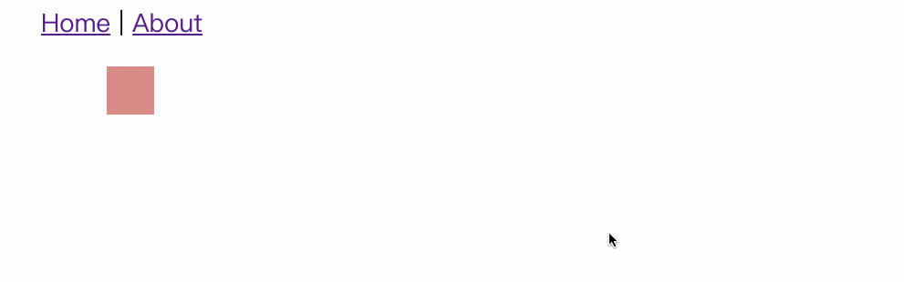
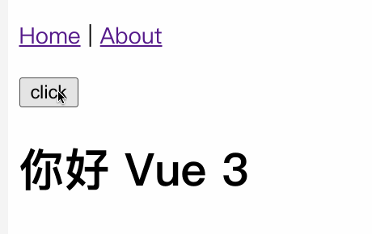
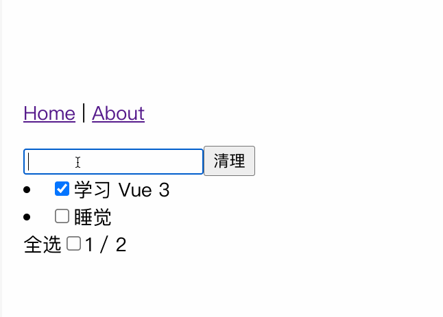
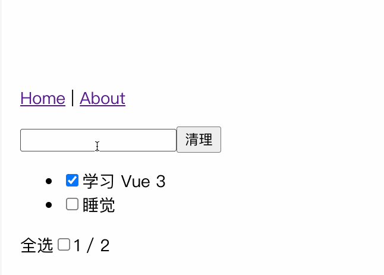
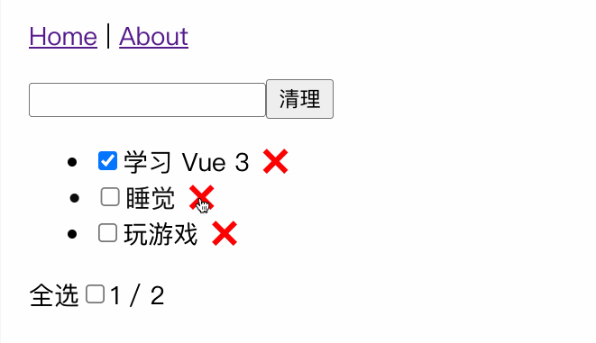
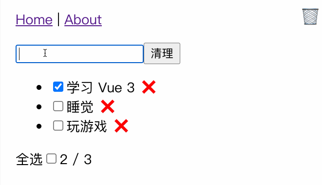

# 09 | 动画：Vue中如何实现动画效果？

你好，我是大圣。

在上一讲中，我给你讲解了组件化设计的思路，有了组件，我们就可以积木式地搭建网页了。领会组件设计的思路后，小圣继续丰富了清单组件的功能，在组件的功能实现完毕后，我给他提出了一个新的要求，希望能有一些动画效果的加入，让这个应用显得不再这么生硬。

小圣自己琢磨以后，又找过来咨询我 Vue 3 中实现动画的方式，所以今天我就来跟你聊一下 Vue 中应该如何实现常见的过渡和动效。在讲解过程中，我们会继续给之前那个清单应用添砖加瓦，给它添加更多酷炫的玩法，让我们正式开始今天的学习吧。

## 前端过渡和动效

在讲 Vue 中的动效和过渡之前，我想先跟你聊一下前端的过渡和动效的实现方式。举个例子，假设我现在有这样一个需求：在页面上要有一个 div 标签，以及一个按钮，点击页面的按钮后，能够让 div 标签的宽度得到增加。

在下面的代码中，我们可以实现上面所说的这个效果。这段代码里，首先是一个 div 标签，我们使用 width 控制宽度。我们想要的前端效果是，每次点击按钮的时候，div 标签的宽度都增加 100px。

```html
<template>

  <div class="box" :style="{width:width+'px'}"></div>
  <button @click="change">click</button>
</template>

<script setup>
import {ref} from 'vue'
let width= ref(100)
function change(){
  width.value += 100
}
</script>

<style>
.box{
  background:red;
  height:100px;
}
</style>
```

这个功能实现的效果图如下，小圣虽然实现了需求中提到的功能，但是现在的显示效果很生硬，这点你从下面的动态效果图中也能看出来。



为了优化显示的效果，首先我们可以通过一个 CSS 的属性 transition 来实现过渡，实现方式非常简单，直接在 div 的样式里加上一个 transition 配置就可以了。下面是具体的实现，其中我们给 transition 配置了三个参数，简单解释呢，就是 div 的 width 属性需要过渡，过渡时间是 1 秒，并且过渡方式是线性过渡。

```html
<style>
.box{
  background:#d88986;
  height:100px;
  transition: width 1s linear;
}
</style>
```

添加上述 transition 配置后，前端页面会显示如下的过渡效果，是不是流畅了一些呢？实际上，日常项目开发中类似的过渡效果是很常见的。



现在你能看到，**我们可以通过 transition 来控制一个元素的属性的值，缓慢地变成另外一个值，这种操作就称之为过渡**。除了 transition，我们还可以通过 animation 和 keyframe 的组合实现动画。

在下面的代码中，我们指定标签的 antimation 配置，给标签设置 move 动画，持续时间为两秒，线性变化并且无限循环。然后使用 @keyframes 定制 move 动画，内部定义了动画 0%、50% 和 100% 的位置，最终实现了一个方块循环移动的效果。

```css

.box1{
  width:30px;
  height:30px;
  position: relative;
  background:#d88986;
  animation: move 2s linear infinite;
}
@keyframes move {
  0% {left:0px}
  50% {left:200px}
  100% {left:0}
}
```

上面代码的实现效果如下：



这就是实现前端动画最简单的方式了，在网页应用开发的场景下，或多或少都会有过渡动画的使用需求。从最基本的颜色和位置的渐变，到页面切换都是动画的应用场景，这些动画在视觉和心理的体验上更加友好，比如等待时间的 Loading 加载提示，弹窗出现的显示动画等。

## Vue 3 动画入门

通常我们实现的动画，会给 Web 应用带来额外的价值。动画和过渡可以增加用户体验的舒适度，让变化更加自然，并且可以吸引用户的注意力，突出重点。transition 和 animation 让我们可以用非常简单的方式实现动画。那么在 Vue 3 中，我们到底该如何使用动画呢？

Vue 3 中提供了一些动画的封装，使用内置的 transition 组件来控制组件的动画。为了让你先有一个感性的认识，这里我们先来举一个最简单的例子：我们可以使用一个按钮控制标题文字的显示和隐藏，具体的代码如下，通过点击按钮，就可以控制 h1 标签的显示和隐藏。

```html
<template>

  <button @click="toggle">click</button>
  <h1 v-if="showTitle">你好 Vue 3</h1>
</template>

<script setup>
import {ref} from 'vue'
let showTitle = ref(true)
function toggle(){
  showTitle.value = !showTitle.value
}
</script>
```

在 Vue 中，如果我们想要在显示和隐藏标题文字的时候，加入动效进行过渡，那么我们直接使用 transition 组件包裹住需要动画的元素就可以了。

在下面代码中，我们使用 transition 包裹 h1 标签，并且设置了 name 为 fade，Vue 会在 h1 标签显示和隐藏的过程中去设置标签的 class，我们可以根据这些 class 去实现想要的动效。

```html
  <transition name="fade">
    <h1 v-if="showTitle">你好 Vue 3</h1>
  </transition>
```

具体 class 的名字，Vue 的官网有一个图给出了很好的解释，图里的 v-enter-from 中的 v，就是我们设置的 name 属性。所以在我们现在这个案例中，标签在进入和离开的时候，会有 fade-enter-active 和 fade-leave-active 的 class，进入的开始和结束会有 fade-enter-from 和 face-enter-to 两个 class。


根据上图所示的原理，我们在 style 标签中新增如下代码，通过 fade-enter-active 和 fade-leave-active 两个 class，去控制动画全程的过渡属性。设置 opacity 有 0.5 秒的过渡时间，并且在元素进入前和离开后设置 opacity 为 0。

```html
<style>
.fade-enter-active,
.fade-leave-active {
  transition: opacity 0.5s linear;
}

.fade-enter-from,
.fade-leave-to {
  opacity: 0;
}
</style>
```

通过对元素进入和离开的过渡设置，我们可以实现如下动画：



## 清单应用优化

现在，我们通过学到的动画原理，去优化一下第二讲的清单应用。我们先来了解一下操作的场景，在原先清单应用已有的交互下，有一个交互的优化，我们想对交互再增加一个优化项。具体来说，就是当输入框为空的时候，敲击回车需要弹出一个错误的提示。

小圣同学对 Composition API 已经非常熟悉了，很快速地写下了下面的代码。小圣在代码的 template 中新增了一个显示错误消息的 div，设置为绝对定位，通过 showModal 变量控制显示和隐藏。并且在 addTodo 函数中，如果 title.value 为空，也就是用户输入为空的时候，就设置 showModal 为 true。这时，如果用户敲击回车，就会显示弹窗，并且定时关闭。

```html
<template>
...清单代码
  <div class="info-wrapper" v-if="showModal">
    <div class="info">
      哥，你啥也没输入！
    </div>
  </div>
</template>

<script setup>
...清单功能代码
  let showModal = ref(false)

  function addTodo() {
    if(!title.value){
      showModal.value = true
      setTimeout(()=>{
        showModal.value = false
      },1500)
      return 
    }
    todos.value.push({
      title: title.value,
      done: false,
    });
    title.value = "";
  }
</script>
<style>
.info-wrapper {
  position: fixed;
  top: 20px;
  width:200px;
}
.info {
  padding: 20px;
  color: white;
  background: #d88986;
}
</style>
```

新增交互后的前端显示效果如下，敲击回车后，如果输入为空，就会显示错误信息的弹窗。


功能虽然实现了，但是我们想进一步提高弹窗的交互效果，也就是弹窗的显示需要新增动画。对于这个需求，我们在直接使用 transition 包裹弹窗之后，设置对应进入和离开的 CSS 样式就可以了。首先，我们给 transition 动画设置 name 为 modal，在 style 中通过对 model 对应的 CSS 设置过渡效果后，就给弹窗增加了弹窗的效果。

```html
<transition name="modal">
  <div class="info-wrapper" v-if="showModal">
    <div class="info">
      哥，你啥也没输入！
    </div>
   </div>
</transition>

<style>
  .modal-enter-from {
    opacity: 0;
    transform: translateY(-60px);
  }
  .modal-enter-active {
    transition: all 0.3s ease;
  }
  .modal-leave-to {
    opacity: 0;
    transform: translateY(-60px);
  }
  .modal-leave-active {
    transition: all 0.3s ease;
  }
</style>
```

通过上面的代码，我们可以进行过渡效果的优化。优化后，前端页面的显示效果如下，可以看到弹窗有一个明显的滑入和划出的过渡效果。



## 列表动画

学了 transition 组件后，小圣兴致勃勃地把清单应用的列表也做了动画显示，但是现在清单列表并不是一个单独的标签，而是 v-for 渲染的列表元素，所以小圣就来找我求助，问我怎么实现列表项依次动画出现的效果。

在 Vue 中，我们把这种需求称之为列表过渡。因为 transition 组件会把子元素作为一个整体同时去过渡，所以我们需要一个新的内置组件 transition-group。在 v-for 渲染列表的场景之下，我们使用 transition-group 组件去包裹元素，通过 tag 属性去指定渲染一个元素。

此外，transition-group 组件还有一个特殊之处，就是不仅可以进入和离开动画，还可以改变定位。就和之前的类名一样，这个功能新增了 v-move 类，在下面的代码中，使用 transition-group 包裹渲染的 li 元素，并且设置动画的 name 属性为 flip-list。然后我们根据 v-move 的命名规范，设置 .flip-list-move 的过渡属性，就实现了列表依次出现的效果了。

```html
    <ul v-if="todos.length">
      <transition-group name="flip-list" tag="ul">
        <li v-for="todo in todos" :key="todo.title">
          <input type="checkbox" v-model="todo.done" />
          <span :class="{ done: todo.done }"> {{ todo.title }}</span>
        </li>
      </transition-group>

    </ul>
<style>
.flip-list-move {
  transition: transform 0.8s ease;
}
.flip-list-enter-active,
.flip-list-leave-active {
  transition: all 1s ease;
}
.flip-list-enter-from,
.flip-list-leave-to {
  opacity: 0;
  transform: translateX(30px);
}
</style>
```

通过上面的代码，我们就可以得到如下的实现效果。你可以看到，在新增列表和显示错误信息的弹窗上，都设置了过渡和动画。



## 页面切换动画

对于一般的前端页面应用来说，还有一个常见的动画切换的场景，就是在页面切换这个场景时的动画。**这个动画切换场景的核心原理和弹窗动画是一样的，都是通过 transition 标签控制页面进入和离开的 class。**

现在默认是在 vue-router 的模式下，我们使用 router-view 组件进行动态的组件渲染。在路由发生变化的时候，我们计算出对应匹配的组件去填充 router-view。

如果要在路由组件上使用转场，并且对导航进行动画处理，你就需要使用 v-slot API。我们来到 src/App.vue 组件中，因为之前 router-view 没有子元素，所以我们要对代码进行修改。

在下面的代码中，router-view 通过 v-slot 获取渲染的组件并且赋值给 Component，然后使用 transition 包裹需要渲染的组件，并且通过内置组件 component 的 is 属性动态渲染组件。这里 vue-router 的动画切换效果算是抛砖引玉，关于 vue-router 进阶的适用内容，全家桶实战篇后面的几讲还会继续深入剖析。

```html
<router-view v-slot="{ Component }">
  <transition  name="route" mode="out-in">
    <component :is="Component" />
  </transition>
</router-view>
```

## JavaScript 动画

在前端的大部分交互场景中，动画的主要目的是提高交互体验，CSS 动画足以应对大部分场景。但如果碰见比较复杂的动画场景，就需要用 JavaScript 来实现，比如购物车、地图等场景。

在下面的代码中，我们首先在清单应用中加上一个删除事项的功能，当点击删除图标来删除清单的时候，可以直接删除一行。

```html
<template>

    ...清单应用其他代码
    
      <transition-group name="flip-list" tag="ul">
        <li v-for="(todo,i) in todos" :key="todo.title">
          <input type="checkbox" v-model="todo.done" />
          <span :class="{ done: todo.done }"> {{ todo.title }}</span>
          <span class="remove-btn" @click="removeTodo($event,i)">
            ❌
          </span>
        </li>
      </transition-group> 
</template>
<script>
  function removeTodo(e,i){
    todos.value.splice(i,1)
  }
</script>
```

通过上面的代码，我们能实现下面所示的效果：



如果我们想在删除的时候，实现一个图标飞到废纸篓的动画，那么在这个场景下，使用单纯的 CSS 动画就不好实现了，我们需要引入 JavaScript 来实现动画。实现的思路也很简单，我们放一个单独存在的动画元素并且藏起来，当点击删除图标的时候，我们把这个动画元素移动到鼠标的位置，再飞到废纸篓里藏起来就可以了。

具体怎么做呢？ 在 Vue 的 transition 组件里，我们可以分别设置 before-enter，enter 和 after-enter 三个函数来更精确地控制动画。

在下面的代码中，我们首先定义了 animate 响应式对象来控制动画元素的显示和隐藏，并且用 transition 标签包裹动画元素。在 beforeEnter 函数中，通过 getBoundingClientRect 函数获取鼠标的点击位置，让动画元素通过 translate 属性移动到鼠标所在位置；并且在 enter 钩子中，把动画元素移动到初始位置，在 afterEnter 中，也就是动画结束后，把动画元素再隐藏起来，这样就实现了类似购物车的飞入效果。

```html
<template>
    <span class="dustbin">
      🗑
    </span>
<div class="animate-wrap">
    <transition @before-enter="beforeEnter" @enter="enter" @after-enter="afterEnter">
        <div class="animate" v-show="animate.show">
            📋
        </div>
    </transition>
</div>
</template>

<script setup>

let animate = reactive({
  show:false,
  el:null
})
function beforeEnter(el){
      let dom = animate.el
      let rect = dom.getBoundingClientRect()
      let x = window.innerWidth - rect.left - 60
      let y = rect.top - 10
      el.style.transform = `translate(-${x}px, ${y}px)`
}
function enter(el,done){
      document.body.offsetHeight
      el.style.transform = `translate(0,0)`
      el.addEventListener('transitionend', done)
}
function afterEnter(el){
      animate.show = false
      el.style.display = 'none'
}
function removeTodo(e,i){
  animate.el = e.target
  animate.show = true
  todos.value.splice(i,1)
}
</script>
<style>
.animate-wrap .animate{
    position :fixed;
    right :10px;
    top :10px;
    z-index: 100;
    transition: all 0.5s linear;
}
</style>
```

上面代码的显示效果如下，我们点击删除后，除了列表本身的动画移出效果，还多了一个飞入废纸篓的效果。你能看到，在引入 JavaScript 后，我们可以实现更多定制的动画效果。



## 总结

今天这一讲的主要内容讲完了，我们来简单复习一下今天学到的知识点。

首先我们学习了前端使用 CSS 实现简单动画的 transition 和 animation 两个配置；然后，我们了解到了通过 Vue 3 提供的 transition 组件，我们可以控制在 Vue 中动画元素进入和离开页面时候的 class；通过制定的命名规范，在 CSS 中设置过渡和动画效果，从而很方便地实现过渡效果，并且丰富了清单应用的弹窗功能；在这之后，我们使用 transition-group 实现列表元素的动画；最后，我还带你了解了 vue-router 中页面切换动画的实现方式。

相信学完今天这一讲，你会对 Vue 3 中实现简单动画的方式有所领会。今天我们实现的动画功能其实是 Vue 中动画的入门实战，所以我特意带你体验了全套玩法。不过你需要注意的是，实际开发中动画也不是越多越好，动画的设计也需要设计师去系统地设计效果，不要用动画做出眼花缭乱的网页。

而且，实际开发中如果想实现更复杂的动画，比如常见电商中商品飞入购物车的效果，管理系统中丰富的动画效果等，只借助 transition 组件是很难实现的。你需要借助 JavaScript 和第三方库的支持，在 beforeEnter、enter、afterEnter 等函数中实现动画。

## 思考题

关于今天设计的弹窗动画，如果想实现一个振动的效果，该如何实现呢？

欢迎在留言区留言讨论，也欢迎你把这一讲推荐给你的朋友、同事。我们下一讲见！