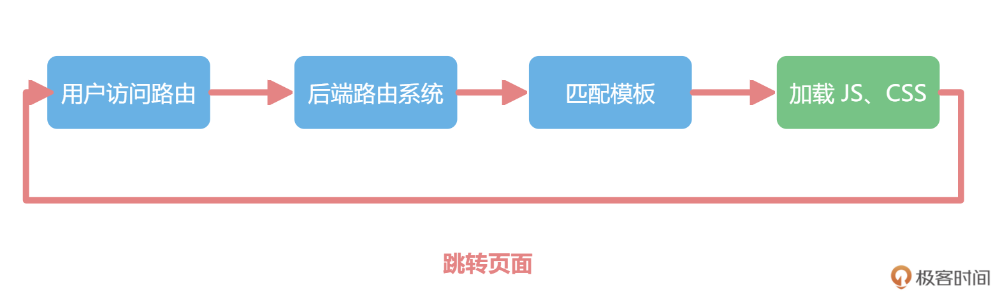

# 11 | 路由：新一代vue-router带来什么变化

你好，我是大圣。在上一讲中，我带你了解了 Vuex 这个数据管理框架的使用方法，以及 Vue 3 中数据管理框架的来源、实战细节和相关的原理。其实项目中除了数据管理，路由系统也是非常核心的模块。所以在这一讲中，我会先带你了解一下前端开发方式的演变，让你明白前端路由因何而来，之后再讲解前端路由的实现原理。最后，我会再带你手写一个 vue-router，并在这个过程中为你补充相关的实战要点，让你对如何用好 vue-router 有一个直观体验。前后端开发模式的演变在 jQuery 时代，对于大部分 Web 项目而言，前端都是不能控制路由的，而是需要依赖后端项目的路由系统。通常，前端项目也会部署在后端项目的模板里，整个项目执行的示意图如下：



jQuery 那个时代的前端工程师，都要学会在后端的模板，比如 JSP，Smatry 等里面写一些代码。但是在这个时代，前端工程师并不需要了解路由的概念。对于每次的页面跳转，都由后端开发人员来负责重新渲染模板。前端依赖后端，并且前端不需要负责路由的这种开发方式，有很多的优点，比如开发速度会很快、后端也可以承担部分前端任务等，所以到现在还有很多公司的内部管理系统是这样的架构。当然，这种开发方式也有很多缺点，比如前后端项目无法分离、页面跳转由于需要重新刷新整个页面、等待时间较长等等，所以也会让交互体验下降。为了提高页面的交互体验，很多前端工程师做了不同的尝试。在这个过程中，前端的开发模式发生了变化，项目的结构也发生了变化。下图所示的，是在目前的前端开发中，用户访问页面后代码执行的过程。


从上面的示意图中，我们可以看到：用户访问路由后，无论是什么 URL 地址，都直接渲染一个前端的入口文件 index.html，然后就会在 index.html 文件中加载 JS 和 CSS。之后，JavaScript 获取当前的页面地址，以及当前路由匹配的组件，再去动态渲染当前页面即可。用户在页面上进行点击操作时，也不需要刷新页面，而是直接通过 JS 重新计算出匹配的路由渲染即可。在前后两个示意图中，绿色的部分表示的就是前端负责的内容。而在后面这个架构下，前端获得了路由的控制权，在 JavaScript 中控制路由系统。也因此，页面跳转的时候就不需要刷新页面，网页的浏览体验也得到了提高。这种所有路由都渲染一个前端入口文件的方式，是单页面应用程序（SPA，single page application）应用的雏形。通过 JavaScript 动态控制数据去提高用户体验的方式并不新奇，Ajax 让数据的获取不需要刷新页面，SPA 应用让路由跳转也不需要刷新页面。这种开发的模式在 jQuery 时代就出来了，浏览器路由的变化可以通过 pushState 来操作，这种纯前端开发应用的方式，以前称之为 Pjax （pushState+ Ajax）。之后，这种开发模式在 MVVM 框架的时代大放异彩，现在大部分使用 Vue/React/Angular 的应用都是这种架构。SPA 应用相比于模板的开发方式，对前端更加友好，比如：前端对项目的控制权更大了、交互体验也更加丝滑，更重要的是，前端项目终于可以独立出来单独部署了。前端路由的实现原理在讲完前端路由的执行逻辑之后，我们深入探索一下前端控制路由的实现原理。现在，通过 URL 区分路由的机制上，有两种实现方式，一种是 hash 模式，通过 URL 中 # 后面的内容做区分，我们称之为 hash-router；另外一个方式就是 history 模式，在这种方式下，路由看起来和正常的 URL 完全一致。这两个不同的原理，在 vue-router 中对应两个函数，分别是 createWebHashHistory 和 createWebHistory。


hash 模式单页应用在页面交互、页面跳转上都是无刷新的，这极大地提高了用户访问网页的体验。为了实现单页应用，前端路由的需求也变得重要了起来。类似于服务端路由，前端路由实现起来其实也很简单，就是匹配不同的 URL 路径，进行解析，然后动态地渲染出区域 HTML 内容。但是这样存在一个问题，就是 URL 每次变化的时候，都会造成页面的刷新。解决这一问题的思路便是在改变 URL 的情况下，保证页面的不刷新。在 2014 年之前，大家是通过 hash 来实现前端路由，URL hash 中的 # 就是类似于下面代码中的这种 # ：

```
http://www.xxx.com/#/login
```

之后，在进行页面跳转的操作时，hash 值的变化并不会导致浏览器页面的刷新，只是会触发 hashchange 事件。在下面的代码中，通过对 hashchange 事件的监听，我们就可以在 fn 函数内部进行动态地页面切换。

```js
window.addEventListener('hashchange',fn)
```

history 模式2014 年之后，因为 HTML5 标准发布，浏览器多了两个 API：pushState 和 replaceState。通过这两个 API ，我们可以改变 URL 地址，并且浏览器不会向后端发送请求，我们就能用另外一种方式实现前端路由 **。在下面的代码中，我们监听了 popstate 事件，可以监听到通过 pushState 修改路由的变化。并且在 fn 函数中，我们实现了页面的更新操作。

```js
window.addEventListener('popstate', fn)
```

手写迷你 vue-router明白了前端路由实现原理还不够，接下来我们一起写代码直观感受一下。这里我们准备设计一个使用 hash 模式的迷你 vue-router。现在，我们在 src/router 目录下新建一个 grouter 文件夹，并且在 grouter 文件夹内部新建 index.js。有了上一讲手写 Vuex 的基础，我们就可以在 index.js 中写入下面的代码。在代码中，我们首先实现了用 Router 类去管理路由，并且，我们使用 createWebHashHistory 来返回 hash 模式相关的监听代码，以及返回当前 URL 和监听 hashchange 事件的方法；然后，我们通过 Router 类的 install 方法注册了 Router 的实例，并对外暴露 createRouter 方法去创建 Router 实例；最后，我们还暴露了 useRouter 方法，去获取路由实例。

```js
import {ref,inject} from 'vue'
const ROUTER_KEY = '__router__'

function createRouter(options){
    return new Router(options)
}

function useRouter(){
    return inject(ROUTER_KEY)
}
function createWebHashHistory(){
    function bindEvents(fn){
        window.addEventListener('hashchange',fn)
    }
    return {
        bindEvents,
        url:window.location.hash.slice(1) || '/'
    }
}
class Router{
    constructor(options){
        this.history = options.history
        this.routes = options.routes
        this.current = ref(this.history.url)

        this.history.bindEvents(()=>{
            this.current.value = window.location.hash.slice(1)
        })
    }
    install(app){
        app.provide(ROUTER_KEY,this)
    }
}

export {createRouter,createWebHashHistory,useRouter}
```

有了上面这段代码，我们回到 src/router/index.js 中，可以看到下面代码的使用方式，我们使用 createWebHashHistory 作为 history 参数，使用 routes 作为页面的参数传递给 createRouter 函数。

```js
import {
    createRouter,
    createWebHashHistory,
} from './grouter/index'
const router = createRouter({
  history: createWebHashHistory(),
  routes
})
```

下一步，我们需要注册两个内置组件 router-view 和 router-link。在 createRouter 创建的 Router 实例上，current 返回当前的路由地址，并且使用 ref 包裹成响应式的数据。router-view 组件的功能，就是 current 发生变化的时候，去匹配 current 地址对应的组件，然后动态渲染到 router-view 就可以了。我们在 src/router/grouter 下新建 RouterView.vue，写出下面的代码。在代码中，我们首先使用 useRouter 获取当前路由的实例；然后通过当前的路由，也就是 router.current.value 的值，在用户路由配置 route 中计算出匹配的组件；最后通过计算属性返回 comp 变量，在 template 内部使用 component 组件动态渲染。

```html
<template>
    <component :is="comp"></component>
</template>
<script setup>

import {computed } from 'vue'
import { useRouter } from '../grouter/index'

let router = useRouter()

const comp = computed(()=>{
    const route = router.routes.find(
        (route) => route.path === router.current.value
    )
    return route?route.component : null
})
</script>
```

在上面的代码中，我们的目的是介绍 vue-router 的大致原理。之后，在课程的源码篇中，我们会在《前端路由原理：vue-router 源码剖析》这一讲完善这个函数的路由匹配逻辑，并让这个函数支持正则匹配。有了 RouterView 组件后，我们再来实现 router-link 组件。我们在 grouter 下面新建文件 RouterILink.vue，并写入下面的代码。代码中的 template 依然是渲染一个 a 标签，只是把 a 标签的 href 属性前面加了个一个 #， 就实现了 hash 的修改。

```html
<template>
    <a :href="'#'+props.to">
        <slot />
    </a>
</template>

<script setup>
import {defineProps} from 'vue'
let props = defineProps({
    to:{type:String,required:true}
})

</script>
```

然后，回到 grouter/index.js 中，我们注册 router-link 和 router-view 这两个组件, 这样 hash 模式的迷你 vue-router 就算实现了。这里我演示了支持 hash 模式迷你 vue-router，那你不妨进一步思考一下，history 模式又该如何实现。

```js
import {ref,inject} from 'vue'
import RouterLink from './RouterLink.vue'
import RouterView from './RouterView.vue'
class Router{
    ....
    install(app){
        app.provide(ROUTER_KEY,this)
        app.component("router-link",RouterLink)
        app.component("router-view",RouterView)
    }
}
```

实际上，vue-router 还需要处理很多额外的任务，比如路由懒加载、路由的正则匹配等等。在今天了解了 vue-router 原理之后，等到课程最后一部分剖析 vue-router 源码的那一讲时，你就可以真正感受到“玩具版”的 router 和实战开发中的 router 的区别。vue-router 实战要点了解了 vue-router 的原理后，我们再来介绍一下 vue-router 在实战中的几个常见功能。首先是在路由匹配的语法上，vue-router 支持动态路由。例如我们有一个用户页面，这个页面使用的是 User 组件，但是每个用户的信息都不一样，需要给每一个用户配置单独的路由入口，这时就可以按下面代码中的样式来配置路由。在下面的代码中，冒号开头的 id 就是路由的动态部分，会同时匹配 /user/dasheng 和 /user/geektime， 这一部分的详细内容你可以参考官方文档的路由匹配语法部分。

```js
const routes = [
  { path: '/users/:id', component: User },
]
```

然后是在实战中，对于有些页面来说，只有管理员才可以访问，普通用户访问时，会提示没有权限。这时就需要用到 vue-router 的导航守卫功能了，也就是在访问路由页面之前进行权限认证，这样可以做到对页面的控制，也就是只允许某些用户可以访问。此外，在项目庞大之后，如果首屏加载文件太大，那么就可能会影响到性能。这个时候，我们可以使用 vue-router 的动态导入功能，把不常用的路由组件单独打包，当访问到这个路由的时候再进行加载，这也是 vue 项目中常见的优化方式。关于 vue-router 实战中的种种优化和注意点，在课程后续的 15-19 讲，也就是实战痛点中，我会借助实战场景，挨个给你讲解。总结好，这一讲的主要内容就讲完了，我们来总结一下今天学到的内容。首先，我们回顾了前后端开发模式的演变，也即前端项目经历的从最初的嵌入到后端内部发布，再到现在的前后端分离的过程，而这一过程也见证了前端 SPA 应用的发展。然后，我们讲到了前端路由实现的两种方式，也即通过监听不同的浏览器事件，来实现 hash 模式和 history 模式。之后，根据这个原理，我们手写了一个迷你的 vue-router，通过 createRouter 创建路由实例，并在 app.use 函数内部执行 router-link 和 router-view 组件的注册，最后在 router-view 组件内部动态的渲染组件。在这一讲的最后，我还给你简单说明了一下 vue-router 实战中常见的一些痛点。vue-router 进一步实战的内容，比如权限认证、页面懒加载等功能，在课程后面的 15-19 讲中还会详细展开。相信今天这一讲结束后，你一定对 vue-router 有了更加新的理解。思考题最后给你留个思考题，今天我们只用了大概 60 行代码，就实现了 hash 模式的迷你 vue-router，那你还可以思考一下，支持 history 模式的迷你 vue-router 又该如何实现呢？欢迎在留言区分享你的答案，也欢迎你把这一讲分享给你的朋友们，我们下一讲见！