# 12 | 调试：提高开发效率必备的Vue Devtools

你好，我是大圣。

跟随我的脚步，通过对前面数讲内容的学习，相信你现在对 Vue+Vuex+vue-router 都已经比较熟悉了。在开启课程后续的复杂项目之前，学会如何调试项目也是我们必须要掌握的一个技能。

在项目开发中，我们会碰到各种各样的问题，有样式错误、有不符合预期的代码报错、有前后端联调失败等问题。也因此，一个能全盘帮我们监控项目的方方面面，甚至在监控时，能精确到源码每一行的运行状态的调试工具，就显得非常有必要了。

而 Chrome 的开发者工具 Devtools，就是 Vue 的调试工具中最好的选择。由于 Chrome 也公开了 Devtools 开发的规范，因而各大框架比如 Vue 和 React，都会在 Chrome Devtools 的基础之上，开发自己框架的调试插件，这样就可以更方便地调试框架内部的代码。Vue Devtools 就是 Vue 官方开发的一个基于 Chrome 浏览器的插件，作为调试工具，它可以帮助我们更好地调试 Vuejs 代码。

这节课，我会先为你讲解如何借助 Chrome 和 VS Code 搭建高效的开发环境，然后再教你使用 Vue 的官方调试插件 Vue Devtools 来进行项目调试工作。

## Chrome 调试工具

首先，我们来了解一下 Chrome 的调试工具，也就是 Chrome 的开发者工具 Chrome DevTools。在 Chrome 浏览器中，我们打开任意一个页面，点击鼠标右键，再点击审查元素（检查），或者直接点击 F12 就可以看到调试窗口了。

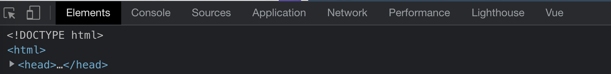

我们看下截图中的调试窗口，里面有几个页面是我们经常用到的：Elements 页面可以帮助我们调试页面的 HTML 和 CSS；Console 页面是我们用得最多的页面，它可以帮助我们调试 JavaScript；Source 页面可以帮助我们调试开发中的源码；Application 页面可以帮助我们调试本地存储和一些浏览器服务，比如 Cookie、Localstorage、通知等等。

Network 页面在我们开发前后端交互接口的时候，可以让我们看到每个网络请求的状态和参数；Performance 页面则用来调试网页性能。Lighthouse 是 Google 官方开发的插件，用来获取网页性能报告，今天我也会教你用 lighthouse 评测一下极客时间官网首页的性能。

以上说的这些调试窗口中的页面，都是 Chrome 的开发者工具中自带的选项，而调试窗口最后面的 Vue 页面就是需要额外安装的 Vue Devtools，也就是调试 Vue 必备的工具。

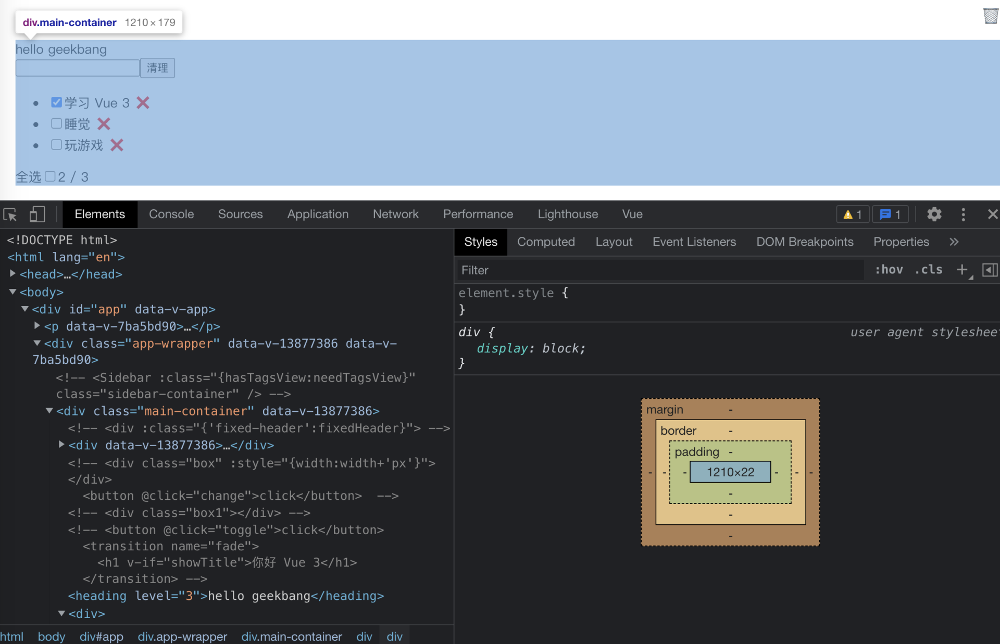

上图所示的是项目开发中用到最多的页面，而在调试窗口右侧的工具栏中，你还可以选中 More tools 来开启更多自带的插件。如下图所示，More tools 中的 Animations 用于调试动画，Security 用于调试安全特性等等。

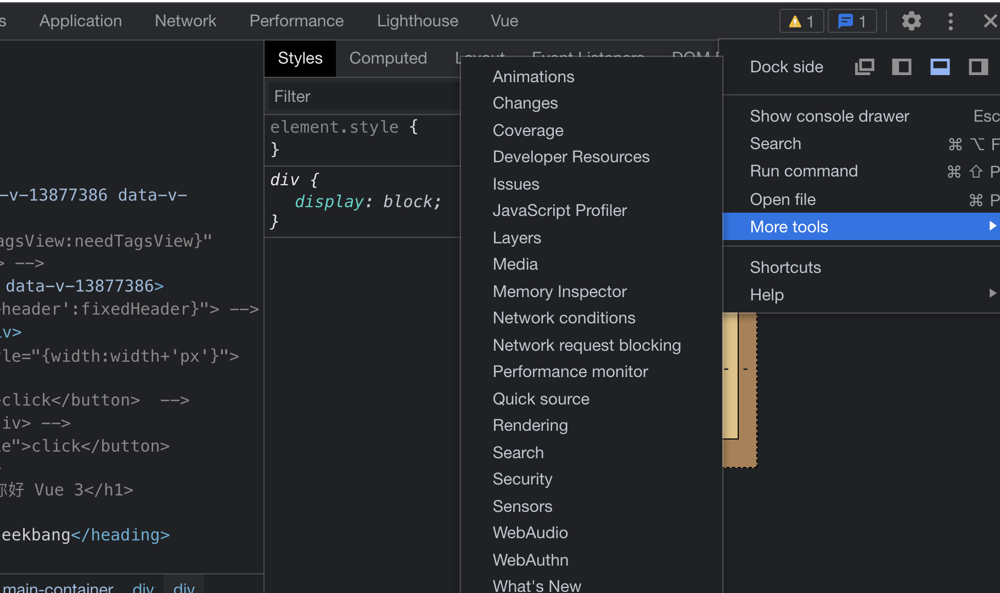

**下面，我们重点介绍一下调试窗口中的 Elements 页面和 Console 页面。这两个页面用来调试页面中的 HTML+CSS+JavaScript，是使用频率最高的两个页面。**

在 Elements 页面中，首先映入眼帘的是开发的 Vue 项目在浏览器里的状态。调试窗口的左侧是正在调试的前端页面的 HTML 结构，当我们把鼠标放到 HTML 代码的任何元素上时，在调试的前端页面上，对应元素在前端页面中所在的位置都会高亮起来。

当我们点击一个元素之后，调试窗口右侧就会显示出当前元素所有的 CSS 样式，这对于我们开发的页面布局和样式调整非常有帮助。并且，我们还可以在 Elements 页面左侧的代码中，任意修改页面的 HTML 和 CSS 代码。

比如，以我在这里给出的调试页面为例，我们可以选中调试页面（清单应用）的 div 标签，再点击调试页面右侧的 element.style，这样就可以直接新增 background 和 padding 属性，也即会得到下图的效果。此外，有一些页面布局上的 bug 可以用这种方式，在网页里实时调整后，再去更新代码。


然后，我们再来看一下在调试中用得最多的 Console 页面。在这个页面内，我们可以直接调试 JavaScript，并且页面中也会显示 JavaScript 出现的报错信息。

举个小例子，我们来到项目里的 src/main.js 文件内，把 createApp 修改成 createApp1，然后回到浏览器的 Console 调试页面，就会看到以下的报错内容，红色报错信息清晰地告诉我们代码执行出现错误的原因。

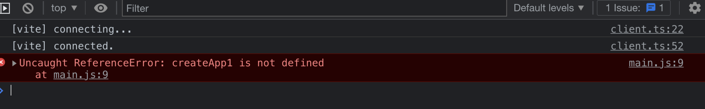

我们点击报错信息的最右侧，还能精确地定位到项目中的文件以及代码的行数。尤其是对于新手程序员来说，精确的报错定位可以极大地提高我们的开发效率。国外甚至有程序员还直接在报错信息里加上 stackoverflow 搜索地址，也算是把 Console 玩出花样了。

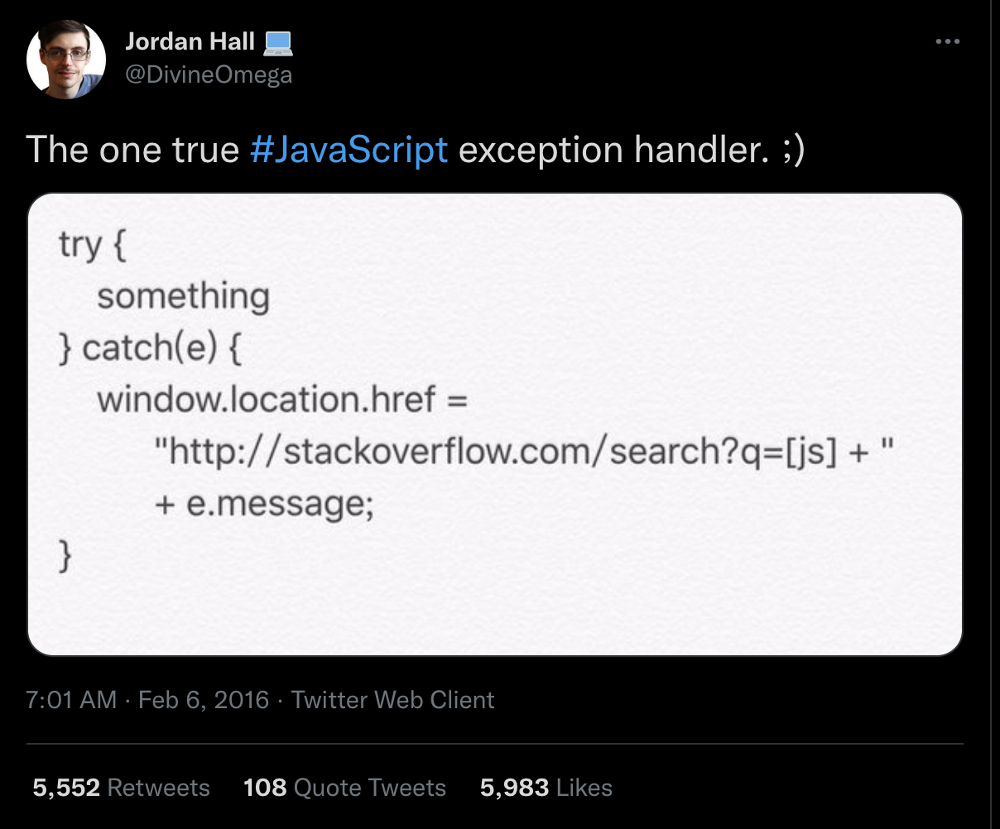

参考我们提到的国外程序员的做法，我们在 src/main.js 里加入下面这段代码 ，这样就可以在日志信息中直接复制报错内容中的链接，去 Stack Overflow 中寻找答案。

```js
window.onerror = function(e){
    console.log(['https://stackoverflow.com/search?q=[js]+'+e])
}
```

其实 Console 页面的用法非常多，当我们在代码里使用 cosole.log 打印信息时，console 页面里就会显示 log 传递的参数，这也是程序员用得最多的调试方法。

除了 console.log，还有 console.info、console.error 等方法可以显示不同级别的报错信息。而在 log 之外，我们还可以使用 console.table 更便捷地打印数组消息。在 MDN 的[Console 页面](https://developer.mozilla.org/zh-CN/docs/Web/API/Console)中，有对 Console 的全部 API 的介绍，你也可以去参考一下。

关于 Console，后续的课程中还会持续地用到，我在这里还可以分享一个我喜欢用的前端面试题，题目来自贺老的面试题。那就是我会把电脑给面试者，让他在 Console 页面里写代码，统计极客时间官网一共有多少种 HTML 标签。

你也可以上手体验一下，打开极客时间的官网，再打开调试窗口，在 Console 页面输入下面的代码，你就可以看到答案。这其实是一个比较考验应试者前端基础的一道题，你可以自己试一试。

```js
new Set([...document.querySelectorAll('*')].map(n=>n.nodeName)).size
```

## Vue Devtools

然后，我们再来介绍一下调试窗口里最后面的 Vue 页面，这个页面其实就是我们在 Chrome 浏览器中安装的第三方的插件 Vue Devtools。

首先我们要做的是安装一下 Vue Devtools。Vue Devtools 的官网上有详细的[安装教程](https://devtools.vuejs.org/)，这里就不过多讲解了。安装完毕后，如果调试的前端页面中有 Vue 相关的代码，就会激活这个 tab。进入到 Vue 这个调试页面后，你就会看到下面的示意图。

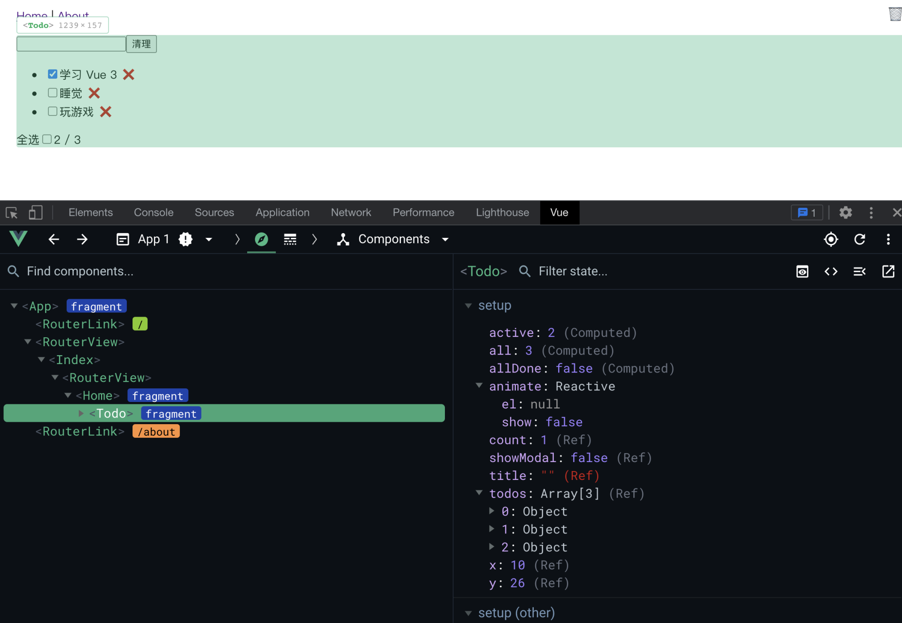

从上面的图中你可以看到，Vue Devtools 可以算是一个 Elements 页面的 Vue 定制版本，调试页面左侧的显示内容并不是 HTML，而是 Vue 的组件嵌套关系。我们可以从中清晰地看到整个项目中最外层的 App 组件，也能看到 App 组件内部的 RouterView 下面的 Todo 组件。

并且，在调试页面的左侧中，当我们点击组件的时候，我们所调试的前端页面中也会高亮清单组件的覆盖范围。调试页面的右侧则显示着 todo 组件内部所有的数据和方法。我们可以清晰地看到 setup 配置下，有 todos、animate、active 等诸多变量，并且这些变量也是和页面实时同步的数据，我们在页面中输入新的清单后，可以看到 active 和 all 的数据也随之发生了变化。

同时，我们也可以直接修改调试窗口里面的数据，这样，正在调试的前端页面也会同步数据的显示效果。有了 Vue 的调试页面，当我们碰到页面中的数据和标签不同步的情况时，就可以很轻松地定位出是哪里出现了问题。

然后在 Component 的下拉框那里，我们还可以选择 Vuex 和 Router 页面，分别用来调试 Vuex 和 vue-router。

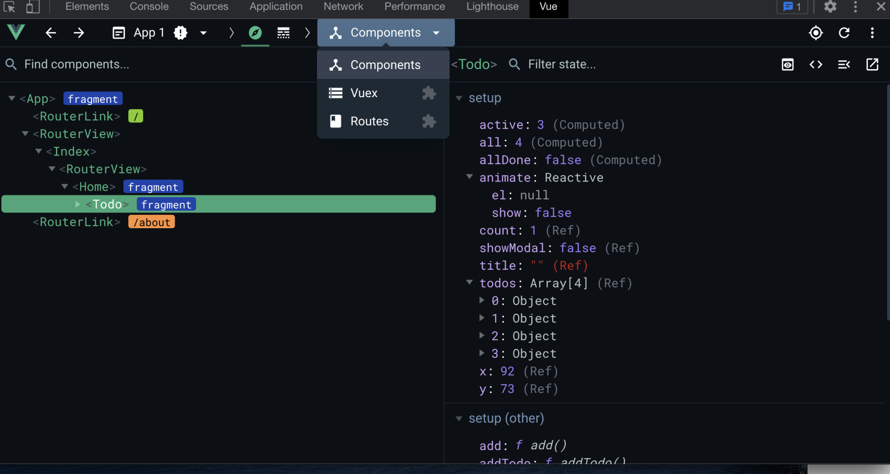

我们先来点击 Vuex 页面试一下，**这个页面里的操作可以帮助我们把 Vuex 的执行过程从黑盒变成一个白盒**。简单来说，我们可以在调试窗口的右侧看到 Vuex 内部所有的数据变化，包括 state、getters 等。

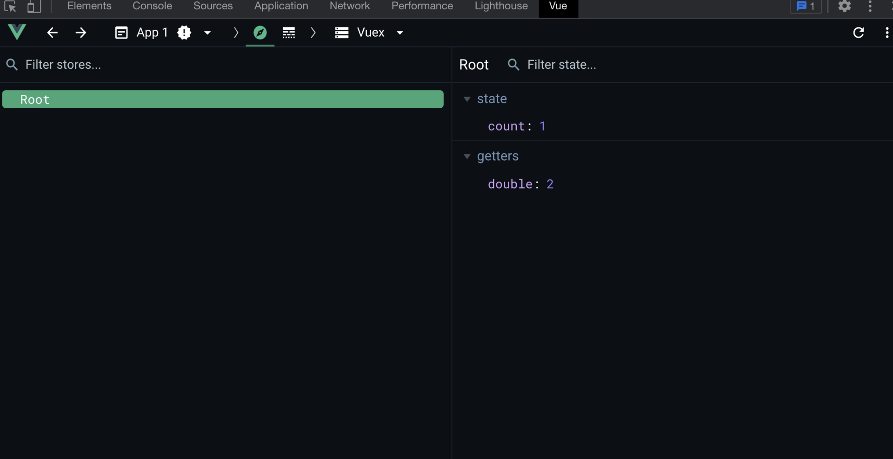

我们点击 Vuex 下拉框里的 Routes 页面，这个页面里显示了整个应用路由的配置、匹配状态、参数等，这里就不做过多的解释了。相信有了 Vue Devtools 后，你能够更快地调试 Vue 项目的内部运行状态，从而极大地提高开发效率。


这里还有一个小技巧，你可以了解一下：在 Components 页面下，你选中一个组件后，调试窗口的右侧就会出现 4 个小工具。

如下图所示，在我用红框标记的四个工具中，最右边的那个工具可以让你直接在编辑器里打开这个代码。这样，调试组件的时候就不用根据路径再去 VS Code 里搜索代码文件了，这算是一个非常好用的小功能。

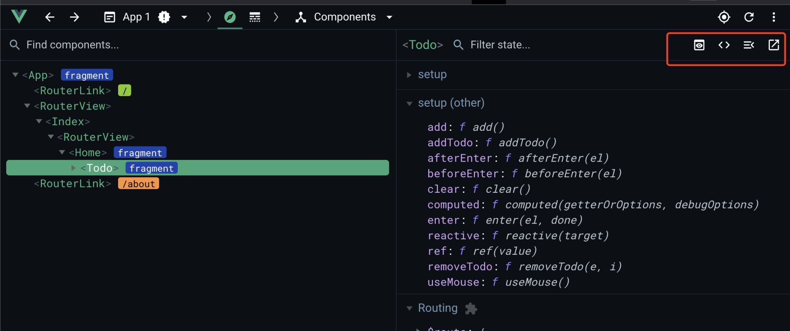

## 断点调试

正常情况下，我们用好 Elements、Console 和 Vue 这三个页面就可以处理大部分的调试结果了。不过太多的 Console 信息会让页面显得非常臃肿，所以还出现过专门去掉 Console 代码的 webpack 插件。

如果代码逻辑比较复杂，过多的 Console 信息也会让我们难以调试。这种情况就需要使用断点调试的功能，Chrome 的调试窗口会识别代码中的 debugger 关键字，并中断代码的执行。

还是通过小例子直观感受一下。我们打开 src/components 目录下的 todo.vue 文件，下面是清单应用的代码，我们在 addTodo 函数内的第一行写上 debugger。然后到前端的清单应用的页面中，我们输入任意一条信息，点击回车，你就会发现页面暂停了，并且调试窗口跳转到了 source 页面。

```js
  function addTodo() {
    debugger
    if(!title.value){
      showModal.value = true
      setTimeout(()=>{
        showModal.value = false
      },1500)
      return 
    }
    todos.value.push({
      title: title.value,
      done: false,
    });
    title.value = "";
}    
```

上面的代码在调试窗口中的效果如下图所示，点击图中用红框圈出的按钮，你就可以在 debugger 暂停的地方，逐行执行代码。并且鼠标放在任意变量上，都可以看到这个变量在代码执行的结果。对于复杂代码逻辑的调试来说，使用断点调试，可以让整个代码执行过程清晰可见。**debugger 也是高级程序员必备的断点调试法，你一定要掌握。**

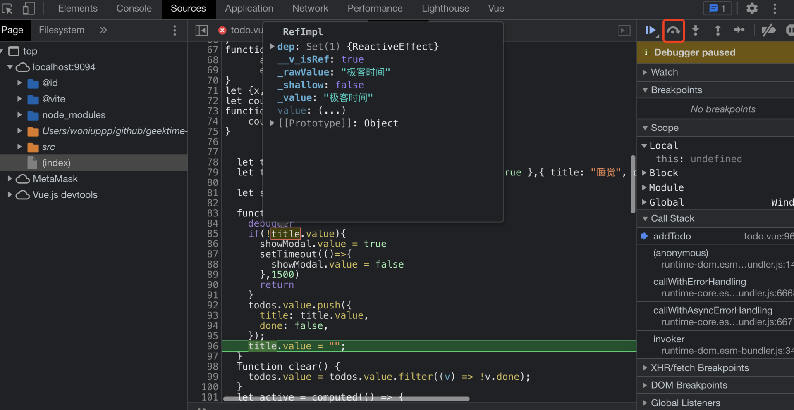

## 性能相关的调试

了解了页面代码的调试方法后，我们再来分享一下页面的性能调试方法。比如，在你遇到页面交互略有卡顿的时候，你可以在调试窗口中点击 Performance 页面中的录制按钮，然后重复你卡顿的操作后，点击结束，就可以清晰看到你在和页面进行交互操作时，浏览器中性能的变化。

以极客时间的官网页面作为具体的例子，我们在调试窗口中点击 Performance 页面中的录制按钮，然后进行刷新页面的操作，并点击首页轮播图，之后我们可以看到如下的效果：

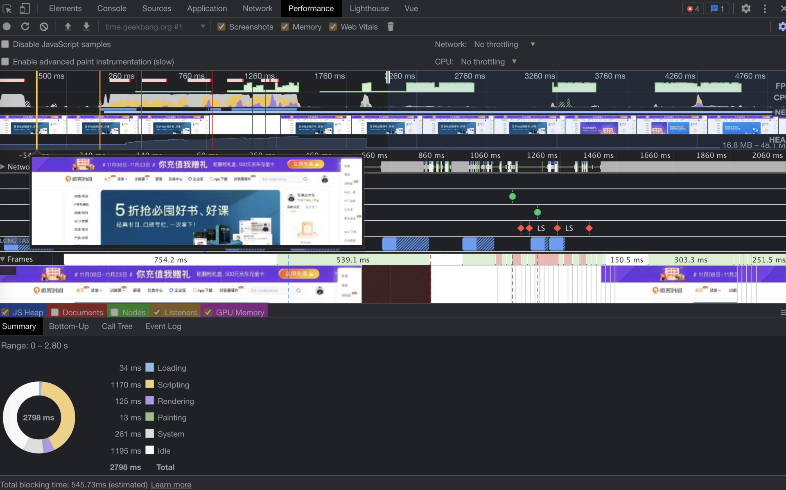

我们可以滑动鼠标，这样就能很清晰地看到极客时间页面加载的过程。然后，我们重点看下首屏加载中的性能指标，通过下方的饼图，你可以看到整个刷新过程中耗时的比例，其中 JS 代码 391ms，整体 624ms。


在 Performace 页面中，我们还可以详细地看到每个函数的执行时间。我们录制一下清单应用新增清单的操作之后，就会显示下面的示意图，从中可以清晰地看到键盘 keydown 事件之后执行的函数，在图中可以找到我们写的 addTodo 方法，以及 mountElement 等 Vue 源码里的函数。关于 Chrome 性能页面更多的使用方法 ，你可以到[Chrome 官方文档](https://developer.chrome.com/docs/devtools/evaluate-performance)上去查看。

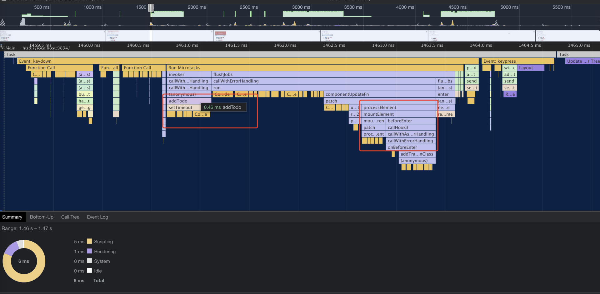

如果你觉得上面手动录制页面的性能报告的方法过于繁琐，还可以直接使用 lighthouse 插件。我们进入到 lighthouse 页面，选择 desktop 桌面版后，点击生成报告。lighthouse 在浏览器上模拟刷新的操作后，给出一个网页评分。这里我们可以看到，极客时间网站首页的评分是 72 分，在合格的标准线上。

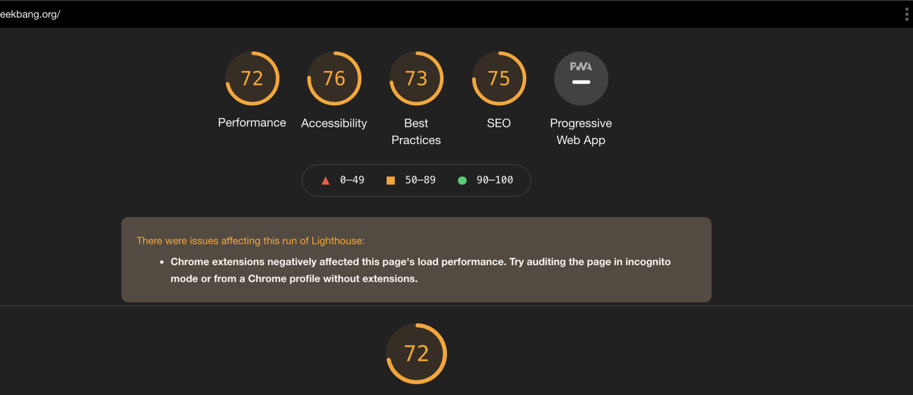

此外，根据性能、可访问性、最佳实践、SEO 和 PWA 五个维度的评分，我们可以看出，在前面四个维度中，极客时间都是及格的，第五个指标置灰，说明极客时间首页还没有支持 PWA。

我们先看下性能指标，下图中详细地给出了 FCP、TTI、LCP 等常见性能指标，并且还很贴心地给出了建议，包括字体、图标宽高、DOM 操作等等，其实我们按照这些建议依次修改，就可以实现对网页的性能优化了。并且网页优化后，性能分数的提升还可以很好地量化优化的结果。

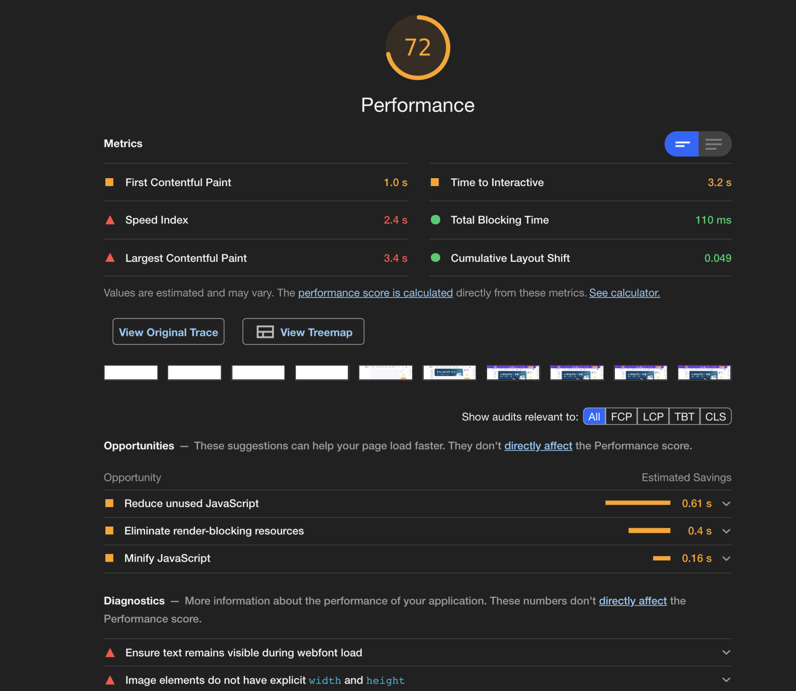

关于极客时间首页 lighthouse 其余几个指标，你可以点开[这个链接](https://pandafe.gitee.io/clock/time.geekbang.org.html)查看结果，相信结合这个实例演示，你一定会对性能优化手段有所体会。

## 总结

好，今天这一讲的主要内容，也即调试 Vue 应用的方法，就讲完了，我们一起来回顾一下吧。

首先，我给你讲解了在 Chrome 浏览器中，进行项目调试的方法。除了最基本的 Console，我们还可以借助 Chrome 提供的其他调试工具提高效率，例如元素面板、源码面板等等。每个面板都带来了透视 Vue 应用的方式，从样式到性能都是我们提高效率最高的工具。

Elements 和 Console 页面可以完成页面的布局和 JavaScript 的调试工作，并且调试窗口还会识别代码中的 debugger 语句，可以让我们在 Chrome 中进行断点调试。Performance 和 lighthouse 页面则提供了对页面做性能测试的方法，从而能帮助我们更好地查看页面中性能的指标。

然后，我们介绍了 Vue 团队开发的插件 Vue Devtools，你可以把 Vue Devtools 理解为是对 Chrome 调试工具的一个扩展。**在Vue Devtools中，我们可以很方便地调试 Vue 的应用，比如查看 Vue 的组件嵌套、查看 Vue 组件内部的 data 等属性。**

此外，当我们遇见页面中的数据和渲染结果不一致的 bug 时，我们可以很方便地使用 Vue Devtools 精确地定位问题，从而极大地提高了开发效率。并且 Vue Devtools 还支持了 Vue 和 vue-router 的调试页面，这让整个页面的 Vuex 数据和路由都清晰可见。

相信今天这一讲结束后，当你在开发应用时再遇到了 bug，你就能通过调试工具快速地定位问题，并借助今天我们讲到的内容，顺利地解决掉 bug。

## 思考题

Vue 的 Devtools 操作比较简单，进阶的知识并不算多。在讲 Console 页面时，我分享了一个与 Vue Devtools 相关的常见的手写面试题，而今天的思考题就是这个面试题的升级版：如何在 Console 页面写一段代码，来统计极客时间首页出现次数最多的 3 种 HTML 标签呢？

欢迎在留言区分享你的答案，我们可以一起探讨高效调试 Vue 的新方法。也欢迎你把这一讲的内容分享给你周围的朋友、同事，我们下一讲见！