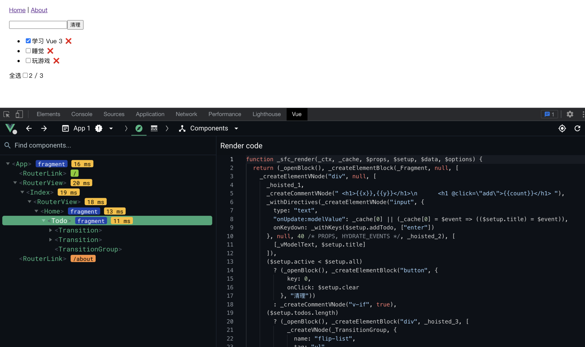
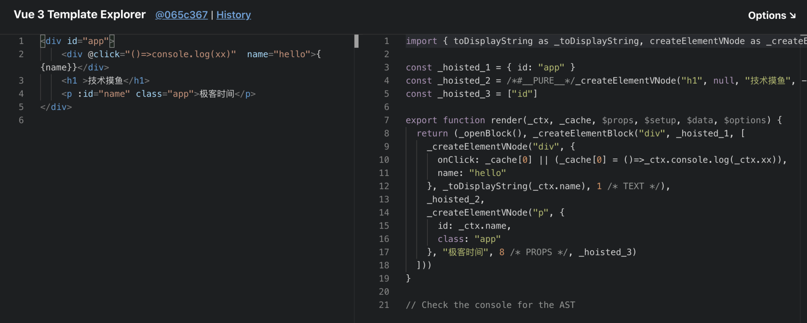

# 13 | JSX：如何利用JSX应对更灵活的开发场景？

你好，我是大圣。在上一讲中，我给你介绍了如何使用 Chrome 和 Vue Devtools 来调试项目，相信你已经拥有了调试复杂项目的能力。今天，我们来聊一个相对独立的话题，就是 Vue 中的 JSX。你肯定会有这样的疑惑，JSX 不是 React 的知识点吗？怎么 Vue 里也有？实际上，Vue 中不仅有 JSX，而且 Vue 还借助 JSX 发挥了 Javascript 动态化的优势。此外，Vue 中的 JSX 在组件库、路由库这类开发场景中，也发挥着重要的作用。对你来说，学习 JSX，可以让你实现更灵活的开发需求，这一讲我们重点关注一下 Vue 中的 JSX。h 函数在聊 JSX 之前，我需要先给你简单介绍一下 h 函数，因为理解了 h 函数之后，你才能更好地理解 JSX 是什么。下面，我会通过一个小圣要实现的需求作为引入，来给你讲一下 h 函数。在 Vue 3 的项目开发中，template 是 Vue 3 默认的写法。虽然 template 长得很像 HTML，但 Vue 其实会把 template 解析为 render 函数，之后，组件运行的时候通过 render 函数去返回虚拟 DOM，你可以在 Vue Devtools 中看到组件编译之后的结果。



在上面的示意图中，调试窗口右侧代码中的 _sfc_render_ 函数就是清单应用的 template 解析成 JavaScript 之后的结果。所以除了 template 之外，在某些场景下，我们可以直接写 render 函数来实现组件。先举个小例子，我给小圣模拟了这样一个需求：我们需要通过一个值的范围在数字 1 到 6 之间的变量，去渲染标题组件 h1~h6，并根据传递的 props 去渲染标签名。对于这个需求，小圣有点拿不准了，不知道怎么实现会更合适，于是小圣按照之前学习的 template 语法，写了很多的 v-if：

```html
  <h1 v-if="num==1">{{title}}</h1>
  <h2 v-if="num==2">{{title}}</h2>
  <h3 v-if="num==3">{{title}}</h3>
  <h4 v-if="num==4">{{title}}</h4>
  <h5 v-if="num==5">{{title}}</h5>
  <h6 v-if="num==6">{{title}}</h6>
```

从上面的代码中，你应该能感觉到，小圣这样的实现看起来太冗余。所以这里我教你一个新的实现方法，那就是 Vue 3 中的h 函数。由于 render 函数可以直接返回虚拟 DOM，因而我们就不再需要 template。我们在 src/components 目录下新建一个文件 Heading.jsx ，要注意的是，这里 Heading 的结尾从.vue 变成了 jsx。在下面的代码中, 我们使用 defineComponent 定义一个组件，组件内部配置了 props 和 setup。这里的 setup 函数返回值是一个函数，就是我们所说的 render 函数。render 函数返回 h 函数的执行结果，h 函数的第一个参数就是标签名，我们可以很方便地使用字符串拼接的方式，实现和上面代码一样的需求。像这种连标签名都需要动态处理的场景，就需要通过手写 h 函数来实现。

```js
import { defineComponent, h } from 'vue'

export default defineComponent({
  props: {
    level: {
      type: Number,
      required: true
    }
  },
  setup(props, { slots }) {
    return () => h(
      'h' + props.level, // 标签名
      {}, // prop 或 attribute
      slots.default() // 子节点
    )
  }
})
```

然后，在文件 src/About.vue 中，我们使用下面代码中的 import 语法来引入 Heading，之后使用 level 传递标签的级别。这样，之后在浏览器里访问  http://localhost:9094/#/about 时，就可以直接看到 Heading 组件渲染到浏览器之后的结果。

```html
 <template>
  <Heading :level="3">hello geekbang</Heading>
</template>

<script setup>
import Heading from './components/Head.jsx'
</script>
```

上面的代码经过渲染后的结果如下：


手写的 h 函数，可以处理动态性更高的场景。但是如果是复杂的场景，h 函数写起来就显得非常繁琐，需要自己把所有的属性都转变成对象。并且组件嵌套的时候，对象也会变得非常复杂。不过，因为 h 函数也是返回虚拟 DOM 的，所以有没有更方便的方式去写 h 函数呢？答案是肯定的，这个方式就是 JSX。JSX 是什么我们先来了解一下 JSX 是什么，JSX 来源自 React 框架，下面这段代码就是 JSX 的语法，我们给变量 title 赋值了一个 h1 标签。

```jsx
const element = <h1 id="app">Hello, Geekbang!</h1>
```

这种在 JavaScript 里面写 HTML 的语法，就叫做 JSX，算是对 JavaScript 语法的一个扩展。上面的代码直接在 JavaScript 环境中运行时，会报错。JSX 的本质就是下面代码的语法糖，h 函数内部也是调用 createVnode 来返回虚拟 DOM。在之后的课程中，对于那些创建虚拟 DOM 的函数，我们统一称为 h 函数。

```js
const element = createVnode('h1',{id:"app"}, 'hello Geekbakg')
```

在从 JSX 到 createVNode 函数的转化过程中，我们需要安装一个 JSX 插件。在项目的根目录下，打开命令行，执行下面的代码来安装插件：

```
npm install @vitejs/plugin-vue-jsx -D
```

插件安装完成后，我们进入根目录下，打开 vite.config.js 文件去修改 vite 配置。在 vite.config.js 文件中，我们加入下面的代码。这样，在加载 JSX 插件后 ，现在的页面中就可以支持 JSX 插件了。

```js
import vue from '@vitejs/plugin-vue'
import vueJsx from '@vitejs/plugin-vue-jsx';

export default defineConfig({
  plugins: [vue(),vueJsx()]
})
```

然后，我们进入 src/componentns/Heading.jsx 中，把 setup 函数的返回函数改成下面代码中所示的内容，这里我们使用变量 tag 计算出标签类型，直接使用渲染，使用一个大括号把默认插槽包起来就可以了。

```js
  setup(props, { slots }) {
    const tag = 'h'+props.level
    return () => <tag>{slots.default()}</tag>
  }
```

我们再来聊一下 JSX 的语法在实战中的要点，详细的要点其实在GitHub 文档中也有全面的介绍，我在这里主要针对之前的清单应用讲解一下。我们进入到 src/components 下面新建文件 Todo.jsx，在下面的代码中，我们使用 JSX 实现了一个简单版本的清单应用。我们首先使用 defineComponent 的方式来定义组件，在 setup 返回的 JSX 中，使用 vModel 取代 v-model，并且使用单个大括号包裹的形式传入变量 title.value ，然后使用 onClick 取代 @click。循环渲染清单的时候，使用.map 映射取代 v-for，使用三元表达式取代 v-if。

```js
import { defineComponent, ref } from 'vue'

export default defineComponent({
  setup(props) {
    let title = ref('')
    let todos = ref([{ title: "学习 Vue 3", done: true },{ title: "睡觉", done: false }]);
    function addTodo(){
        todos.value.push({
            title:title.value
        })
        title.value = ''
    }
    return () => <div>
        <input type="text" vModel={title.value} />
        <button onClick={addTodo}>click</button>
        <ul>
            {
                todos.value.length ? todos.value.map(todo=>{
                    return <li>{todo.title}</li>
                }): <li>no data</li>
            }
        </ul>
    </div>
  }
})
```

通过这个例子，你应该能够认识到，使用 JSX 的本质，还是在写 JavaScript。在 Element3 组件库设计中，我们也有很多组件需要用到 JSX，比如时间轴 Timeline、分页 Pagination、表格 Table 等等。就像在 TimeLine 组件的源码中，有一个 reverse 的属性来决定是否倒序渲染，我们在下面写出了类似的代码。代码中的 Timeline 是一个数组，数组中的两个元素都是 JSX，我们可以通过数组的 reverse 方法直接进行数组反转，实现逆序渲染。类似这种动态性要求很高的场景，template 是较难实现的。

```js
export const Timeline = (props)=>{
    const timeline = [
        <div class="start">8.21 开始自由职业</div>,
        <div class="online">10.18 专栏上线</div>
    ]
    if(props.reverse){
        timeline.reverse()
    }
    return <div>{timeline}</div>
}
```

JSX 和 Template看到这里，你一定会有一个疑惑：我们该怎么选择 JSX 和 template 呢？接下来，我就和你聊聊 template 和 JSX 的区别，这样你在加深对 template 的理解的同时，也能让你逐步了解到 JSX 的重要性。先举个例子，我们在极客时间官网购买课程的时候，就如下图所示的样子，页面顶部有搜索框、页面左侧有课程的一些类别。我们按照极客时间对课程的分类，比如前端、后端、AI、运维等分类，可以很轻松地筛选出我们所需类别的课程。试想一下，如果没有这些条件限制，而是直接显示课程列表，那你就需要自己在几百门的课程列表里搜索到自己需要的内容。也就是说，接受了固定分类的限制，就能降低选择课程的成本。这就告诉我们一个朴实无华的道理：我们接受一些操作上的限制，但同时也会获得一些系统优化的收益。


在 Vue 的世界中也是如此，template 的语法是固定的，只有 v-if、v-for 等等语法。Vue 的官网中也列举得很详细，也就是说，template 遇见条件渲染就是要固定的选择用 v-if。这就像极客时间官网上课程的分类是有限的，我们需要在某一个类别中选择课程一样。我们按照这种固定格式的语法书写，这样 Vue 在编译层面就可以很方便地去做静态标记的优化。而 JSX 只是 h 函数的一个语法糖，本质就是 JavaScript，想实现条件渲染可以用 if else，也可以用三元表达式，还可以用任意合法的 JavaScript 语法。也就是说，JSX 可以支持更动态的需求。而 template 则因为语法限制原因，不能够像 JSX 那样可以支持更动态的需求。这是 JSX 相比于 template 的一个优势。JSX 相比于 template 还有一个优势，是可以在一个文件内返回多个组件，我们可以像下面的代码一样，在一个文件内返回 Button、Input、Timeline 等多个组件。

```js
export const Button = (props,{slots})=><button {...props}>slots.default()</button>
export const Input = (props)=><input {...props} />
export const Timeline = (props)=>{
  ...
}
```

在上面，我们谈到了 JSX 相比于 template 的优势，那么 template 有什么优势呢？你可以先看下面的截图，这是使用 Vue 官方的 template 解析的一个 demo。



在 demo 页面左侧的 template 代码中，你可以看到代码中的三个标签。页面右侧是 template 代码编译的结果，我们可以看到，相比于我们自己去写 h 函数，在 template 解析的结果中，有以下几个性能优化的方面。首先，静态的标签和属性会放在 _hoisted 变量中，并且放在 render 函数之外。这样，重复执行 render 的时候，代码里的 h1 这个纯静态的标签，就不需要进行额外地计算，并且静态标签在虚拟 DOM 计算的时候，会直接越过 Diff 过程。然后是 @click 函数增加了一个 cache 缓存层，这样实现出来的效果也是和静态提升类似，尽可能高效地利用缓存。最后是，由于在下面代码中的属性里，那些带冒号的属性是动态属性，因而存在使用一个数字去标记标签的动态情况。比如在 p 标签上，使用 8 这个数字标记当前标签时，只有 props 是动态的。而在虚拟 DOM 计算 Diff 的过程中，可以忽略掉 class 和文本的计算，这也是 Vue 3 的虚拟 DOM 能够比 Vue 2 快的一个重要原因。

```js
import { toDisplayString as _toDisplayString, createElementVNode as _createElementVNode, openBlock as _openBlock, createElementBlock as _createElementBlock } from "vue"

const _hoisted_1 = { id: "app" }
const _hoisted_2 = /*#__PURE__*/_createElementVNode("h1", null, "技术摸鱼", -1 /* HOISTED */)
const _hoisted_3 = ["id"]

export function render(_ctx, _cache, $props, $setup, $data, $options) {
  return (_openBlock(), _createElementBlock("div", _hoisted_1, [
    _createElementVNode("div", {
      onClick: _cache[0] || (_cache[0] = ()=>_ctx.console.log(_ctx.xx)),
      name: "hello"
    }, _toDisplayString(_ctx.name), 1 /* TEXT */),
    _hoisted_2,
    _createElementVNode("p", {
      id: _ctx.name,
      class: "app"
    }, "极客时间", 8 /* PROPS */, _hoisted_3)
  ]))
}

// Check the console for the AST
```

在 template 和 JSX 这两者的选择问题上，只是选择框架时角度不同而已。我们实现业务需求的时候，也是优先使用 template，动态性要求较高的组件使用 JSX 实现，尽可能地利用 Vue 本身的性能优化。在课程最后的生态源码篇中，我们还会聊到框架的设计思路，那时你就会发现除了 template 和 JSX 之外，一个框架的诞生还需要很多维度的考量，比如是重编译还是重运行时等等，学到那里的时候，你会对 Vue 有一个更加深刻的理解。总结好，今天这一讲的主要内容就讲完了，我们来简单总结一下今天学到了什么吧。今天我主要带你学习了 Vue 3 中的 JSX。首先我们学习了 h 函数，简单来说，h 函数内部执行 createVNode，并返回虚拟 DOM，而 JSX 最终也是解析为 createVnode 执行。而在一些动态性要求很高的场景下，很难用 template 优雅地实现，所以我们需要 JSX 实现。因为 render 函数内部都是 JavaScript 代码，所以 render 函数相比于 template 会更加灵活，但是 h 函数手写起来非常的痛苦，有太多的配置，所以我们就需要 JSX 去方便快捷地书写 render 函数。JSX 的语法来源于 React，在 Vue 3 中会直接解析成 h 函数执行，所以 JSX 就拥有了 JS 全部的动态性。最后，我们对比了 JSX 和 template 的优缺点，template 由于语法固定，可以在编译层面做的优化较多，比如静态标记就真正做到了按需更新；而 JSX 由于动态性太强，只能在有限的场景下做优化，虽然性能不如 template 好，但在某些动态性要求较高的场景下，JSX 成了标配，这也是诸多组件库会使用 JSX 的主要原因。思考题在你现在实现的需求里，有哪些是需要 JSX 的呢？欢迎在留言区分享你的看法，也欢迎你把这一讲推荐给你的同事和朋友们，我们下一讲再见。