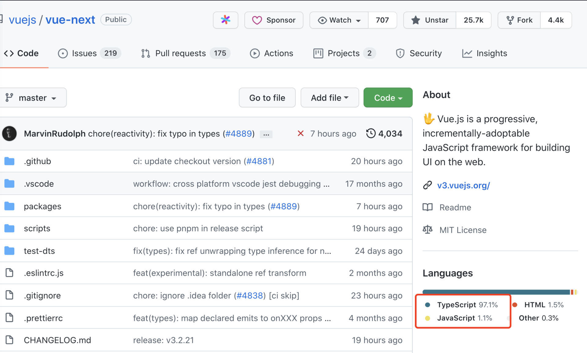
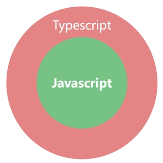
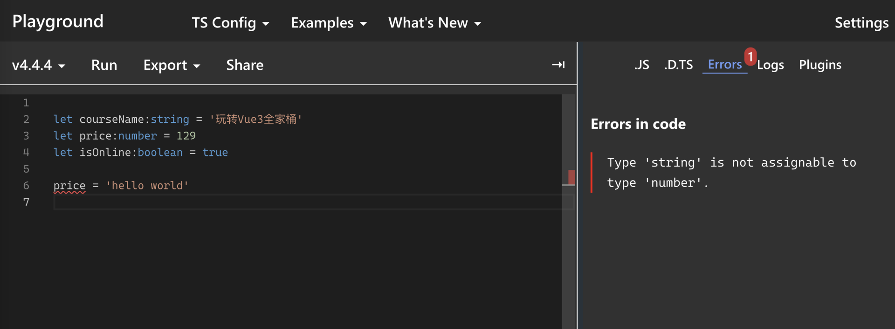
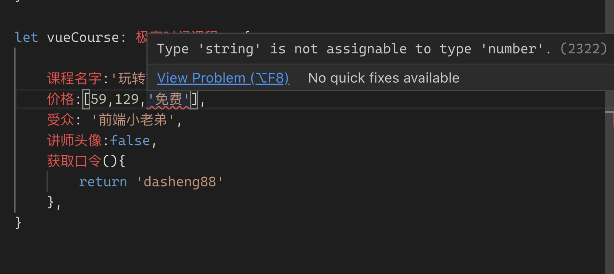
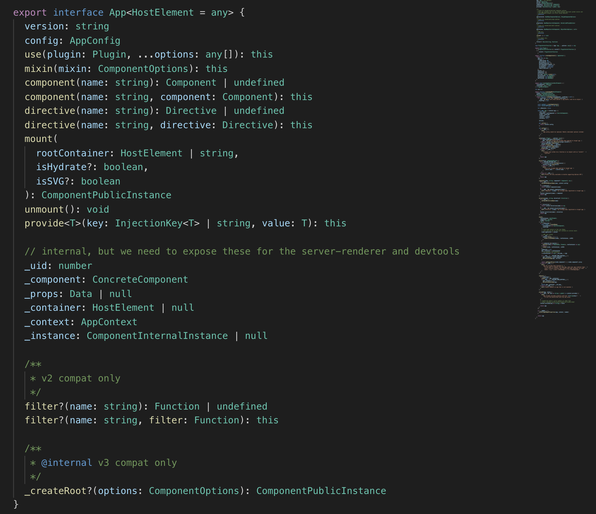

# 14 | TypeScript：Vue 3中如何使用TypeScript？

你好，我是大圣。

在上一讲中，我为你介绍了 Vue 中的 JSX，以及 template 和 JSX 各自的优缺点。就像在上一讲中我提到的 template 牺牲灵活性换来了静态标记的收益，你能看到：有些时候，我们需要放弃一些灵活性去换取项目的整体收益。那么在这一讲中，我会给你介绍一个可以在语言层面上，提高代码可维护性和调试效率的强类型语言——TypeScript。

在整体上，我们的课程还是以使用 JavaScript 为主。对于 TypeScript 的内容，我会在这一讲中先带着你入门。下面，我会先讲一下 TypeScript 的入门知识 ；然后作为巩固，我会带你在 Vue 3 里再实战一下 TypeScript；最后，我会对 TypeScript 和 JavaScript 这两者做一个对比分析，让你明白如何在这两者之间做一个更好的平衡。

## 什么是 TypeScript

TypeScript 是微软开发的 JavaScript 的超集，这里说的超集，意思就是 TypeScript 在语法上完全包含 JavaScript。TypeScript 的主要作用是给 JavaScript 赋予强类型的语言环境。现在大部分的开源项目都是用 TypeScript 构建的，并且 Vue 3 本身 TS 的覆盖率也超过了 95%。



下图展示了 TypeScript 和 JavaScript 的关系，**TypeScript 相当于在 JavaScript 外面包裹了一层类型系统，这样可以帮助我们开发更健壮的前端应用**。



接下来，我们看一下 TypeScript 带来的新语法：首先，TypeScript 可以在 JavaScript 的变量之上限定数据类型。你可以打开这个 TypeScript 官方的[演示链接](https://www.typescriptlang.org/play#code/FAGwpgLgBAxg9gVwE4GcwDkCGBbMAuFCJASwDsBzKAXigHJBK50Bt4gNQTAGZALRUDbtQNwtbQkKAAcSMfKQTYARmCTUoARgBMATkHRiKAPKkQZfNLhxwmUgqJtgwUcXELaACzAgQcKAHc4SEABMBQA)，在线体验一下 TypeScript 的这种新语法。

上面 TypeScript 的官方演示链接，我用截图的方式放到了下面。你可以看到 TypeScript 和 JavaScript 的区别在于：TypeScript 的变量后面有一个冒号用来设置好变量的数据类型，courseName 变量的值只能是字符串，price 只能是数字。

在第六行代码中，我们给 price 赋值了字符串，页面右边解析出来的 JavaScript 代码是没有任何问题的。但是我们点击右边的 Errors 时，就会看到一个报错信息，明确告诉你 string 类型的变量不能赋值给数字类型。



这段演示代码算是 TypeScript 中最简单的 Demo 了，你的脑子里肯定会提出一个问题：在 TypeScript 中，既然变量不能随便赋值，那这会带来什么好处吗？

我还是给你举个例子，在你去极客时间官网购买课程的时候，如果官网上对每个课程的类型都定义得非常详细，那么在课程列表页面，你就能知道《玩转 Vue 3 全家桶》这个课的受众、价格、难度等类型，所以你在购买之前就可以很轻松地过滤不需要的课程。用 TypeScript 来描述的话，就是下面的代码：

```ts
interface 极客时间课程 {
    课程名字:string,
    价格:number[],
    受众:string,
    讲师头像?:string|boolean,
    获取口令():string
}

let vueCourse: 极客时间课程 = {
    课程名字:'玩转Vue 3全家桶',
    价格:[59,129],
    受众: '前端小老弟',
    讲师头像:false,
    获取口令(){
        return 88
    }
}
```

这就是 TypeScript 带来的好处，如果项目中的每个变量、每个接口都能在定义的时候定义好类型，那么很多错误在开发阶段就可以提前被 TypeScript 识别。在上面的代码中，我们使用 interface 去定义一个复杂的类型接口，也即极客时间课程。

这样，一个变量想要描述一个课程，就必须要按照这个格式去定义，也就是说：课程名必须是字符串、价格必须是一个数组，并且内部全部是数字、讲师头像可以是字符串或布尔这两个类型之一、获取口令必须是一个函数，并且返回一个字符串。

只要是不符合接口规定的类型的变量，就会直接在变量下方给出红色波浪线的报错提示。鼠标移到报错的变量那里，就会有提示信息弹出，直接通知你哪里出问题了。**这也是为什么现在大部分前端开源项目都使用 TypeScript 构建的原因，因为每个函数的参数、返回值的类型和属性都清晰可见，这就可以极大地提高我们代码的可维护性和开发效率。**



TypeScript 能够智能地去报错和提示，也是 Vue 3 的代码阅读起来比较顺畅的主要原因。点击这里的 Vue 3 源码[链接](https://github.com/vuejs/core/blob/main/packages/runtime-core/src/apiCreateApp.ts#L28)，如下图所示，在这个源码文件内部的 interface App 中，定义好了 Vue 实例所需要的所有方法后，我们可以看到熟悉的 use、component、mount 等方法。并且每个方法的参数类型和返回值都已经定义好了，阅读和调试代码的难度也降低了很多。



接下来，我来跟你聊一下 TypeScript 中的一些进阶用法。很多时候，你看不懂开源库 TypeScript 的原因，也是出在对这些进阶用法的生疏上。

首先要讲到的进阶用法是泛型，泛型就是指有些函数的参数，你在定义的时候是不确定的类型，而返回值类型需要根据参数来确定。在下面的代码中，我们想规定 test 函数的返回类型和参数传递类型保持一致，这个时候就没有办法用 number 或者 string 预先定义好参数 args 的类型，为了解决这一问题，泛型机制就派上了用场。

我们在函数名的后面用尖括号包裹一个类型占位符，常见的写法是，这里为了帮助你理解，我用 < 某种类型 > 替代这种写法。调用方式可以直接使用 `test(1)`, 也可以使用 `test <number> (1)` 。泛型让我们拥有了根据输入的类型去实现函数的能力，这里你也能感受到 TypeScript 类型可以进行动态设置。

```js
function test<某种类型>(args:某种类型):某种类型{
    return args
}
```

接下来，我再给你介绍一下 TypeScript 中泛型的使用方法。在下面的代码中，我们实现一个函数 getProperty，它能够动态地返回对象的属性。函数的逻辑是很好实现的，那怎么使用 TypeScript 限制 getProperty 的类型呢？

```js
getProperty(vueCourse， '课程名字') // 返回 ['玩转Vue3全家桶']
```

因为 getProperty 的返回值是由输入类型决定的，所以一定会用到泛型。但是返回值是 vueCourse 的一个 value 值，那如何定义返回值的类型呢？首先我们要学习的是 keyof 关键字，下面代码中我们使用 type 课程属性列表 = keyof 极客时间课程 ，就可以根据获取到的极客时间课程这个对象的属性列表，使用 extends 来限制属性只能从极客时间的课程里获取。

```js
function getProperty<某种类型, 某种属性 extends keyof 某种类型>(o: 某种类型, name: 某种属性): 某种类型[某种属性] {
    return o[name]
}
function getProperty<T, K extends keyof T>(o: T, name: K): T[K] {
    return o[name]
}
```

对于上面给出的代码，你可以打开[这个链接](https://www.typescriptlang.org/play?#code/FAGwpgLgBAxg9gVwE4GcwDkCGBbMAuFCJASwDsBzKAXigHJBK50Bt4gNQTAGZALRUDbtQNwtbQkKAAcSMfKQTYARmCTUoARgBMATkHRiKAPKkQZfNLhxwmUgqJtg14GQhyAZpnFRAgeaAi7UBvpoBfUwH-RgaC8oAG9gKDCoAMBYFUB1bQIiMnIAGlDwwHe5QB4LPEkZOQBtAF1k8KhAdeVAdHk4kgoi8MAm6MAIPUAWTUB5hQB+SoSAHyMTMDMasMB24MA15UBj5UATuQAKAEoOimAAX2twaAA3NgBhRFR8Ny8-QJoQ4qjYhhY2KC4+WgGoDLxcgFZVRJVVQpSw8rw6QFklQD3XoB4HUAgAGAfH1bl8oA0WngnCA0HcRhMZsdiuEkJBkOZaAATTAoAAWYAoAA5SQJikslg4EKQYBBiHBzORIAAFJBwYRyCAATwAPIAF80As56Abx9ANHqiSgIsAejqAcgMoGAAB72Ui4lBQADWYF5cAc0rF4oAfJM4L8RRKpaQcLtZXLZgaJbk7flglDMRBsVA4Llrbh8otrKyIByuTzeZN1mAtshEbQAoByv0A1Eq0abAYOh7lIPmRzbbOOnVNAA)体验一下，如果传递的 name 不是极客时间课程类型中的属性，就会有报错提示。


上面只是 TypeScript 最简单的应用，关于 TypeScript 的更多类型的使用文档，你可以在[官网文档](https://www.typescriptlang.org/docs/handbook/2/everyday-types.html)上找到很详细的教程和介绍。而且 TypeScript 的类型其实是可以编程的，可以根据类型去组合推导新的类型，甚至可以使用 extends 去实现递归类型。

在 Vue 源码中也有一些地方用到了递归类型，可以书写更复杂的类型组合，这一部分你可以自己去官网学习。到这里，相信你应该大致能理解 TypeScript 给我们带来的好处了，那如何在 Vue 3 中使用 TypeScript 呢，这就是我们接下来要解决的问题。

## Vue 3 中的 TypeScript

由于 TypeScript 中的每个变量都需要把类型定义好，因而对代码书写的要求也会提高。**Vue 2 中全部属性都挂载在 this 之上，而 this 可以说是一个黑盒子，我们完全没办法预先知道 this 上会有什么数据，这也是为什么 Vue 2 对 TypeScript 的支持一直不太好的原因。**

Vue 3 全面拥抱 Composition API 之后，没有了 this 这个黑盒，对 TypeScript 的支持也比 Vue2 要好很多。在下面的代码中，首先我们需要在 script 标签上加一个配置 lang=“ts”，来标记当前组件使用了 TypeScript，然后代码内部使用 defineComponent 定义组件即可。

```html
<script lang="ts">
import { defineComponent } from 'vue'
export default defineComponent({
  // 已启用类型推断
})
</script>
```

在 `<script setup>` 的内部，需要调整写法的内容不多。下面的代码使用 Composition API 的过程中，可以针对 ref 或者 reactive 进行类型推导。如果 ref 包裹的是数字，那么在对 count.value 进行 split 函数操作的时候，TypeScript 就可以预先判断 count.value 是一个数字，并且进行报错提示。

```js
    const count = ref(1)
    count.value.split('') // => Property 'split' does not exist on type 'number'
```

我们也可以显式地去规定 ref、reactive 和 computed 输入的属性，下面代码中我们分别演示了 ref、reactive 和 computed 限制类型的写法，每个函数都可以使用默认的参数推导，也可以显式地通过泛型去限制。

```html
<script setup lang="ts">
import { computed, reactive, ref } from '@vue/runtime-core';
interface 极客时间课程 {
    name:string,
    price:number
}


const msg = ref('') //  根据输入参数推导字符串类型
const msg1 = ref<string>('') //  可以通过范型显示约束

const obj = reactive({})
const course = reactive<极客时间课程>({name: '玩转Vue3全家桶', price: 129})

const msg2 = computed(() => '') // 默认参数推导
const course2 = computed<极客时间课程>(() => {
  return {name: '玩转Vue3全家桶', price: 129}
})
</script>
```

在 Vue 中，除了组件内部数据的类型限制，还需要对传递的属性 Props 声明类型。而在 `<script setup>` 语法中，只需要在 defineProps 和 defineEmits 声明参数类型就可以了。下面的代码中，我们声明了 title 属性必须是 string，而 value 的可选属性是 number 类型。

```js
const props = defineProps<{
  title: string
  value?: number
}>()
const emit = defineEmits<{ 
  (e: 'update', value: number): void
}>()
```

接下来，我们对清单应用做一个 TypeScript 代码的改造。首先清单本身就是一个类型，在下面的代码中，我们定义 Todo 这个接口，然后初始化 todos 的时候，Vue 也暴露了 Ref 这个类型，todos 是 Ref 包裹的数组。

```js
import {ref, Ref} from 'vue'
interface Todo{
  title:string,
  done:boolean
}
let todos:Ref<Todo[]> = ref([{title:'学习Vue',done:false}])
```

因为这里需要把 todos 的格式设置为 Vue3 的响应式类型，所以当你需要了解 Composition API 所有的类型设置的时候，你可以进入项目目录下面的 node_modules/@vue/reactivity/dist/reactivity.d.ts 中查看。

完成了上面的操作后，我们再来了解一下和 vue-router 的优化相关的工作。vue-router 提供了 Router 和 RouteRecordRaw 这两个路由的类型。在下面的代码中，用户路由的配置使用 RouteRecordRaw 来定义，返回的 router 实例使用类型 Router 来定义，这两个类型都是 vue-router 内置的。通过查看这两个类型的定义，我们也可以很方便地学习和了解 vue-router 路由的写法。

```js
import { createRouter, createWebHashHistory, Router, RouteRecordRaw } from 'vue-router'
const routes: Array<RouteRecordRaw> = [
  ...
]

const router: Router = createRouter({
  history: createWebHashHistory(),
  routes
})

export default router
```

我们打开项目目录下的 node_modules/vue-router/dist/vue-router.d.ts 文件，下面的代码中你可以看到 vue-router 是一个组合类型，在这个类型的限制下，你在注册路由的时候，如果参数有漏写或者格式不对的情况，那就会在调试窗口里直接看到报错信息。如果没有 TypeScript 的话，我们需要先启动 dev，之后在浏览器的调试页面里看到错误页面，回来之后才能定位问题。

```js
export declare type RouteRecordRaw = RouteRecordSingleView | RouteRecordMultipleViews | RouteRecordRedirect;

declare interface RouteRecordSingleView extends _RouteRecordBase {
    /**
     * Component to display when the URL matches this route.
     */
    component: RawRouteComponent;
    components?: never;
    /**
     * Allow passing down params as props to the component rendered by `router-view`.
     */
    props?: _RouteRecordProps;
}
```

## TypeScript 和 JavaScript 的平衡

TypeScript 引入的强类型系统带来了可维护性较好、调试较为方便的好处。并且 TypeScript 在社区的热度也越来越高，也有人开始提问：“到底是学 TypeScript 还是 JavaScript？”

但是，这个提问忽略了这一点：**TypeScript 是 JavaScript 的一个超集，这两者并不是完全对立的关系**。所以，学习 TypeScript 和学习 JavaScript 不是二选一的关系，你需要做的，是打好坚实的 JavaScript 的基础，在维护复杂项目和基础库的时候选择 TypeScript。

TypeScript 能发展至今，得益于微软，而 JavaScript 的语法则是由 TC39 协会制定的。由于 JavaScript 的发展速度问题，有一些语法的实现细节在 TC39 协会还在讨论的时候，TypeScript 就已经实现了。比较典型的就是装饰器 Decorator 的语法，因为 TC39 在 Decorator 的实现思路上，和 Typescript 不同，未来 TypeScript 的 Decorator 可能会和 JavaScript 的 Decorator 发生冲突。

TypeScript 最终还是要编译成为 JavaScript，并在浏览器里执行。对于浏览器厂商来说，引入类型系统的收益并不太高，毕竟编译需要时间。而过多的编译时间，会影响运行时的性能，所以未来 TypeScript 很难成为浏览器的语言标准。

所以我们的核心还是要掌握 JavaScript，在这个基础之上，无论是框架，还是 TypeScript 类型系统，我们都将其作为额外的工具使用，才是我们最佳的选择。

## 总结

这一讲的主要内容就结束了，我们来复习一下今天学到的内容。首先，我们介绍了 TypeScript 是什么，以及该如何使用 TypeScript 带来的类型系统。我们可以限制变量的类型，包括 string、number、boolean 等。如果把数字类型的变量赋值给了字符串类型的变量，TypeScript 就会在编译阶段提示类型出错的信息。

我们可以从代码编辑器的智能提示中及时发现错误，这对我们代码的开发效率是一个很大的提升。基于数字、字符串这种简单的变量类型，我们可以组装出接口类型、数组类型等，也就可以更精确地控制项目中的数据结构。

然后，我们学习了在 Vue 3 中如何去使用 TypeScript，在我们使用的 `<script setup>` 环境下，Vue 已经把对 TypeScript 的支持封装得很好了，这样 ref 和 reactive 可以很好地实现类型推导，我们只需要定义好项目中使用变量的格式即可。然后 vue-router 和 Vuex 也提供了自己 TypeScript 类型系统，比如我们可以引入 vue-router 的 RouterViewRecord 类型去限制我们书写路由的格式。

最后，我们讨论了一下 TypeScript 和 JavaScript 的关系，这个问题在社区热度也一直不减，我也给出了我的想法，那就是 JavaScript 是前端这个行业的语法标准，而 TypeScript 是在此之上的类型系统。主流的浏览器短期也不会直接支持 TypeScript，所以我们学习的重点还是要放在 JavaScript 之上。不过，要是你对 TypeScript 非常感兴趣的话，也可以在留言区留言，如果呼声很高，我也会考虑新增专门的 TypeScript 的加餐。

## 思考题

最后给你留一个思考题：了解了 TypeScript 的使用后，你可以回想一下 Vue 2 里有哪些写法是对 TypeScript 不友好的，以及我们应该怎么在 Vue 3 优化呢？

欢迎你在评论区留言分享，也欢迎你把这一讲的内容分享给你的同事和朋友。