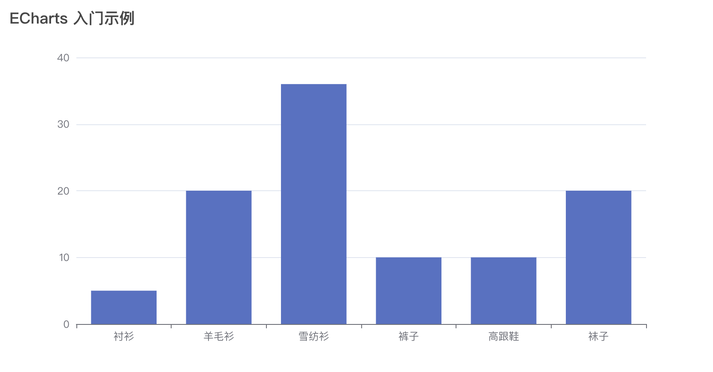

# 17 | 实战痛点3：Vue 3中如何集成第三方框架

你好，我是大圣。

在上一讲中，我给你介绍了如何在 Vue 3 中实现页面和接口的权限管理。我们把 vue-router 的动态路由、导航守卫、axios 的接口拦截等功能配合到一起使用，实现了页面的权限控制，这也算是 Vue 中进阶使用 vue-router 和 axios 的一个方式。

今天，我们再来学习另一个进阶玩法，聊一下如何在 Vue 3 中使用和引入更多的框架。可别小看这里的门道，有的第三方工具框架跟 Vue 耦合性不高，而有的需要做适配，这一讲我就详细给你说说实操中的注意事项，帮助你在提高开发效率的同时少走弯路。

## 独立的第三方库

首先我们要介绍的第三方框架是 axios，这是一个完全独立于 Vue 的框架，我们可以使用 axios 发送和获取网络接口数据。在 Vue、React 框架下，axios 可以用来获取后端数据。甚至在 Node.js 环境下，也可以用 axios 去作为网络接口工具去实现爬虫。

axios 这种相对独立的工具对于我们项目来说，引入的难度非常低。通常来说，使用这种独立的框架需要以下两步。

以页面进度条工具 NProgress 为例，第一步是，我们先进入到项目根目录下，使用下面的命令去安装 NProgress。

```sh
npm install nprogress -D
```

第二步，就是在需要使用 NProgress 的地方进行 import 的相关操作，比如在页面跳转的时候，我们就需要使用 NProgress 作为进度条。导入 NProgress 库之后，我们就不需要使用 Vue3 的插件机制进行注册，只需要通过 router.beforeEach 来显示进度条，通过 afterEach 来结束进度条就可以了。

```js
import NProgress from 'nprogress' // progress bar
router.beforeEach(async (to, from, next) => {
  // start progress bar
  NProgress.start()
})

router.afterEach(() => {
  // finish progress bar
  NProgress.done()
})
```

在项目中，我们之后还会依赖很多和 NProgress 类似的库，比如处理 Excel 的 xlsx 库，处理剪切板的 clipboard 库等等。

## 组件的封装

下面我们以可视化组件为例，来分析复杂组件的封装。之所以选择可视化组件为示例，是因为管理系统中的统计数据、销售额数据等等，都喜欢用饼图或柱状图的方式来展示。

虽然可视化本身和 Vue 没有太大关系，但我们需要在页面中以组件的形式显示可视化图表。对此，我们的选择是用可视化框架 ECharts 去封装 Vue 的组件，来实现可视化组件。

我们再简单介绍一下可视化框架的使用方式，不管你选择用百度的 ECharts，还是蚂蚁的 G2 等框架，在框架的使用方法上，都是类似的。首先，你需要完成图表库的配置，并且填入图表数据，然后把这个数据渲染在一个 DOM 上就可以了。

下面的代码展示了一个 ECharts 的入门案例，代码中我们首先使用 echarts.init 初始化一个 DOM 标签；然后在 options 中配置了图表的结构，包括标题、x 轴等；并且我们还通过 series 配置了页面的销量数据；最后使用 myChart.setOption 的方式渲染图表就可以了。

```html
<!DOCTYPE html>
<html>
  <head>
    <meta charset="utf-8" />
    <title>ECharts</title>
    <!-- 引入刚刚下载的 ECharts 文件 -->
    <script src="echarts.js"></script>
  </head>
  <body>
    <!-- 为 ECharts 准备一个定义了宽高的 DOM -->
    <div id="main" style="width: 600px;height:400px;"></div>
    <script type="text/javascript">
      // 基于准备好的dom，初始化echarts实例
      var myChart = echarts.init(document.getElementById('main'));
      // 指定图表的配置项和数据
      var option = {
        title: {
          text: 'ECharts 入门示例'
        },
        tooltip: {},
        legend: {
          data: ['销量']
        },
        xAxis: {
          data: ['衬衫', '羊毛衫', '雪纺衫', '裤子', '高跟鞋', '袜子']
        },
        yAxis: {},
        series: [
          {
            name: '销量',
            type: 'bar',
            data: [5, 20, 36, 10, 10, 20]
          }
        ]
      };
      // 使用刚指定的配置项和数据显示图表。
      myChart.setOption(option);
    </script>
  </body>
</html>
```

看上面的代码，我们先配置好图表需要的数据，然后使用 setOption 初始化图表，之后在浏览器中打开项目主页面，就可以看到下图所示的这种可视化结果。在你理解了 ECharts 的使用方法后，下一个要解决的问题是，我们该如何在 Vue 3 中集成这个框架呢？答案就是我们自己实现与 ECharts 对应的 Vue 组件即可。



在 Vue 3 中集成 ECharts 的最简单的方式，就是封装一个 Chart 组件，把上面代码中的 option 配置以参数的形式传递给 Chart 组件，然后组件内部进行渲染即可。

我们还是结合代码直观体验一下。在下面的代码中，template 设置了一个普通的 div 作为容器，通过 mount 和 onUnmounted 生命周期内部去初始化图表，实现 ECharts 框架中图表的渲染和清理，然后 initChart 内部使用 echart 的 API 进行渲染，这样就实现了图表的渲染。

```html
<template>
  <div ref="chartRef" class="chart"></div>
</template>

<script setup>
import * as echarts from 'echarts'
import {ref,onMounted,onUnmounted} from 'vue'
// 通过ref获得DOM
let chartRef = ref()
let myChart 
onUnmounted(()=>{
  myChart.dispose()
  myChart = null
})
onMounted(()=>{
    myChart = echarts.init(chartRef.value)
     const option = {
        tooltip: {
            trigger: 'item'
        },
        color: ['#ffd666', '#ffa39e', '#409EFF'],
        // 饼图数据配置
        series: [
            {
                name: '前端课程',
                type: 'pie',
                radius: '70%',
                data: [
                    {value: 43340, name: '重学前端'},
                    {value: 7003, name: 'Javascript核心原理解析'},
                    {value: 4314, name: '玩转Vue3全家桶'}
                ]
            }
        ]
    }
    myChart.setOption(option)
})
</script>
```

在上面，我们虽然实现了可视化组件的封装，但因为逻辑并不复杂，所以我们的实现还比较简略。

我们当然可以尝试去实现一下更详细的可视化组件封装，但因为 ECharts 是一个非常复杂的可视化框架，有饼图，地图等不同的图表类型，如果引入 ECharts 全部代码的话，项目的体积会变得非常臃肿。所以，如果我们能按照不同的图表类型按需引入 ECharts，那么除了能够让组件使用起来更方便之外，整体项目的包的大小也会优化很多。

## 指令的封装

接下来，我们再介绍一下指令增强型组件的封装。

比如我们常见的图片懒加载的需求，这一需求的实现方式就是在 img 的标签之上，再加上一个 v-lazy 的属性。而图片懒加载和指令增强型组件的封装的关系在于，v-lazy 指令的使用方式是在 HTML 标签上新增一个属性。Vue 内置的指令我们已经很熟悉了，包括 v-if、v-model 等等。像图片懒加载这种库和 DOM 绑定，但是又没有单独的组件渲染逻辑的情况，通常在 Vue 中以指令的形式存在。

在 Vue 中注册指令和组件略有不同，下面的代码中我们注册实现了 v-focus 指令，然后在 input 标签中加上 v-focus 指令，在指令加载完毕后，鼠标会自动聚焦到输入框上，这个实现在登录注册窗口中很常见。

```js
// 注册一个全局自定义指令 `v-focus`
app.directive('focus', {
  // 当被绑定的元素挂载到 DOM 中时……
  mounted(el) {
    // 聚焦元素
    el.focus()
  }
})
```

指令的生命周期和组件类似，首先我们要让指令能够支持 Vue 的插件机制，所以我们需要在 install 函数内注册 lazy 指令。这种实现 Vue 插件的方式，在 vuex 和 vue-router 两讲中已经带你学习过了，这里的代码里我们使用 install 方法，在 install 方法的内部去注册 lazy 指令，并且实现了 mounted、updated、unmounted 三个钩子函数。

```js
const lazyPlugin = {
  install (app, options) {
    app.directive('lazy', {
      mounted: ...,
      updated: ...,
      unmounted: ...
    })
  }
}
```

我们通过 lazy 指令获取到当前图片的标签，并且计算图片的位置信息，判断图片是否在首页显示。如果不在首页的话，图片就加载一个默认的占位符就可以了，并且在页面发生变化的时候，重新进行计算，这样就实现了页面图片的懒加载。

与懒加载类似的，还有我们组件库中常用的 v-loading 指令，它用来显示组件内部的加载状态，我们在 Element3 中。也有类似的指令效果，下面的代码中，我们注册了 loadingDirective 指令，并且注册了 mounted、updated、unmounted 三个钩子函数，通过 v-loading 的值来对显示效果进行切换，实现了组件内部的 loading 状态。

动态切换的 Loading 组件能够显示一个 circle 的 div 标签，通过 v-loading 指令的注册，在后续表格、表单等组件的提交状态中，加载状态就可以很方便地使用 v-loading 来实现。

```js
const loadingDirective = {
  mounted: function (el, binding, vnode) {
    const mask = createComponent(Loading, {
      ...options,
      onAfterLeave() {
        el.domVisible = false
        const target =
          binding.modifiers.fullscreen || binding.modifiers.body
            ? document.body
            : el
        removeClass(target, 'el-loading-parent--relative')
        removeClass(target, 'el-loading-parent--hidden')
      }
    })
    el.options = options
    el.instance = mask.proxy
    el.mask = mask.proxy.$el
    el.maskStyle = {}

    binding.value && toggleLoading(el, binding)
  },

  updated: function (el, binding) {
    el.instance.setText(el.getAttribute('element-loading-text'))
    if (binding.oldValue !== binding.value) {
      toggleLoading(el, binding)
    }
  },

  unmounted: function () {
    el.instance && el.instance.close()
  }
}

export default {
  install(app) {
    // if (Vue.prototype.$isServer) return
    app.directive('loading', loadingDirective)
  }
}
```

## 引入第三方库的注意事项

我们封装第三方库的目的是实现第三方框架和 Vue 框架的融合，提高开发效率。这里我跟你聊几个和引入第三方库相关的注意事项。

首先，无论是引用第三方库还是你自己封装的底层库，在使用它们之初就要考虑到项目的长期可维护性；其次，尽可能不要因为排期等问题，一股脑地把第三方库堆在一起，虽然这样做可以让项目在早期研发进度上走得很快，但这样会导致项目中后期的维护成本远远大于重写一遍代码的成本。

然后是 Vue 中的 mixin，extends 机制能不用就不用，这两个 API 算是从 Vue 2 时代继承下来的产物，都是扩展和丰富 Vue 2 中 this 关键字，在项目复杂了之后，mixin 和 extends 隐式添加的 API 无从溯源，一旦多个 mixin 有了命名冲突，调试起来难度倍增。

项目中的全局属性也尽可能少用，全局变量是最原始的共享数据的方法，Vue 3 中我们使用 app.config.globalProperties.x 注册全局变量，要少用它的主要原因也是项目中的全局变量会极大的提高维护成本。有些监控场景必须要用到，就要把所有注册的全局变量放在一个独立的文件去管理。

最后，我们引入第三方框架和库的时候一定要注意按需使用，比如我们只用到了 ECharts 中的某几种类型的图，也只用到了 Element3 中的部分组件。现在引入全部代码的方式会让项目体积越来越大，关于代码体积优化的内容，我们在 18 讲谈性能优化时也会详细介绍。

## 总结

今天的这一讲的内容就学完了，我们来复习一下今天学到的知识。首先，我们介绍了 Vue 中如何封装第三方工具框架，比如 axios，NProgress 等，这些框架和 Vue 耦合性不强，直接引入使用即可。然后，我讲到了 Vue 中封装可视化组件库的方式，也就是把第三方库放在 Vue 的组件内部执行。

就像对于 ECharts、wangEditor 等成熟的框架来说，对这些框架进行 Vue 3 框架的适配工作，主要适配的载体就是组件。你可以选择直接透传所有 option 配置来做一个很浅的封装，也可以针对需要用的组件类型逐个封装，比如 ECharts 可以封装 Pie，Bar 等不同类型的组件。

之后我们讲解了指令增强型组件的封装，这种库和 DOM 绑定，但是又没有单独的组件渲染逻辑，通常在 Vue 中以指令的形式存在，比较常见的就是图片懒加载指令以及 loading 指令，我们项目中也会用到这两个指令来增强组件。

最后，我也给你介绍了一些引入第三方库时，需要你注意的事项，例如**从项目开始之初就要考虑到长期维护的成本，不要一股脑地堆砌代码，要学会全面使用 Composition API 组织代码、少用全局变量，以及不要引入第三方库全部代码，这些都是很值得你注意的地方**。

## 思考题

最后留一个思考题，你的项目中还有什么第三方框架需要引入呢？

大家可以在评论区分享你的答案，也欢迎你把这一讲的内容分享给你的同事、朋友们。